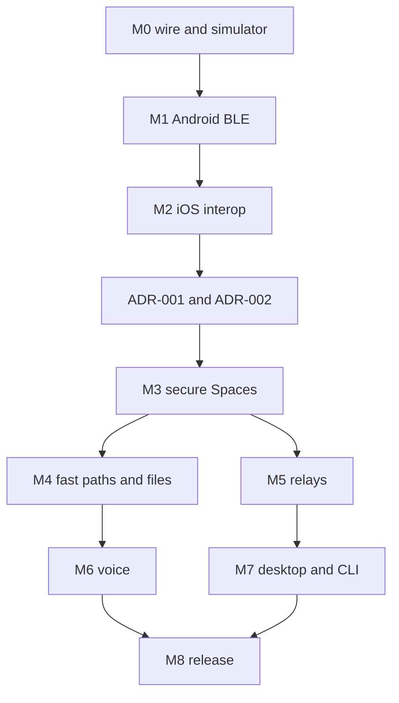

# Lattice implementation plan

**Status:** planned; dates are intentionally absent until staffing and device availability are known. Each milestone has an exit gate, and later work depends on earlier evidence. Prototype wire choices may change before v1 freeze.

| Milestone | Build slice | Depends on | Exit gate | IDs |
| --- | --- | --- | --- | --- |
| M0 — Protocol lab | Cargo skeleton, canonical CBOR, identity, event/hash vectors, fake clocks/paths, in-memory log | None | Two Rust replicas converge on reordered valid text; invalid bytes rejected | LAT-002–003, IDN-001, NET-003 |
| M1 — Android nearby text | Compose shell, UniFFI, Android BLE GATT, SQLite/outbox, one Space/text channel | M0 | Three Android devices exchange and recover text with Internet disabled | LAT-001,004, IDN-002–003, SPC-001–002, MSG-001–003, NET-001–004, MOB-001–003 |
| M2 — iOS interoperability | SwiftUI shell, Core Bluetooth, permissions/background states, mixed sync | M1 | Android/iPhone direct text and missed-history repair on physical devices | SPC-003 prototype, NET-005, MOB-004–006, LAT-008,016 |
| M3 — Secure Spaces | MLS lifecycle, roles, channels, DM, edits, policy, local search | M2; ADR-001/002 | Add/remove/rekey, policy conflict and channel-confidentiality cases pass | SPC-004–011, MSG-004–012, IDN-004–008, NET-012 |
| M4 — Fast local/files | Capability probe, Wi-Fi Aware/LAN, routing, couriers, content hashes | M3 | Mixed-device direct file resumes across path change | NET-006–008, FIL-001–007 |
| M5 — Optional relays | Versioned mailbox/Nostr adapter, subscriptions, relay privacy settings | M3; ADR-003 | Two remote peers sync through two independent relays; offline nearby still works | NET-009–011,013 |
| M6 — Voice | Signaling, WebRTC/Opus, direct ICE, optional TURN, controls | M3; M4 for local upgrade | Small room direct and relay cases, clean no-route failure | VOC-001–007, LAT-017 |
| M7 — Desktop/CLI/node | Tauri UI, CLI, optional persistent peer | M3; M5 for relay control | Interoperability across mobile, desktop, CLI; no special node authority | DSK-001–005, CLI-001–009 |
| M8 — Stable release | Fuzzing, interop vectors, migrations, privacy/battery/security review | All required earlier gates | Every v1 acceptance gate in TEST_PLAN passes; open blockers closed | LAT-006–020, VOC-008, DSK-006 |

## Critical path

## Milestone delivery contract

Each milestone delivers: implementation, updated requirement statuses, protocol vectors affected, meaningful simulator/device tests, updated architecture/ADR if boundaries changed, and a known-limit note. A failed physical interoperability test changes the design before expanding the UI. “Done” means exit evidence is recorded, not that a feature demo looks correct.

## Research and hardware work scheduled into implementation

At M1/M2 collect GATT MTU/flow-control behavior and platform background traces on named phones. At M3 model-check or bounded-enumerate concurrent admin/MLS histories. At M4 compare direct-only, bounded courier, and anti-entropy in seeded contact traces and measure battery. At M5 audit relay metadata. At M6 measure NAT success, jitter and upload per participant. At M8 commission independent review of keys/authorization and verify build migration.

See [TODO.md](TODO.md) for actionable items and [TEST_PLAN.md](quality/TEST_PLAN.md) for exact matrices. A paper is outside the build plan until running code and reproducible results exist.

## Work packages and dependencies

**M0** produces a compileable Cargo workspace, pure codec/identity/event crates, byte-exact vectors, deterministic simulated transport and a SQLite interface stub. Define event ID and author sequence before networking: otherwise different clients cannot agree on what was sent. A physical BLE spike may run alongside but must not become a separate wire standard.

**M1** produces a vertical Android slice from Compose button through UniFFI, Rust local transaction, BLE envelope, remote verification/projection and durable receipt. Begin with direct text, then a three-device opportunistic path. Record actual GATT behavior and app restart. Avoid premature custom rich text or public relays.

**M2** proves the protocol is implementable on iOS and compatible with Android in real radio conditions. SwiftUI/Core Bluetooth adapter performs same vector and local schema checks. Record which foreground/background states are viable; if discovery fails on a supported device, fix path assumptions before multiplying features.

**M3** adds the authorization boundary: invites, credentials/KeyPackages, MLS group changes, roles, channel rules, DMs and messaging mutations. ADR-001/002 policies are accepted; their implementation and security evidence remain exit gates. Channel UI and protocol metadata must reflect ADR-002's policy-only read semantics. A failed partition membership experiment prevents progression to a “secure Spaces” claim even if happy-path chat works.

**M4/M5** independently add high-bandwidth direct paths/files and optional relays. Both reuse event IDs; neither introduces a second state authority. File manifests must be hash-checked and resumable. Relay profile is frozen under ADR-003 and tested against independently operated compatible services.

**M6/M7** add a small-room WebRTC call and broader desktop/CLI surfaces using the same Rust core. Media tests require actual NAT/LAN cases and report lack of TURN. Desktop node mode is explicitly optional and quota bounded.

**M8** is not a polish sprint: it includes external security review, fuzzing, migration, privacy captures, power and interoperability measurements, accessibility, stable wire freeze and published known limitations. A v1 release waits for those artifacts; a design document alone is not release evidence.

## Go/no-go conditions

| Gate | Stop if |
| --- | --- |
| M0 → M1 | Codec vectors disagree or duplicate author sequences can create inconsistent events. |
| M1 → M2 | Offline local commit/physical BLE transfer fails or restart loses the outbox. |
| M2 → M3 | Android/iOS cannot authenticate and reconcile the same event bytes. |
| M3 → M4/M5 | MLS concurrency, Welcome handling, policy or private-channel claim is unresolved. |
| M5 → public relay claim | Relay kind/retrieval/privacy profile is unversioned or works on only one test service. |
| M6 → voice claim | Call UI misreports connected state or omits no-TURN failure. |
| M8 → stable v1 | Critical/high review finding, migration failure, missing vectors or inaccurate privacy copy. |
