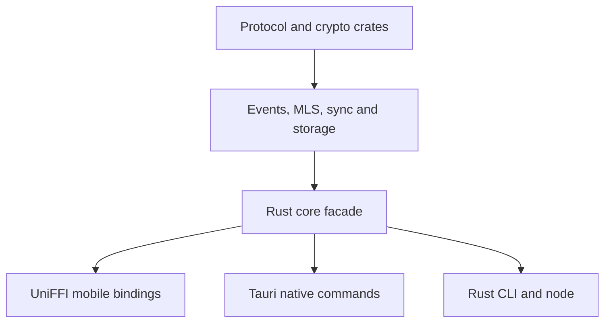

# Technology and integration specification

**Status:** proposed. Technology choice is a boundary decision; a library is selected only after compatibility, maintenance, license and security review.

| Layer | Technology | Role and constraint |
| --- | --- | --- |
| Android app | Kotlin, Jetpack Compose, Android SDK | UI/lifecycle, BLE and Wi-Fi adapters, audio, foreground status |
| iOS app | Swift, SwiftUI, Core Bluetooth, Network.framework | UI/lifecycle, nearby transports, Keychain, AVAudioSession |
| Shared domain | Rust Cargo workspace | Canonical encoding, events, identity, MLS integration, policy, routing, sync, storage |
| Mobile bindings | Mozilla UniFFI | Coarse Kotlin/Swift command/query interface; batched notifications |
| Desktop | Tauri v2, React, TypeScript, Vite | Local WebView UI; Rust core in native process |
| CLI and optional node | Rust | Headless diagnostics, local client commands and volunteer peer |
| JS workspaces | Bun, Turborepo | Desktop/design package dependency management and script orchestration |
| Local persistence | SQLite | Transactional event log, outbox and projections; encrypted sensitive blobs |
| Wire | Deterministic CBOR | Exact canonical profile and vectors before v1 |
| Cryptography | Ed25519, X25519, MLS 1.0, reviewed Noise implementation | Distinct identity, group and link layers; no hand-rolled primitives |
| Nearby | BLE GATT; Wi-Fi Aware/LAN/P2P where supported | Discovery/control; bulk upgrade after capability/permission checks |
| Internet delivery | Optional Nostr-compatible WebSocket adapter | Opaque mailbox, untrusted and replaceable |
| Media | WebRTC, Opus, ICE; optional STUN/TURN | Direct small-room voice, explicit relay/failure behavior |

## Boundaries

- UI → Rust facade: `create_space`, `import_invite`, `send_message`, `observe_channel`, `join_voice`, `network_status`. Commands return stable IDs and typed failures, not raw packet success.
- Platform transport → Rust: `open_path`, `send_envelope`, `ingest_bytes`, `path_status`; adapters never interpret decrypted channel content.
- Rust → platform: secure-key access, radio scheduling, app lifecycle, notifications, microphone/peer connection. Avoid per-packet FFI round trips where possible.
- Native build systems remain authoritative: Cargo for Rust, Gradle for Android, Xcode for iOS, Bun/Vite/Tauri for desktop. Turborepo runs scripts; it does not substitute for these builds.

## Review gates before locking libraries

1. MLS implementation supports the chosen ciphersuite, persistence, commit/proposal management and test vectors; ADR-001 still defines application ordering.
2. Noise implementation exposes exact pattern, transcript binding, counter behavior and interoperable tests.
3. WebRTC mobile builds expose audio session and ICE configuration needed by VOC requirements.
4. SQLite integration supports atomic event/projection commits and safe MLS-state coordination.
5. Licenses and current platform SDK support are checked before pinning dependencies.

Sources: [UniFFI](https://mozilla.github.io/uniffi-rs/), [Tauri architecture](https://v2.tauri.app/concept/architecture/), [Android Wi-Fi Aware](https://developer.android.com/develop/connectivity/wifi/wifi-aware), [Apple Wi-Fi Aware](https://developer.apple.com/documentation/WiFiAware), [MLS RFC 9420](https://www.rfc-editor.org/rfc/rfc9420). See [architecture.md](architecture.md) for repository layout.

## Build and package graph

`crates/lattice-protocol` and crypto/identity crates form the lowest pure layer. Events/MLS/sync/storage/router build on their public types. `lattice-core` composes these behind the CLI/Tauri/UniFFI entry points. Android Gradle and iOS Xcode link generated bindings and platform libraries; neither should create independent serializers or permission reducers. Desktop React depends on typed Tauri commands and generated design tokens. `Cargo.lock` and `bun.lock` are committed; native mobile dependencies and toolchains are pinned for reproducible release builds.

## Technology-specific limits

- BLE GATT is a fragmented control/text carrier; connection MTU and throughput vary by hardware and OS. Native adapters own pacing, credits and reconnect.
- Wi-Fi Aware is a capability, not a universal phone feature. Validate Android/Apple permissions, entitlements and real interoperability on target devices.
- SQLite is authoritative only for a local installation; merge and cryptographic validation happen above the database, not through shared SQL replication.
- UniFFI is the interop mechanism, not a license to pass platform SDK objects through Rust. Prefer owned byte buffers, typed IDs and coarse asynchronous commands.
- Bun/Turborepo coordinate JS-facing packages; they cannot replace Cargo, Gradle or Xcode build graphs.
- Optional Nostr relays are mailbox infrastructure, not backend business logic; WebRTC/TURN concerns media, not event-log replication.

## Selection checklist

For each candidate dependency, record exact version, active maintenance, security advisories, license, platform toolchain compatibility, crash behavior and reproducible build implications in an ADR/lockfile update. Critical Rust/FFI and crypto packages require fuzz/integration tests before use on hostile packets. Select an MLS library only after running add/remove/concurrent-Commit scenarios and verifying persistence on both mobile platforms. Every externally visible behavior is specified by wire vectors, not by whichever library happens to be chosen.
