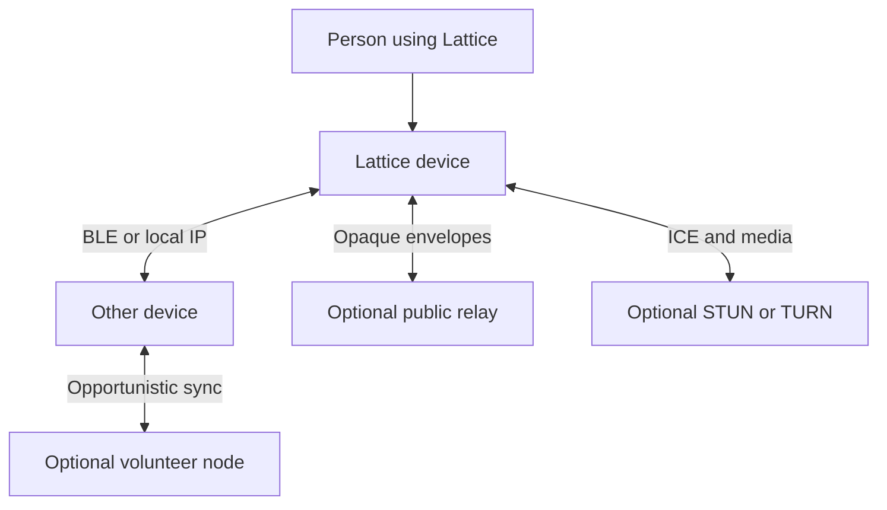
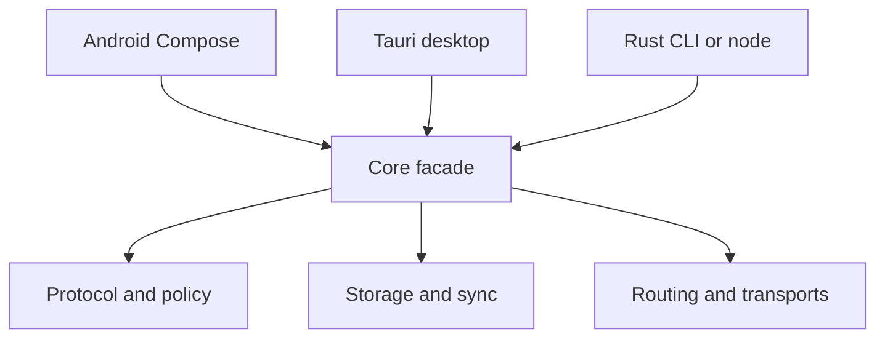
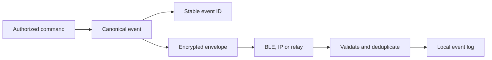
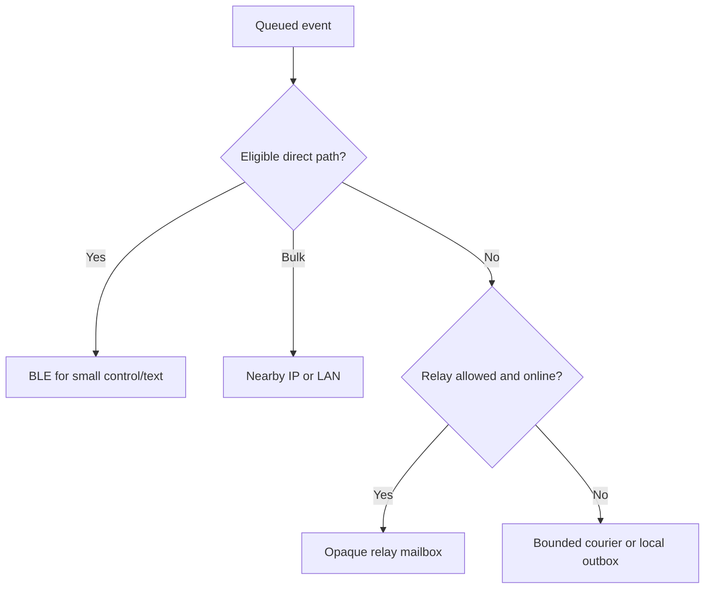
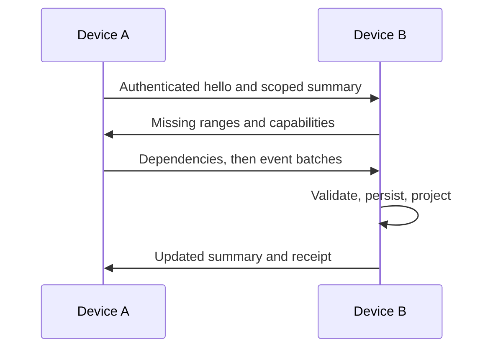
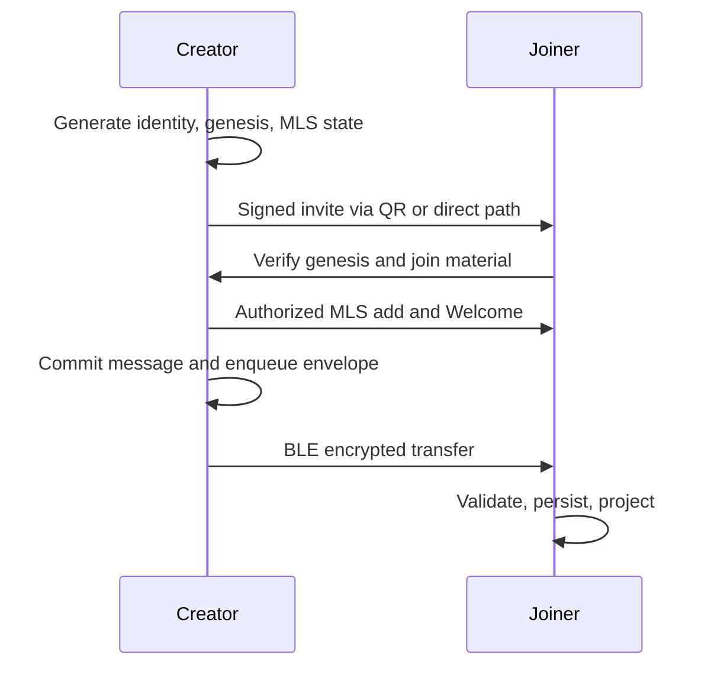

# Lattice Architecture

> **Status:** Proposed architecture, implementation baseline; not a claim of a working or audited system.
> **Version:** 0.1 · 22 September 2026
> **Scope:** Android, desktop, CLI, optional persistent nodes, and interoperable protocol. iOS implementation, verification and support claims are out of current delivery scope.
> **Companion:** Lattice engineering specification (`spec.md`), versioned `protocol/specs/*`, and `docs/decisions/ADR-*.md`.
> **Source material:** The supplied `spec (1).md` and `spec(4).md`. The first preserves fuller inline citations; the second identifies itself as the engineering source of truth. Differences and unresolved semantics are recorded here rather than silently decided.

**Scope note:** iOS-specific material retained below is legacy design reference only. It is not normative for current implementation, verification or release acceptance; the current platform and release requirements are owned by `docs/PLAN.md`, `docs/REQUIREMENTS.md` and `docs/quality/TEST_PLAN.md`.

## 1. Purpose, status, and reading guide

Lattice is a local-first community communication system with Spaces, channels, messages, roles, files, direct messages, and live voice. A Space has no mandatory Lattice-operated server or authoritative cloud database. Devices retain authenticated state locally, communicate over direct nearby paths when possible, and may use untrusted, user-selected Internet relays when configured. **The unit of authority is a validated event and its cryptographic context, not the path on which it arrived.**

This document is an implementation architecture, not the final wire standard. It gives system boundaries, component ownership, runtime behavior, deployment modes, invariants, risks, and verification gates. Exact field numbers, wire widths, algorithm constants, library selections, radio UUIDs, and protocol version negotiation become normative only when frozen in `protocol/specs/` with public test vectors. Existing source-spec examples are *drafts* where their widths or semantics remain undecided.

The organization follows the concerns in [arc42](https://arc42.org/overview/)—goals, context, building blocks, runtime, deployment, crosscutting concepts, decisions, and risks—and uses focused static and dynamic views consistent with the [C4 model](https://c4model.com/diagrams). Diagrams are conceptual. Arrows show logical calls or transfers, not a promise that every link exists simultaneously.

### Decision status vocabulary

| Status | Meaning | Example |
| --- | --- | --- |
| **Baseline** | Adopted architectural direction; implementation still pending | Rust core, native mobile, transport-independent event IDs |
| **Profile draft** | Concrete candidate that needs vectors/interoperability review | Deterministic CBOR layout; experimental BLE service, discovery, and first-contact handshake values; release vectors and interoperability remain open |
| **Open** | Cannot be treated as complete until an ADR and tests exist | MLS concurrent Commit policy, private-channel key isolation |
| **Deferred** | Outside first interoperable release | Large-room SFU, video, public directory, multi-device user account |

### System priorities

1. **Offline correctness:** creating local state and exchanging text nearby must work with Internet disabled.
2. **Security before delivery:** an untrusted path may carry bytes; only validated, authorized events affect state.
3. **Predictable convergence:** replay, duplication, order changes, and path switching cannot silently produce incompatible valid projections.
4. **Honest availability:** mobile OS scheduling, network partitions, NAT, missing keys, and storage loss appear as explicit states.
5. **Bounded resources:** radio duty cycle, replication, memory, disk, event size, and per-peer work have caps.
6. **Replaceable carriers:** BLE, nearby IP, relays, and future transports implement contracts below the event model.

Non-goals for v1 include global anonymity, guaranteed delivery in a permanent partition, continuous routing on a suspended phone, unlimited conferencing without infrastructure, retroactive erasure of received plaintext, and support for an unbounded public Space with free Sybil admission.

## 2. Context and trust boundaries

The principal actor is a person using one or more installations. In the first interoperable profile, a *device installation* is the cryptographic member; a human-level multi-device identity and recovery protocol are deferred. A user may run multiple installations, each separately joined to an MLS group.



| Boundary | Trusted for | Must not be trusted for |
| --- | --- | --- |
| Device secure storage and reviewed Rust core | Local keys, event validation, projections | Physical safety of a stolen unlocked device |
| UI and platform bridge | Presenting commands/status, radio/audio integration | Defining wire validity, minting authority, bypassing policy |
| Nearby link and courier | Transporting bounded opaque bytes | Content integrity, identity, availability, exact distance |
| Nostr-compatible relay | Optional asynchronous mailbox service | Space membership, plaintext confidentiality, retention/deletion guarantees |
| STUN/TURN | Discovering or relaying media paths | Channel authority or content confidentiality beyond WebRTC protections |
| Other Space members | Actions their role permits | Confidentiality of content they were legitimately able to decrypt |

A courier need not be a Space member. A persistent node is an ordinary peer with explicitly configured uptime/storage/relay duties; it must not become an implicit owner or authoritative database. A public relay can withhold or replay encrypted bytes and observe metadata. No global connectivity or availability claim follows from “serverless.”

### Core invariants

| ID | Invariant | Enforced by |
| --- | --- | --- |
| I-01 | Equal accepted event IDs correspond to equal canonical event bytes | Canonical encoding, domain-separated hash, collision assumption |
| I-02 | Re-enveloping or changing carriers never changes application event ID | Event/envelope separation |
| I-03 | An event changes a projection only after cryptographic, causal, policy, and epoch checks | Validation pipeline and atomic commit |
| I-04 | A relay or courier is never authoritative for a Space | Local validated log and authenticated membership |
| I-05 | Missing history, MLS epochs, or permissions yield pending/conflict states, never optimistic acceptance | Dependency tracking |
| I-06 | Media is never stored and sprayed as message envelopes | Delivery-class and router enforcement |
| I-07 | Sender-local commit does not imply peer delivery; relay acceptance does not imply reading | Separate delivery acknowledgments |
| I-08 | Radio advertisements do not contain stable Lattice account/device keys, nicknames, or Space names | Platform-adapter constraints and captures |
| I-09 | Every queue and parser allocation is bounded | Per-peer/global quotas and decode limits |

I-03 and convergence depend on settling the MLS and policy-conflict profile in §7; they are acceptance conditions, not already-proven guarantees.

## 3. System shape and application topology

Each in-scope product surface uses the same protocol domain. Android is the native mobile application because BLE roles, Wi-Fi peer APIs, background policy, notifications and audio are central to the product. Desktop embeds the Rust core in a Tauri v2 process and uses React/TypeScript/Vite for presentation. The Rust CLI works without a JavaScript runtime. Cargo owns Rust workspaces; Bun workspaces and Turborepo coordinate desktop/design/TypeScript scripts; Gradle owns Android builds. [UniFFI](https://mozilla.github.io/uniffi-rs/) supplies generated Kotlin bindings; [Tauri's architecture](https://v2.tauri.app/concept/architecture/) supplies the desktop boundary.



The facade receives coarse commands and publishes state snapshots/streams. It does not expose high-frequency packet handling through UI callbacks. Platform adapters accept opaque buffers and perform radio, audio, secure-key, notification, and lifecycle work. The Rust core decides validity, event semantics, storage transaction boundaries, reconciliation, and delivery policy. Calling a native API successfully is not evidence that the remote device received a packet.

### Component ownership and allowed dependencies

| Component | Owns | May call | Must not do |
| --- | --- | --- | --- |
| `lattice-core` | Commands, orchestration, subscriptions, errors | Domain crates through stable APIs | Hold platform UI objects or radio SDK types |
| `lattice-protocol` | Encoding profile, IDs, bounds, version/capability handling | Pure data/crypto primitives | Database or network I/O |
| `lattice-identity`, `lattice-crypto`, `lattice-mls` | Keys, verification, sessions, MLS state | Reviewed crypto libraries and secure-storage port | Invent new ciphers or treat a signature as role authorization |
| `lattice-events` | Event kinds, policy input, deterministic reducers | Protocol, identity, MLS state | Select a network path |
| `lattice-storage` | SQLite migrations, event log, projections, outbox, local transactions | Domain validation interfaces | Silently accept invalid remote objects |
| `lattice-sync` | Summaries, missing ranges, snapshot planning | Read-only store view | Change membership or bypass validation |
| `lattice-router`, `lattice-mesh` | Path selection, retries, bounded forwarding, courier queue | Transport capabilities, envelope metadata | Decrypt Space content or create application events |
| `lattice-transport`, adapters | Path lifecycle, framing, capabilities, health | OS APIs, network sockets | Interpret decrypted messages or decide permissions |
| `lattice-files` | Manifest/chunk verification and resume state | Storage, transport planner | Treat an unauthenticated filename/MIME as safe content |
| `lattice-voice` | Session and signaling semantics, room topology | Auth/policy, platform media ports | Carry continuous RTP over BLE/relay events |
| `lattice-relay` | Opaque Internet mailbox mapping | Relay-neutral envelope port and WebSocket client | Treat relay acceptance as recipient delivery |
| `lattice-uniffi` | FFI data/ownership contract | Public core API | Implement independent protocol rules |

The dependency direction is platform/UI → facade → domain policy and services → ports → platform adapters. To avoid crate cycles, foundational `protocol`/`crypto` types do not depend on `core`, `storage`, or the apps. `voice` owns call state while native media engines own microphone, audio session, and peer connections.

## 4. Repository architecture

The target repository is a monorepo with independently versionable protocol documents and one Rust core. Paths describe ownership, not an assertion that they already exist.

```text
lattice/
├── apps/
│   ├── android/                 # Kotlin, Compose, Gradle, radio/audio adapters
│   ├── ios/                     # retained future-reference tree; outside current release scope
│   ├── desktop/                 # Tauri v2, React, TypeScript, Vite
│   └── cli/                     # CLI packaging/docs; binary in crates/
├── crates/
│   ├── lattice-core/            # facade and orchestration
│   ├── lattice-protocol/        # wire and compatibility
│   ├── lattice-identity/        # identities and verification
│   ├── lattice-crypto/          # primitives/session adapters
│   ├── lattice-mls/            # groups, KeyPackages, epochs
│   ├── lattice-events/         # signed events and reducers
│   ├── lattice-storage/        # SQLite and migrations
│   ├── lattice-sync/           # anti-entropy
│   ├── lattice-mesh/           # forwarding/couriers
│   ├── lattice-router/         # paths/queues/failover
│   ├── lattice-transport/      # transport interfaces
│   ├── lattice-relay/          # mailbox adapter
│   ├── lattice-files/          # attachment manifests/chunks
│   ├── lattice-voice/          # voice state/signaling
│   ├── lattice-platform/       # shared adapter ports
│   ├── lattice-uniffi/         # mobile bindings
│   ├── lattice-cli/            # CLI executable
│   ├── lattice-node/           # optional headless peer
│   └── lattice-testkit/        # fake clock, paths, fixtures
├── transports/                 # platform BLE, Wi-Fi, LAN, WebRTC, relay implementations
├── protocol/{specs,schemas,vectors}/
├── packages/{desktop-ui,theme,protocol-inspector,config}/
├── design/{tokens,icons,assets,scripts}/
├── tooling/{mesh-simulator,packet-inspector,network-chaos,benchmarks,fuzz}/
├── tests/{protocol,interop,security,mesh,sync,routing,mobile,e2e}/
├── docs/{architecture,security,development,decisions,releases}/
├── Cargo.toml                 # Cargo workspace
├── Cargo.lock
├── package.json               # Bun workspace
├── bun.lock
├── turbo.json
└── rust-toolchain.toml
```

`architecture.md` lives at the repository root as an entry point. `protocol/specs/` defines exact interoperable bytes; `docs/decisions/` records reasons and supersession rather than rewriting decision history, consistent with [ADR guidance](https://docs.aws.amazon.com/prescriptive-guidance/latest/architectural-decision-records/best-practices.html). Generated UniFFI code, token outputs, and vector tables must be reproducible from committed sources. The repository has no mandatory backend service directory. Optional relay/TURN development fixtures and volunteer-node deployment recipes are clearly marked optional.

## 5. Data, identity, and wire boundaries

### Objects and authority

| Object | Purpose | Authority and persistence |
| --- | --- | --- |
| Device identity | Signing/DH keys and verification fingerprint | Device secure storage; public signed identity bundle |
| Space genesis | Random Space ID, initial creator/policy, MLS group binding | Signed immutable root; fingerprint shared via invite |
| Channel | Named view within a Space, type and permission overrides | Authenticated metadata events |
| Event | Immutable application mutation; message/edit/delete/reaction/admin action | End-to-end authenticated canonical bytes in local log |
| Envelope | Route-specific ciphertext carrier with expiry and forwarding limits | Router; may be regenerated without changing event ID |
| MLS state | Group membership epoch and key material | Validated sequence of MLS handshake messages |
| Projection | Local query-optimized Space/channel/message state | Deterministically rebuilt from accepted events and security state |
| Outbox | Locally originated, not yet delivered envelopes | Device SQLite, protected content, bounded retries |
| Courier queue | Third-party opaque objects held for later contacts | Bounded local ciphertext cache, no Space secret grant |
| File manifest/chunks | Content metadata and resumable transfer | End-to-end authenticated manifest and hash-checked chunks |

Proposed scalar representations include a 32-byte `SpaceId`, 32-byte event hash, per-author 64-bit sequence, and logical clock. `ChannelId` width and some envelope fields remain profile drafts. Device fingerprint is a domain-separated hash of a canonical public identity bundle. Display name and avatar are signed mutable profile data, never authentication labels. An invite binds Space genesis, inviter identity/signature, expiry and rendezvous hints; hints are connectivity suggestions and do not confer admin authority.

### Canonical event versus delivery envelope



A v1 candidate event contains wire version; optional Space/channel IDs; device author and monotonic author sequence; Lamport time and untrusted wall-time hint; causal parents; kind/flags; protected body; and authentication context. Its ID is a domain-separated SHA-256 hash of the exact deterministic preimage. The external envelope contains a version, envelope ID, delivery class, ephemeral hints, expiry, hop/copy budgets, and opaque payload. **Transport hops may change routing metadata but must never forge or mutate signed event bytes.**

Use one deterministic CBOR profile with numeric map keys, shortest encodings, no duplicate keys or indefinite-length structures in signed/hashed objects, defined UTF-8 rules, and strict size checks before allocation. [RFC 8949](https://www.rfc-editor.org/rfc/rfc8949) provides CBOR foundations; Lattice still needs its own exact profile and cross-language vectors. Avoid speculative “optional unknown fields are preserved” behavior in signed preimages until extension hashing, validation, and version rules are specified.

### Event kinds and projection ownership

| Domain | Event examples | Projection rule |
| --- | --- | --- |
| Space security | genesis, member add/remove, policy resolution, KeyPackage reference | Causal authorization plus MLS binding; no wall-clock winner |
| Space metadata | rename, icon, channel create/meta, role definition/assignment | Deterministic order for ordinary edits; explicit conflict for security decisions |
| Messaging | message, edit, tombstone delete, reply, thread | Append immutable events; reducer computes display view |
| Set operations | reactions, pins | Element-tagged add/remove, not blind toggling |
| Files | manifest, chunk availability | Authenticated manifest, independent chunk hashes |
| Ephemeral | presence, typing, voice state | Expiring runtime state; not guaranteed historical convergence |

Materialized display ordering may use `(Lamport, author, sequence, event ID)` as a stable tie-break. That total order does **not** decide cryptographic membership conflicts, infer physical send order, or override causal dependencies. A `MESSAGE_DELETE` is a tombstone in honest projections; devices that already obtained plaintext can retain it.

## 6. Transport and routing architecture

### Capabilities and policy

| Carrier | Discovery/connection | Workload | Hard constraint |
| --- | --- | --- | --- |
| BLE GATT | Nearby application-specific service; possible central and peripheral roles | Discovery, handshake, text, compact sync, bounded forwarding | Not sustained RTP or default large-file path |
| Wi-Fi Aware | Runtime-supported direct nearby IP path | Bulk sync, attachments, local voice | OS/hardware/entitlement and interoperability checks |
| Platform peer-to-peer Wi-Fi | Supported platform-specific direct IP | Apple/Android fallback where applicable | No assumed Android–Apple compatibility |
| LAN | Generic mDNS/DNS-SD service and authenticated direct socket | Fast sync, files, voice | Same reachable IP network, local-network permissions |
| WebRTC data/media | ICE-selected direct or relay path | RTP audio, optional file data channel | Media access and ICE negotiation required |
| Nostr-compatible relay | User-configured WebSocket mailbox | Remote delayed opaque events and signaling | No Space authority; relay size/retention/policy vary |
| Courier peer | Encounter-based opaque cache | Small deferred messages | Strict copy, byte, duration, and trust quotas |

Android supports Wi-Fi Aware subject to feature availability; [Android's overview](https://developer.android.com/develop/connectivity/wifi/wifi-aware) must be used at integration time. Apple's [Wi-Fi Aware documentation](https://developer.apple.com/documentation/WiFiAware) and [adoption guidance](https://developer.apple.com/documentation/wifiaware/adopting-wi-fi-aware) specify its platform requirements; neither OS version alone nor simulator results prove mixed-platform interoperability. BLE throughput depends on PHY, GATT MTU, pacing and device behavior. Its fragments are encrypted-envelope slices with connection-local handles, indices, length, timeout, memory cap, flow-control credits, and reassembly limits. Nearby advertisements contain a generic service ID and changing token, no stable identity or Space names. Passive linkability remains a residual risk through timing and radio/network metadata.

The router scores viable paths per class using latency, estimated energy, throughput, metered-network preference, and observed reliability. It may send over several paths for durability within policy; receiver-level deduplication handles convergence. Voice needs low latency; history sync can defer on expensive radio. A direct path is preferred for bulk content; a relay can bridge disjoint meshes when the user permits it. Path selection changes without rewriting event IDs.



Controlled flooding is only for suitable local broadcast traffic, with hop limits, deduplication, jitter and per-peer quotas. Deferred unicast can use binary spray with finite copy budgets inspired by [Spray and Wait](https://doi.org/10.1145/1080139.1080143); [Bitchat's whitepaper](https://github.com/permissionlesstech/bitchat/blob/main/WHITEPAPER.md) provides relevant real-world courier design choices. This is a policy to evaluate, not a promise of eventual delivery. Transit peers may decline storage; malicious ones may drop or delay. Exact cache filters can have false positives, so periodic anti-entropy must repair omissions.

For Internet mail, the first candidate adapter maps an opaque Lattice envelope into Nostr relay events described by [NIP-01](https://github.com/nostr-protocol/nips/blob/master/01.md). An experimental kind, retrieval tags, key rotation, expiration, and publish/subscribe profile must be frozen before claiming public relay interoperability. Outer relay keys may be distinct from device/Space keys; relays still see IP addresses, event size, timing and retrieval tags. [NIP-17](https://github.com/nostr-protocol/nips/blob/master/17.md) and [NIP-44](https://github.com/nostr-protocol/nips/blob/master/44.md) do not supply Lattice's Space group security.

## 7. Security, membership, and authorization

### Identity and session layers

An installation generates a long-term Ed25519 signing key, X25519 DH key, MLS leaf/KeyPackage material, and a local at-rest wrapping secret. Use Android Keystore wrapping where available and the host OS-protected storage on desktop; report actual protection level in diagnostics. A verified contact pins the full canonical identity fingerprint, established with a QR comparison or session-bound short authentication string. Nicknames alone do not authenticate peers.

Pairwise nearby control uses a reviewed Noise handshake profile with explicit transcript binding to protocol version, identities, ephemeral discovery tokens, capabilities, nonces, and optional invite context. “Noise-style” is not sufficient for an interoperable release: the chosen pattern, DH/cipher/hash names, payload schedule, prologue, transcript binding, replay behavior, and test vectors must be recorded. Use [the Noise specification](https://noiseprotocol.org/noise.html) as the framework, not custom handshake arithmetic. Link encryption and Space content encryption have distinct scopes.

### MLS and application policy

MLS 1.0 provides group key establishment; the application must define credentials, member authorization, delivery, concurrent Commit handling, and synchronization. [RFC 9420](https://www.rfc-editor.org/rfc/rfc9420) specifies the protocol, while [RFC 9750](https://www.rfc-editor.org/rfc/rfc9750) explains that MLS does not itself enforce a Space's administrator policy and that peer-to-peer delivery may produce competing Commits. The source specification proposes one MLS group per Space and potentially a two-member group per DM. The mandatory MLS 1.0 ciphersuite is the initial compatibility baseline; alternative suites require explicit negotiation and vectors.

**Membership is not a simple convergent metadata set.** The application couples each add/remove/ban to validated MLS handshakes, permission state and causal context. An honest client that lacks a prerequisite keeps an event pending; it does not treat an apparently newer timestamp as authority. Removed members cannot be made to forget old plaintext or material they previously possessed. New members should not get earlier epoch secrets by default.

**Commit conflict policy — accepted ADR-001.** MLS groups have a linear epoch history, and two isolated administrators can create competing Commits from the same epoch. Lattice accepts only a commit based on the locally current parent epoch; missing parents remain pending, while valid competing successors are retained as conflict evidence and freeze membership-sensitive mutation. Recovery requires explicit new-group invitations; no timestamp, hash, role, or arrival-order winner is selected. This accepted policy still requires permutation, recovery, and interoperability evidence before its convergence claims are verified.

**Channel access policy — accepted ADR-002.** Domain-separated keys from one Space-wide exporter do not hide channel content from another member with the same group secret. Channel roles may restrict actions such as send, attach, moderate, and voice participation; every active MLS Space member remains within the read trust boundary. Read-private channels and equivalent confidentiality claims are unsupported and must fail closed unless a future reviewed profile adds separate cryptographic membership.

Roles (`owner`, `admin`, `moderator`, `member`, custom masks) grant operation-specific capabilities: managing Space/channel/roles, invites, member removal/bans, send/attach/threads, announcements/pins, voice join/speak/moderation, retention, and relay recommendations. An administrative event binds author, permission, causal parents, and MLS epoch. Its validity is checked at the causal policy state, not at wall-clock reception time. Contradictory concurrent security events require explicit conflict/resolution semantics. Owner actions must not silently outrank an incompatible cryptographic branch unless the protocol specifies how all honest replicas agree on that authority.

### Threat model and mitigations

| Adversary/failure | Possible effect | Architectural response and residual limit |
| --- | --- | --- |
| Radio observer | Presence/linkability, packet timing, size | Rotating application tokens; no stable advertised key; does not promise anonymity |
| Active nearby injector | Replay, invalid packets, allocation attacks | Authenticated sessions, signatures, bounds, replay caches, rate limits |
| Malicious member | Unauthorized admin attempt or retention of learned content | Causal policy check, MLS removal for future epochs; prior plaintext cannot be recalled |
| Malicious relay/courier | Drop, reorder, correlate, retain ciphertext | End-to-end checks, alternate paths, queue visibility; cannot force availability/deletion |
| Stolen device | Key/cache exposure | OS secure storage, encrypted sensitive blobs, device lock; unlocked-device risk remains |
| Broken client/FFI | Divergent projection or key handling | Shared Rust validation, vectors, fuzzing, interop tests and focused audit |
| Public Sybil/DoS | Queue/radio exhaustion | Invite-first Spaces, per-peer quotas, pre-auth work budgets, bounded queues |
| Desktop WebView compromise | Unauthorized privileged commands | Narrow Tauri command ACL, CSP, sanitized content, secrets stay in Rust |

No custom cryptographic primitive is authorized by this architecture. Review key deletion, KeyPackage one-time use, disk serialization of MLS states, crash consistency, and rekey behavior before stable release. [RFC 9750](https://www.rfc-editor.org/rfc/rfc9750) explains why delivery and authentication services remain application responsibilities even in a peer-to-peer design.

## 8. Synchronization, persistence, and data lifecycle

**Live forwarding** gives low-latency best effort; **anti-entropy** repairs gaps. Per Space/channel summaries track author sequence contiguous prefixes and missing ranges, plus recent-set digests or a snapshot boundary. A receiver reveals only authorized/common scopes during reconciliation. An absent author range is requested in bounded batches; critical MLS/proposal/policy dependencies are prioritized. A probabilistic summary can defer retrieval but cannot remove a durable local event.



SQLite stores immutable accepted event bytes, causal parents, current Space/channel/message projections, gaps/summaries, outbox, courier queue, attachment state, and relay cursors. MLS state and signing material require protected persistence and transactional coordination with event acceptance. No UI layer directly modifies canonical protocol tables. A receive transaction validates bounds, authenticity and dependencies; inserts an event if new; advances gap state; updates projections; and schedules resulting acknowledgments. If an MLS transition and its visible membership event cannot be committed atomically within one store abstraction, the client needs a recoverable journal protocol and crash tests before enabling membership writes.

### Data retention and recovery

| Data | Retention | Recovery/failure behavior |
| --- | --- | --- |
| Private keys/MLS state | Until explicit identity/device reset and safe key deletion | No centralized password reset; encrypted user-controlled export is a future/defined feature |
| Canonical events | User/Space policy, with protected minimum for causal security | Missing required history becomes an explicit gap, not silent convergence |
| Outbox | Until acknowledged, expired, canceled before first send, or retry policy ends | Restart-safe retries with jitter/backoff |
| Courier data | Short bounded ciphertext TTL and quota | May be discarded without affecting sender's own event log |
| Attachment chunks | Manifest/retention/storage policy | Resume by hash-verified chunk bitmap; missing file clearly indicated |
| Presence and typing | Seconds, volatile | No durable or globally consistent online state |

Compaction cannot silently discard MLS/authorization dependencies needed to validate a retained snapshot. A signed snapshot needs provenance, a trust rule, an audit horizon, and recovery from disagreement; snapshots do not rewrite old event IDs. If every source of a missing event has deleted it, no protocol can reconstruct it. Device storage pressure must favor dropping presence/optional prefetch/courier data before user-authored local events; failure to commit locally is reported to the sender.

### Files

A file manifest specifies encrypted/signed metadata, total length, whole-file hash, chunk sizing, ordered chunk hashes, and sanitized display filename. Files move directly over a fast nearby path or optional WebRTC data path where available. Small user-approved transfers may use BLE. Nostr event relays are not assumed to host arbitrary large blobs. Every received chunk is bounded and hash checked before the completion bitmap advances. User-facing export never executes content based on MIME or filename claims alone.

## 9. Runtime scenarios and failure semantics

### Create a Space and send offline



An invite rendezvous hint does not authenticate a Space. Accepting a join requires verified genesis, KeyPackage/credential handling, MLS add, and application policy. A local message is `queued` until an eligible path takes it; after next-hop/relay acceptance it is `forwarded`; destination device receipt means `delivered-to-device`; an optional authenticated read receipt means `read-local`.

### Cross a partition and change paths

Device A authors a message and commits it locally. A temporary courier accepts a bounded ciphertext copy; later it meets B and forwards. If B first obtains the event from a Nostr relay or Wi-Fi path, event-level deduplication yields one projection. If B lacks an MLS epoch or parent policy state, the message waits pending dependency retrieval. The originator does not infer delivery merely from courier deposit.

### Remove a member while disconnected

Two partitions may still temporarily have different membership views. Removing a member causes a new MLS epoch on the valid branch, but members unaware of the commit can send under the old epoch. The UI must not promise instantaneous universal revocation. The chosen Commit policy determines treatment of concurrent old-epoch ciphertext, branch loss and rejoin. Authorization conflicts surface visibly; “last timestamp wins” is prohibited.

### Join a voice channel

Authenticated voice signaling (join, offer, answer, ICE, state, leave) travels over an available data path and binds Space membership, voice permission, and a random session incarnation ID. WebRTC selects a usable direct IP candidate; Opus media runs over secure RTP. BLE and Nostr may transport modest signaling, never continuous audio. If direct traversal fails, a configured user/community TURN can relay media; without it the call fails cleanly and reports the reason. [ICE](https://www.rfc-editor.org/rfc/rfc8445), [TURN](https://www.rfc-editor.org/rfc/rfc8656), and [Opus](https://www.rfc-editor.org/rfc/rfc6716) supply the underlying mechanisms. Small rooms can attempt peer fanout; room-size limits require measurement; large-room SFU operation is deferred.

### Failure table

| Condition | Storage/event behavior | User-visible status |
| --- | --- | --- |
| No reachable peer/path | Keep locally committed event and bounded outbox | Queued, last attempt, retry policy |
| Relay accepted event but recipient silent | Retain event until expiry/ack policy | Forwarded, never read/delivered |
| Bad signature/noncanonical bytes | Reject/quarantine within bounded diagnostics | Security/protocol failure, no projection |
| Missing MLS commit or event parent | Persist bounded pending object, request dependency | Syncing or undecryptable pending |
| Two conflicting policy branches | Keep safe pending/conflict state; follow ADR resolution | Conflict requiring action if necessary |
| Storage full/corrupt | Roll back atomic mutation; avoid success UI | Local storage error and remediation |
| Radio permission/OS suspension | Deactivate path, preserve queues | Mesh unavailable or degraded |
| ICE failed, TURN not configured | End attempt; no fake connected state | Cannot connect, optional relay setting |

## 10. Deployment, platform policy, and availability

Lattice ships self-contained clients. A fully local Space requires two active reachable devices; no vendor account, DNS, public relay, STUN, or TURN is involved for BLE text. Geographically separated asynchronous delivery needs some retained courier contact or reachable mailbox. Internet calling may require STUN for address discovery and TURN for relaying. Deployments cannot honestly promise no infrastructure under every route.

| Mode | Required elements | Service availability | Notes |
| --- | --- | --- | --- |
| Nearby offline | Active compatible devices and BLE permissions | Contact dependent | Base correctness target |
| Nearby high bandwidth | Compatible Wi-Fi Aware/P2P or shared LAN | Hardware/API dependent | Capability probe and fallback |
| Remote deferred | Internet and chosen compatible relay(s) | Relay policy dependent | No relay authority or guaranteed retention |
| Volunteer persistent | Desktop/CLI node with optional always-on storage | Operator dependent | No special authority; opt-in quotas |
| Internet voice | Reachable ICE pair, optional STUN/TURN | NAT and operator dependent | Media is separate from event mailbox |

Android 12+ requires modern Bluetooth runtime permissions and restricts background service starts; a long-running mesh mode must be an opt-in visible foreground-service experience where supported. Android background scheduling and device-vendor policy remain first-class states. See [Android Bluetooth permissions](https://developer.android.com/develop/connectivity/bluetooth/bt-permissions) and [Android background service limits](https://developer.android.com/develop/background-work/services/fgs/restrictions-bg-start).

The interface should show path class, last sync time, queued items, and degraded capability without claiming globally correct presence. Basic navigation: Spaces/channels, messages/threads, voice, transfers, invites/members/roles, network settings, identity/security, local retention, diagnostics. Android Compose and desktop Tauri can share design tokens and semantics while retaining native accessibility and platform conventions. The theme has no authority over protocol state.

## 11. Observability, performance, and quality requirements

No mandatory telemetry or central observability backend is needed. Local structured logs use stable event classes, error codes, path type, byte/queue counters, and bounded diagnostic retention. Secrets, plaintext content, full private keys, and unrestricted packet payloads must be excluded by default. User-initiated diagnostic export redacts identifiers and makes disclosure explicit. Developer packet inspection is opt-in, locally scoped and never used to bypass the event validator.

Quality targets in the supplied spec are design goals, not measured promises. Proposed gates need a named device, workload, network condition, sample count, and percentile; release reports must include failures, not only median success.

| Quality attribute | Scenario | Evidence required |
| --- | --- | --- |
| Offline function | Two devices exchange text with Internet disabled | Android/Android physical tests |
| Convergence | Duplicate/reorder the same valid event over three carriers | Identical canonical event store and projections |
| Security | Forge admin event, replay expired envelope, omit MLS commit | Rejection/pending state without unauthorized projection |
| Battery | Idle scan/advertise, active chat, courier mode | Measured power/device/OS matrix; opt-in controls |
| Latency | Local commit while no path exists | UI response independent of network and durable recovery |
| Availability | Background/screen-off/terminated states | Observed contact success; correct degraded UI |
| Resource bounds | Flood fragments, partial assemblies, huge histories | Memory/disk limits and backpressure behavior |
| Files | Interrupt, change path, resume | Verified final hash and no duplicate visible attachment |
| Voice | LAN, varied NAT, absent TURN, reconnect | Setup success/failure, audio latency/jitter, truthful status |

Use deterministic simulated clocks and seeded contact traces for protocol tests. Measure on physical radios for claims about BLE/Wi-Fi availability, throughput, background behavior and battery. Keep routing simulator baselines (direct-only, flood, bounded copies, anti-entropy, relay assistance) to quantify tradeoffs, not to assert novelty from intuition.

## 12. Verification, compatibility, and release engineering

### Test layers

| Layer | Required checks |
| --- | --- |
| Wire | Public canonical bytes/hash/signature and malformed-input vectors; clean-room decode |
| Domain | Property tests for event reducers, authorization and dependency ordering |
| Crypto | MLS lifecycle, concurrent commits, key deletion, removed member, KeyPackage reuse, Noise test vectors |
| Sync/mesh | Partition, churn, duplicate, loss, delayed contact, bounded copy/cache behavior |
| Storage | Crash between steps, migration/rollback, damaged DB, key unavailable, outbox restart |
| Interop | Rust/Kotlin parity and Android/desktop/CLI behavior over supported shared paths |
| Security | Fuzz all parsers, adversarial frames/relay reorder, queue and allocation limits |
| UI/E2E | Queued/forwarded/delivered states, permission denial, voice failure, accessibility |

Protocol major versions reject incompatible mandatory semantics; minor/capability additions may be negotiated if both sides understand them. Unknown required features are not silently ignored. Source schemas and test vectors are published with the implementation. Historical signed bytes are not recoded under a new canonical format during migration; the local database can add projections without rewriting identity. Releases pin Rust/Bun/mobile dependencies, generate bindings reproducibly, disclose security-relevant dependency changes, and test migration from the previous stable database.

**Implementation sequence:** (0) pure Rust identity/canonical event/vector/simulator; (1) Android BLE and local SQLite text over two/three devices; (2) Android physical lifecycle acceptance; (3) MLS + roles with ADR-001/002 settled; (4) LAN/Wi-Fi Aware and resumable files; (5) optional relay; (6) small-room WebRTC voice; (7) desktop/CLI/persistent peer; (8) security review and protocol freeze. A simple Android prototype can precede the full Space/MLS feature set, but its on-wire provisional format must not be mistaken for stable v1.

## 13. Architectural decisions and open ADRs

| ID | Decision | Status | Reason/next evidence |
| --- | --- | --- | --- |
| D-01 | Native Kotlin/Compose Android and shared Rust/UniFFI | Baseline | Direct Android OS radio/audio/lifecycle integration with shared semantics |
| D-02 | One immutable event identity above carriers | Baseline | Deduplication and path-independent projection |
| D-03 | SQLite local log/projections and outbox | Baseline | Offline transaction durability, rebuildable views |
| D-04 | BLE discovery/control; nearby IP for bulk; relays optional | Baseline | Carrier properties and absence of mandatory backend |
| D-05 | MLS for group membership; Noise for pairwise sessions | Baseline, profile draft | Standards/reviewed libraries; exact application profile pending |
| D-06 | Controlled flood + bounded courier copies + anti-entropy | Baseline, tuning open | Avoid unbounded amplification; measure on traces |
| D-07 | WebRTC/Opus small-room voice, TURN optional | Baseline | No viable sustained BLE media route; NAT may require relay |
| ADR-001 | Concurrent MLS Commit conflicts | Accepted fail-closed rule: reject automatic branch selection, freeze conflicted group mutations, and recover via explicit new-group membership. | See [ADR-001](decisions/ADR-001-membership-commit-conflicts.md); implementation/vector evidence pending |
| ADR-002 | Channel read confidentiality | Accepted policy-only semantics; cryptographically read-private channels are unsupported. | See [ADR-002](decisions/ADR-002-channel-read-semantics.md); implementation evidence pending |
| ADR-003 | Nostr relay kind, retrieval tags, outer identity and limits | Open before public relay release | Interop/privacy and relay compatibility tests |
| ADR-004 | Snapshot/compaction validation and recovery | Open before long-lived large Spaces | Prevent history truncation from invalidating authorization |
| ADR-005 | BLE rotating token/rendezvous privacy profile | Open before strong privacy claims | Test passive captures and correlation attacks |
| ADR-006 | Multi-device identity/recovery | Deferred | Device-scoped v1 avoids pretending recovery is solved |

ADRs record context, options, decision, consequences, status, and supersession links. High-risk changes update this document, the narrower protocol profile, implementation, and tests together. A decision is not complete merely because code exists.

## 14. Risks, limits, and acceptance gates

| Risk | Impact | Concrete mitigation or gate |
| --- | --- | --- |
| Mobile background execution differs across OS/vendors | High | Physical device matrix; user-visible availability state and opt-in modes |
| Android BLE or Wi-Fi quirks | High | Conservative GATT framing, capability detection, Android device tests, fallback |
| MLS branch divergence or bad authorization | Critical | ADR-001, model/property tests, external security review |
| Space-wide key exposes supposedly private channels | Critical | Never advertise read-private semantics; a future separate-key design requires a superseding ADR, vectors, and tests |
| Nostr relay size/retention/policy mismatch | Medium/High | Publish relay profile, multi-relay tests, optional adapter isolation |
| Relay/courier metadata and DoS | High | Minimal tags, quotas, no anonymity claim, security review |
| Excessive radio/disk use | High | Power modes, bounded copies/cache/outbox, measured budgets |
| Voice cannot traverse NAT or scales badly | High | TURN configuration/failure UX; measured small-room cap |
| Snapshot/history gaps | High | Explicit incomplete state, signed provenance and repair protocol |
| FFI or desktop privilege escalation | High | Narrow API, binding parity tests, WebView command ACL |

The release cannot be called interoperable v1 until independent encoding vectors agree; physical Android offline text/sync works; add/remove/rekey and conflict cases are resolved; no Space requires a particular relay or volunteer node; public relay fallback is tested against at least two independent instances; event permutation tests converge under the defined policy; parsers are fuzzed; local data migrations pass; security review gates close high-severity findings; and product privacy/availability language matches actual network captures and Android behavior. iOS receives no support claim under current scope.

## 15. Glossary

| Term | Meaning |
| --- | --- |
| Space | Replicated community membership, policy and channels bound to cryptographic group state |
| Device identity | Installation-level signing/DH credentials; v1 MLS member is a device |
| Event | Immutable authenticated application mutation |
| Envelope | Opaque carrier object with routing/expiry/copy metadata |
| Projection | Deterministic local state/materialized view from accepted events |
| Courier | Peer temporarily holding encrypted envelopes for later delivery |
| Relay | Optional untrusted Internet mailbox carrying opaque envelopes |
| MLS epoch | One linear state in a group-key history; new Commit advances it |
| Anti-entropy | Peer exchange of summaries and missing authenticated history |
| Snapshot | Authenticated state/checkpoint proposal with explicit history trust rules |
| Forwarded | Next hop accepted bytes; destination receipt is not implied |
| Delivered | Destination device acknowledged authenticated event receipt |

## 16. Sources and documentation conventions

Architecture documentation structure: [arc42 overview](https://arc42.org/overview/), [C4 model](https://c4model.com/diagrams), and [ADR practice](https://docs.aws.amazon.com/prescriptive-guidance/latest/architectural-decision-records/best-practices.html). Related implementation: [Bitchat whitepaper](https://github.com/permissionlesstech/bitchat/blob/main/WHITEPAPER.md), [Briar design](https://briarproject.org/how-it-works/), [Jami network](https://docs.jami.net/en_US/user/jami-distributed-network.html), and [local-first software](https://www.cl.cam.ac.uk/research/dtg/archived/files/publications/public/mk428/local-first.pdf). Protocol and platform foundations: [DTN RFC 4838](https://www.rfc-editor.org/rfc/rfc4838), [MLS RFC 9420](https://www.rfc-editor.org/rfc/rfc9420), [MLS architecture RFC 9750](https://www.rfc-editor.org/rfc/rfc9750), [CBOR RFC 8949](https://www.rfc-editor.org/rfc/rfc8949), [Noise](https://noiseprotocol.org/noise.html), [ICE RFC 8445](https://www.rfc-editor.org/rfc/rfc8445), [TURN RFC 8656](https://www.rfc-editor.org/rfc/rfc8656), [Opus RFC 6716](https://www.rfc-editor.org/rfc/rfc6716), [NIP-01](https://github.com/nostr-protocol/nips/blob/master/01.md), [Android Bluetooth](https://developer.android.com/develop/connectivity/bluetooth/bt-permissions), [Android Wi-Fi Aware](https://developer.android.com/develop/connectivity/wifi/wifi-aware), [Apple Core Bluetooth background](https://developer.apple.com/library/archive/documentation/NetworkingInternetWeb/Conceptual/CoreBluetooth_concepts/CoreBluetoothBackgroundProcessingForIOSApps/PerformingTasksWhileYourAppIsInTheBackground.html), and [Apple Wi-Fi Aware](https://developer.apple.com/documentation/WiFiAware).

**Maintenance rule:** this document states system boundaries and rationale; `protocol/specs/*` states exact interoperable bytes and cryptographic profiles; ADRs preserve decision history; current code and measured tests show what actually works. Update all four when they disagree. No dates, measurements, compatibility claims, or “audited” language should be inferred from a design target.
