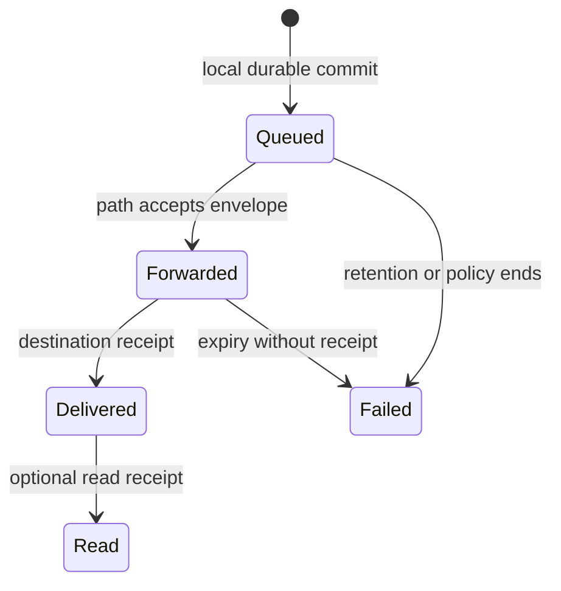
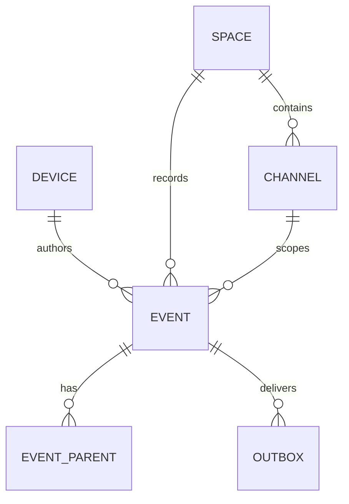

# Local data model and lifecycle

**Status:** logical schema proposal. SQLite table definitions and migrations are versioned in code; source `spec.md` contains an illustrative draft. Core IDs: LAT-002–004/011–012, MSG-001–011, FIL-001–007.

## Ownership

| Store | Durable contents | Authority |
| --- | --- | --- |
| `events` | Exact canonical accepted event bytes and IDs | Immutable validated log |
| `event_parents`, `sync_state` | Causal edges, contiguous per-author ranges, gaps, snapshot floor | Repair/validation metadata |
| `spaces`, `members`, `channels`, `messages`, `reactions` | Indexed query projections | Rebuildable from accepted history and MLS/policy state |
| `outbox` | Locally owned unsent/forwarded encrypted envelopes and retry schedule | Sender-local delivery queue |
| `courier_queue` | Opaque third-party ciphertext, expiry/copy budget | Best-effort opt-in cache |
| `files`, `chunks` | Manifests, path/bitmap, integrity state | Content-addressed transfers |
| `relay_state`, `routes`, `peers` | User relay settings, cursor and path hints | Local hints, not global presence |
| Secure storage | Private signing/DH/MLS material and local wrapping secret | Platform-protected installation state |

## Constraints and transitions

`event_id` is the primary dedupe key. `(author_id, author_seq)` is unique for a valid author stream; the same pair with a different event hash is a fork/error, not an overwrite. `space_id` is random and independent of name. Parent references and MLS epoch are explicit dependencies. Wall time is for display/audit hints; deterministic render order uses logical time and stable ties, not authorization.

On remote receive: parse bounded frame → authenticate envelope/session → decode canonical event → check ID/signature/MLS/policy/causal parents → commit event, summary and projection atomically → enqueue receipts. Missing epoch/parent is stored in a bounded pending area and requested; a bad signature is rejected. Crash before commit changes no visible projection. MLS-state persistence requires an atomic transaction or recoverable journal with explicit crash tests.

## Retention and compaction

Locally authored history may be retained according to Space/user settings such as ephemeral/7/30/90 days/forever, subject to key availability and device space. Courier TTL and byte quotas are separate and always bounded. Presence/typing are expiring soft state. Deleting visible content creates a tombstone; malicious peers may retain prior bytes. Signed snapshots must prove lineage and retain enough dependencies to validate policy; ADR-004 fixes exact trust/compaction semantics. If no peer retains missing content, show irrecoverable gap instead of silently declaring full sync.

At-rest protection encrypts keys and selected sensitive blobs with platform-wrapped secrets. Indexes/timestamps may remain plaintext for queries, and privacy documentation must list them. Search indexes must be purged/rebuilt on key reset or retention expiry. Schema migrations preserve canonical historical bytes and are tested against the previous stable version. File export sanitizes path and content names.

## Logical entities and relationships

This diagram is a local query schema, not a global centralized database. An event can be a Space operation without a channel. A pending invalid or incomplete object lives outside the accepted event projection until prerequisites pass. `author_seq` must be atomic with creation to avoid reuse after crash. Cryptographic canonical bytes are stored exactly as received/created; adding an index or migrating a SQLite table does not recode old signed bytes.

## Transactional workflows

**Authoring:** reserve next per-device sequence and Lamport value, encode/protect/sign, insert event, update projection and outbox within one durable transaction; expose event ID after commit. If signing/MLS state requires external secure storage, use a recoverable journal/idempotent protocol and test interrupted states.

**Receiving:** validate frame size and canonical event before projection; if prerequisites missing, put a bounded pending reference and request dependencies. Once valid, insert canonical bytes and parent edges, advance contiguous/gap summary, update derived tables and queue receipts atomically. Duplicate event ID is no-op except transport acknowledgments. Same `(author,seq)` with different event bytes is not merged.

**MLS change:** secure group-state commit, associated membership event and outbox need a crash-consistent protocol. A database transaction alone may not cover platform key storage or an external MLS library; recovery must know whether the epoch was committed and whether Welcome was sent. Never project a new member solely because a row or a relay event exists.

**Attachment:** write received chunk to temporary location with quota; flush and hash; atomically mark bitmap; after whole-file hash, expose export. If a crash occurs before bitmap commit, discard/reverify the fragment. Sanitized export path is independent of untrusted sender filename.

## Suggested indexes and quotas

Primary uniqueness: `events(event_id)` and `(author_id, author_seq)` with fork-detection handling. Queries need `(space_id, channel_id, lamport, author_id, author_seq)`; parent lookup and `outbox(next_attempt_ms)` indexes; `files(file_hash)` and chunk bitmap; scope-specific sync range indexes. Define max body, parent count, pending bytes, courier bytes, file size and search-index budget in the final protocol/config; do not infer safe limits solely from SQLite's capacity. Queue eviction order favors volatile presence/optional prefetch before locally authored events. Storage-full is an explicit error, never silent loss of newly sent content.

## Snapshot and privacy consequences

A snapshot records provenance, included event frontier and policy/MLS epoch binding; replicas need a way to detect incompatible history. Retention can prune old ciphertext only after the trust/compaction rules in ADR-004 are accepted and advertised to peers. A local full-text index contains sensitive decrypted terms unless specifically encrypted or protected; diagnostics and backups must not inadvertently include it. Exports include a content/metadata warning and avoid copying private keys by default.
