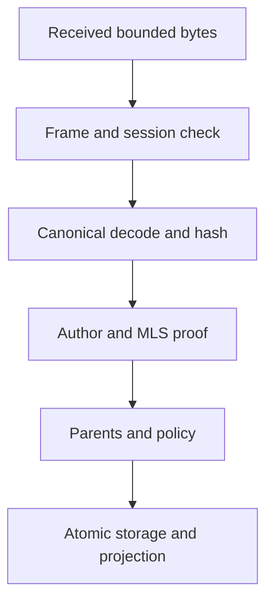

# Protocol profile and interoperability boundaries

**Status:** draft. `spec.md` contains longer examples; stable v1 wire bytes are not frozen. Bounded executable candidates cover canonical CBOR, event-ID hashing, local identity, and NIP-01/NIP-11 relay networking; see [`protocol/specs/00-overview.md`](../../protocol/specs/00-overview.md) and its vector file. These candidates are not an interoperability claim. Do not ship independent client implementations from this summary alone.

## Current executable candidate

The Rust workspace has bounded candidates for canonical CBOR, signed event framing, event authorization, protected OpenMLS state operations, signature-to-ciphertext binding, delivery envelopes, NIP-01/NIP-11 relay profile validation, a secure WebSocket relay client, and bounded direct TCP framing. These do not establish interoperable or end-to-end behavior: credential trust, durable reducer recovery, authenticated native path integration, two-relay interoperability, and app wiring remain incomplete.

## Layer map

| Layer | Object | Stable across paths? | Validation |
| --- | --- | --- | --- |
| Identity | Canonical public bundle, fingerprint | Yes | Signature/key binding and human verification |
| Application | Signed/MLS-protected event with causal parents | Yes | Canonical hash, auth, parent, epoch and policy |
| Delivery | Envelope ID, TTL, copy budget, destination hint | May change on re-envelope | Bound, expiry, replay and class checks |
| Link | BLE fragments, LAN frames, WebSocket relay events | No | Link session and framing checks |
| Media | Voice signaling events vs WebRTC media | Session-scoped | Space permission, ICE/DTLS-SRTP checks |

### Candidate event shape

```text
EventV1 { version, space_id?, channel_id?, author_device_id,
  author_seq, lamport, wall_time_hint, parents[], kind, flags,
  protected_body, authentication_context }
event_id = SHA-256("lattice:event:v1" || canonical_cbor(event_preimage))
```

The signed preimage/ID/signature order must be pinned before v1. An `author_seq` rollback or duplicate `(author,seq)` with distinct bytes is a validation error. Wall time cannot grant authority. Envelope ID may change after expiry or delivery-class change; event ID must not. An envelope does not prove a sender is authorized. Versioned CBOR profile uses integer keys, minimal encodings, duplicate-key rejection, no indefinite structures in hashed values, strict bounds and public vectors. [CBOR RFC 8949](https://www.rfc-editor.org/rfc/rfc8949) is a foundation, not Lattice's complete profile.

## Identity and invitation

Identity bundle candidate fields: Ed25519 verify key, X25519 DH key, version, creation hint and extensions; fingerprint is a domain-separated hash of exact canonical public bytes. Profile/name are separate signed events. Invite carries random Space ID, genesis hash, inviter proof, expiry, nonce/use policy, join policy and untrusted BLE/LAN/relay rendezvous hints. A human-verified contact pins full fingerprint. KeyPackage and Welcome delivery are separate authenticated steps.

## Transport handshakes and BLE

Nearby paths perform a reviewed Noise handshake with explicit pattern, prologue, transcript identity/version/capability/token binding and replay window. Advertising carries a generic service UUID and rotating app token, never static key or Space name. BLE GATT `control`, `rx`, `tx`, `capabilities`, and `upgrade` characteristics are candidates. Fragment after envelope encryption; per-peer aggregate reassembly bytes, object count, deadline, fragment count and pacing credits are mandatory. Adapter “queued to OS” is not remote receipt.

## Sync state

Per authorized scope, exchange `{author_id, contiguous_seq, gap_digest}`, recent-event summary, snapshot floor and capabilities. Request missing range/dependencies in bounded batches; authenticate all events before projection. MLS proposals/Commits and policy dependencies are requested before ciphertext needing those epochs. A Bloom/Golomb-type recent summary may have false positives, so a later exact reconciliation path must repair gaps. Never reveal unrelated Space membership merely by sending every known scope.

The Rust node exposes a one-shot authenticated direct-sync path over a caller-owned connected transport. Its fixed Noise prologue is `lattice:direct-sync:noise-xx:v1\0` (Noise XX, empty handshake payloads); no Noise-generated static key is treated as a Lattice identity. After Noise completes, each side sends a Noise-encrypted fixed-width 70-byte identity proof: `LIDP || 0x01 || role || Ed25519_signature`, where role is `1` for initiator and `2` for responder. The signature input is the exact concatenation `lattice:direct-sync-identity-proof:v1\0 || role || final_noise_handshake_hash[32] || initiator_bundle[65] || responder_bundle[65]`. The remote proof must verify with the caller's exact pinned Ed25519 key; the role and both byte-exact v1 identity bundles are bound to this session transcript.

Subsequent `LSYN` request/response frames are wholly encrypted with Snow's directional Noise transport state. Its sequential nonces reject replay/out-of-order packets; any transport authentication error poisons that state and the one-shot API returns an error without accepted events. The requester's and responder's callbacks must each authorize the exact peer/scope before planning or event-source access. An exact-hop receipt is not peer delivery.

`Client::with_pinned_identity` can load and revalidate the exact persisted pin before lending the live local `DeviceIdentity` to an async operation; it does not export private bytes or prove how a pin was human-verified. The caller still supplies authorized summaries, event validation, and scope policy. Sync summaries/checkpoints and accepted events are not persisted by this exchange; MLS epoch, membership, and event permission checks remain the caller's responsibility. Each encrypted application frame is bounded to one Noise message (65,519 plaintext bytes maximum, further reduced by the adapter cap). Route planning is not connected to this already-selected adapter: `plan_forward` returns candidate `PathId`s but no adapter mapping, and its forwarding expiry/hop/copy inputs are not supplied by this session API.

## Membership and conflict

An MLS group has a linear epoch history. [MLS architecture §5.2](https://www.rfc-editor.org/rfc/rfc9750#section-5.2) describes peer delivery and simultaneous Commit strategies. [ADR-001](../decisions/ADR-001-membership-commit-conflicts.md) accepts fail-closed conflict handling and explicit new-group recovery; [ADR-002](../decisions/ADR-002-channel-read-semantics.md) makes channels policy-only. [`06-spaces.md`](../../protocol/specs/06-spaces.md) and [`07-permissions.md`](../../protocol/specs/07-permissions.md) specify candidate payload, causal and permission rules, and a candidate reducer exists. Credential trust, group-reference/membership proof, durable conflict recovery, and complete membership tests remain incomplete. Generic Lamport sorting is only for presentation; secure concurrent-admin operation is not enabled.

## Relay and files

Nostr is an optional opaque-envelope carrier defined by the local candidate [`13-relay.md`](../../protocol/specs/13-relay.md) and [ADR-003](../decisions/ADR-003-nostr-envelope-relay-profile.md). It uses NIP-01 kind `39001`, a relay-only key, an MLS-protected opaque mailbox tag, NIP-40 expiry, and bounded best-effort backfill; [`09-envelope.md`](../../protocol/specs/09-envelope.md) defines the carrier object. A bounded Rust `wss://` client now fetches compatible NIP-11 metadata, publishes only with a positive matching NIP-01 `OK`, and retrieves an exact mailbox filter. This implementation and its unit tests do not establish two-relay interoperability or app integration. [NIP-01](https://github.com/nostr-protocol/nips/blob/master/01.md) defines events/subscriptions, not Lattice authorization. Never claim NIP-17 or Bitchat interoperability from similar wrapping. File manifests/chunks have independent hashes and transfer quotas; general event relays are not file stores.

## Compatibility, error classes and vectors

Major version mismatch or unknown mandatory feature fails closed; compatible optional fields need explicit hashed-byte retention semantics. Minimum vectors: identity fingerprint; canonical message/admin event and ID; distinct envelope IDs carrying same event; malformed duplicate map key; author-sequence collision; signed invite; Noise transcript; MLS add/remove/competing Commit; fragment reassembly; sync gap; file chunk; relay wrap/unwrap; voice signaling authorization. Stable error classes: `PROTO_UNSUPPORTED`, `PROTO_MALFORMED`, `CRYPTO_AUTH_FAILED`, `CRYPTO_EPOCH_MISSING`, `POLICY_DENIED`, `POLICY_CONFLICT`, `ROUTE_UNAVAILABLE`, `ROUTE_EXPIRED`, `TRANSPORT_PERMISSION`, `TRANSPORT_UNSUPPORTED`, `STORAGE_FULL`, `STORAGE_CORRUPT`, `FILE_HASH_MISMATCH`, `VOICE_ICE_FAILED`, `VOICE_TURN_REQUIRED`.

References: [RFC 9420](https://www.rfc-editor.org/rfc/rfc9420), [RFC 9750](https://www.rfc-editor.org/rfc/rfc9750), [Noise](https://noiseprotocol.org/noise.html), [DTN RFC 4838](https://www.rfc-editor.org/rfc/rfc4838), [NIP-01](https://github.com/nostr-protocol/nips/blob/master/01.md), and [architecture.md](../architecture.md).

## Wire document decomposition and freeze order

| Versioned document | Must fix before a stable implementation |
| --- | --- |
| `00-overview` | Version/capability matrix, normative language and scopes |
| `01-identifiers`, `02-encoding` | Field widths, byte order/CBOR profile, domain strings, canonical hashes |
| `03-identity`, `04-sessions` | Identity bundle, credential verification, Noise pattern/prologue/replay |
| `05-events`, `06-spaces`, `07-permissions` | Signed event framing, Space/membership payloads, permission registry and causal conflicts; candidate specs exist, reducers remain incomplete |
| `08-mls`, `09-envelope`, `10-ble` | Group lifecycle/conflicts, delivery class/TTL/copy budget, fragmentation and GATT profile; MLS protected persistence is integrated, link profile remains candidate |
| `11-sync`, `12-routing` | Gap summaries, snapshots, path metrics, retry and courier rules |
| `13-relay`, `14-files`, `15-voice` | Candidate Nostr envelope/retrieval profile, manifest/chunks, room incarnation/signaling; bounded Rust relay networking exists, while app integration and independent-relay interoperability remain unimplemented |
| `16-versioning` | Required/optional feature bits, downgrade prevention and migration |

Before a document freezes, it must define maxima for strings, arrays, event bodies, parent lists, fragments, pending dependencies, and queue bytes, and include byte-exact positive and negative vectors. Candidate bounds are not proof of implementation conformance. A field marked “future” in the integrated spec does not silently become required for v1. No implementer may derive a byte limit from a UI placeholder or radio MTU alone.

## Validation pipeline with failure classes



If frame/canonical format is malformed, return `PROTO_MALFORMED` before large allocation. A valid ciphertext with an absent epoch is `CRYPTO_EPOCH_MISSING` and goes into a bounded pending queue, not the projection. Valid signature but absent permission yields `POLICY_DENIED`. Conflicting valid branches yield `POLICY_CONFLICT` under ADR-001. All accepted event IDs are idempotent, but a repeated author sequence with a different event ID is a protocol-security anomaly requiring quarantine/diagnostic evidence. Link session proof alone never proves an event body is acceptable to a Space.

## Space sync exchange

1. Authenticate a peer, negotiate protocol/capabilities and minimize disclosed Space intersection; refuse incompatible required features.
2. Exchange scope-specific summaries with contiguous per-author sequence, sparse gap digests and snapshot horizon.
3. Compute missing ranges and explicit dependency IDs; schedule MLS/policy before ordinary text, then files. Scope each request to permissions.
4. Choose a path by total delta and policy: BLE for compact summaries/control, eligible IP for bulk; cap each batch and memory footprint.
5. Verify each immutable object; perform atomic insert/projection; return summary/receipt. A failed batch object does not invalidate earlier accepted events but cannot leave a half-projected object.
6. Continue until exact ranges reconcile or report a retention/partition gap. A probabilistic recent-item filter never proves historical completeness.

## Courier and relay accounting

An envelope records delivery class, expiry, hop limit and copy budget; duplicate suppression uses envelope and event IDs at different layers. Binary spray may split budget between carriers, but the exact atomic transfer/ACK protocol must prevent both peers from each retaining the full budget after a disconnect. Retried author envelopes can be rewrapped after expiry without altering event ID. Public relay events are accepted only when inner Lattice content and its associated membership context validate. Outer Nostr key is a routing/publishing identity, not Space membership. A public relay cannot promise deletion, so security must not depend on expiration hints.

## Files and media boundaries

File manifests are authenticated event payloads; chunk bytes are verified against hashes before becoming available. Do not route large chunks through ordinary Nostr events by default. Voice signaling events must be associated with a current room incarnation and authorized member, while SDP/ICE and network candidates may leak IP/topology metadata to call participants; data-routing encryption does not make a call anonymous. Media uses WebRTC security and never inherits courier retention.
