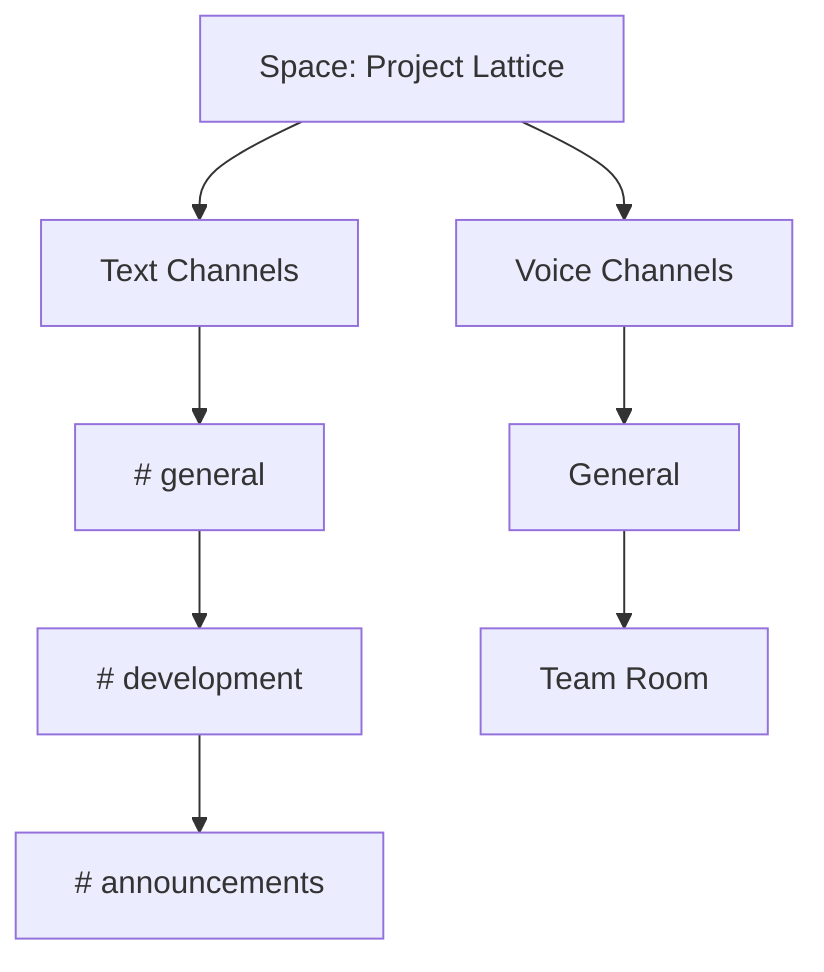
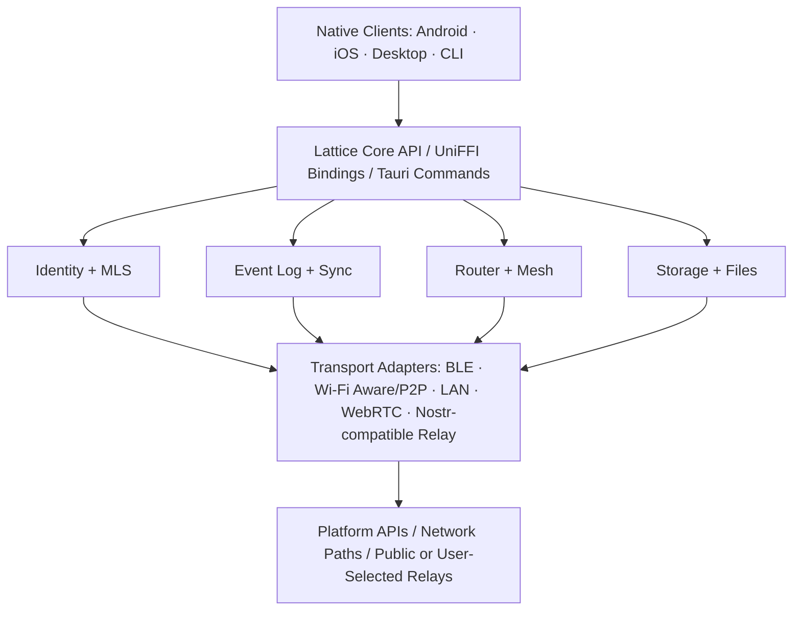
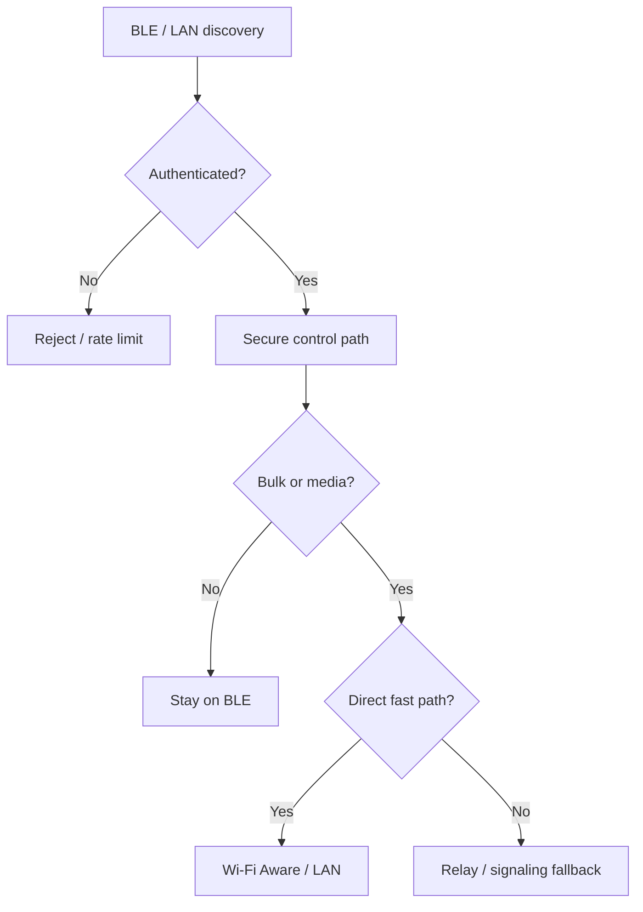
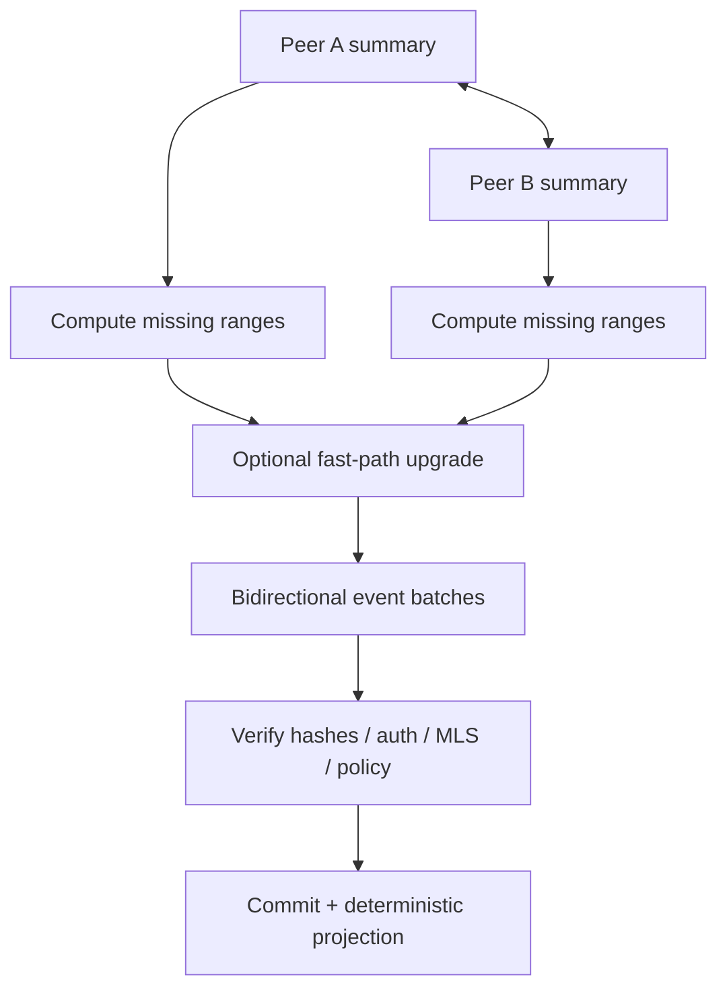
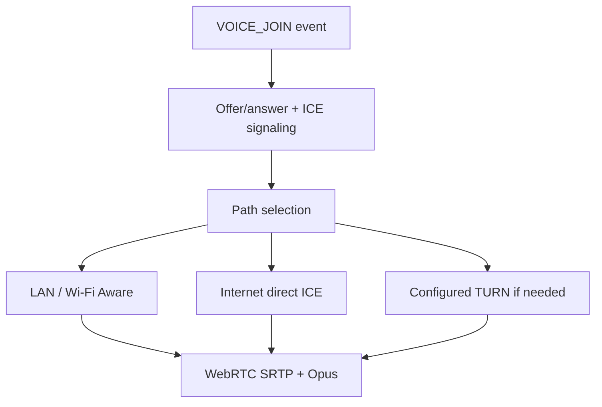
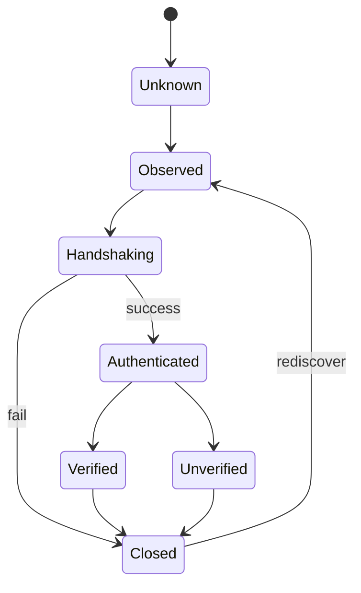
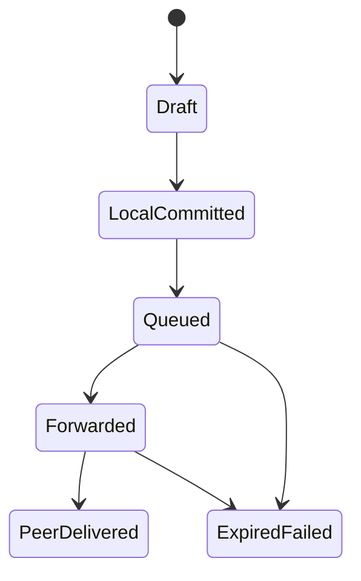

# Lattice: A Local-First, Serverless-by-Default Community Communication System

End-to-End Technical Specification, Protocol Architecture, Security Model, and Implementation Plan

**Lattice Project · Draft Specification v0.1 --- 23 September 2026 · Status: Research and Engineering Draft**

> **Source:** Full conversion of `lattice_spec.tex`.

## Abstract

This document specifies Lattice, a decentralized communication platform that presents a Discord-like model of spaces, text channels, direct messages, roles, permissions, and live voice channels while avoiding dependence on a project-operated cloud backend. Nearby devices communicate directly using Bluetooth Low Energy (BLE), Wi-Fi Aware, peer-to-peer Wi-Fi, and local IP networking. When direct reachability is unavailable but Internet access exists, clients may use user-selected or public decentralized relays, initially through a Nostr-compatible relay adapter. Message state is local-first: every client stores an authenticated event log, computes deterministic local projections, reconciles missing events opportunistically, and continues functioning during partitions. The mobile clients are native applications—Kotlin with Jetpack Compose on Android and Swift with SwiftUI on iOS—sharing a Rust implementation of the protocol, cryptography, synchronization, routing, and storage abstractions through generated Kotlin and Swift bindings. Desktop uses Tauri with the same Rust core, and a native Rust command-line client provides diagnostics, automation, and optional volunteer relay/node operation.

The specification separates application semantics from transport semantics. Text, metadata, membership updates, and synchronization events are signed and end-to-end protected above the transport layer; transports merely carry opaque envelopes. BLE is treated as a constrained discovery, control, and low-volume mesh medium, while Wi-Fi Aware, local IP, or direct WebRTC paths are preferred for high-throughput files and real-time media. Store-carry-forward forwarding draws on disruption-tolerant networking literature, using bounded replication rather than unbounded flooding. Group key establishment is based on Messaging Layer Security (MLS) rather than a bespoke group cryptosystem. Voice uses WebRTC and Opus with signaling carried by Lattice events; no guarantee of Internet voice reachability is made without a viable ICE path or an explicitly configured third-party/volunteer TURN path. The design deliberately records mobile-operating-system background restrictions as architectural constraints rather than assuming that a mobile process can remain continuously active.

**Keywords:** peer-to-peer communication, local-first software, Bluetooth Low Energy, Wi-Fi Aware, delay-tolerant networking, opportunistic routing, Nostr, WebRTC, Messaging Layer Security, Rust, Kotlin, Swift, Tauri

---
# Document Status, Scope, and Normative Language

## Purpose

This is an engineering specification rather than a marketing description. It defines the target behavior, internal boundaries, protocol objects, security assumptions, transport-selection rules, application model, repository layout, implementation milestones, and verification criteria for Lattice. It is intended to be sufficiently explicit that independent client implementations could be built without requiring access to a central Lattice service.

The document uses the key words **MUST**, **MUST NOT**, **SHOULD**, **SHOULD NOT**, and **MAY** in the sense of RFC 2119 and RFC 8174 when written in uppercase ([rfc2119](#ref-rfc2119); [rfc8174](#ref-rfc8174)). Statements labeled *design target* are objectives rather than measured performance claims. Statements labeled *future* are intentionally outside the first interoperable protocol version.

## Non-goals

Lattice is not designed to provide anonymous networking, guaranteed censorship resistance against a global adversary, guaranteed delivery in a permanently partitioned network, or unlimited Discord-scale voice conferences without infrastructure. It does not attempt to replace the Bluetooth Mesh Profile. It uses BLE links to construct an application-specific peer overlay suitable for phones and desktops. It also does not claim that a mobile operating system will permit continuous background scanning, advertising, or audio operation under all conditions.

## Design constraints

The system is constrained by four non-negotiable requirements:

1.  **No mandatory Lattice-operated backend.** Basic identity, spaces, channels, messages, and nearby communication must work without a vendor account or central database.

2.  **Transport independence.** Application state must survive a transport change from BLE to Wi-Fi to Internet relay and back without changing message identity or semantics.

3.  **Native mobile access.** Radio, audio, background-execution, power, and networking APIs are core product capabilities; therefore Android and iOS clients are native rather than React Native wrappers.

4.  **Local authority.** The local database and authenticated event log, not a cloud service, are the primary source of application state.

# Research Basis and Related Systems

## BitChat and dual-transport messaging

BitChat demonstrates a practical dual-transport model in which nearby peers form a BLE application mesh and distant peers may be reached using Nostr relays when Internet connectivity exists. Its 2026 whitepaper describes a common transport interface, BLE controlled flooding, store-and-forward couriers, and Nostr relay fallback ([bitchatwhitepaper](#ref-bitchatwhitepaper)). This architecture validates the broad feasibility of separating message routing from one fixed network path. Lattice adopts that architectural idea but expands the application semantics to persistent communities, role-controlled channels, replicated metadata, files, and live voice.

A relevant privacy lesson is that BitChat’s current whitepaper explicitly notes linkability created by stable identity material exposed in nearby announcements ([bitchatwhitepaper](#ref-bitchatwhitepaper)). Lattice therefore does not advertise the stable account/device public key or stable device identifier in BLE advertisements. Discovery uses rotating unlinkable tokens and performs authenticated identity binding only after an encrypted session is established.

## Delay- and disruption-tolerant networking

The Delay-Tolerant Networking (DTN) architecture describes a message-oriented overlay with persistent storage and store-and-forward behavior for networks where continuous end-to-end paths may not exist ([rfc4838](#ref-rfc4838)). This matches the reality of phone-to-phone local meshes: peers appear briefly, partitions are normal, and a message may need to be carried by an intermediate device until a later contact opportunity.

Epidemic routing showed that pairwise message exchanges can achieve eventual delivery in disconnected ad hoc networks but consume substantial replication resources ([vahdat2000](#ref-vahdat2000)). Spray-and-Wait subsequently bounded replication by limiting the number of message copies before entering a direct-delivery waiting phase ([spraywait](#ref-spraywait)). Lattice follows the latter principle: forwarding budgets are explicit, message priorities are distinct, and synchronization prefers compact set reconciliation over replaying every item to every neighbor.

## Local-first replication and CRDTs

Local-first software emphasizes offline availability, user-controlled local data, collaboration, and convergence without a permanently authoritative server ([localfirst](#ref-localfirst)). CRDT research provides conditions under which replicated state can converge despite unsynchronized updates ([shapiro2011](#ref-shapiro2011)). Lattice does not require every object to be implemented as a textbook CRDT. Instead, it uses an append-only authenticated event model, deterministic projection rules, monotonic identifiers, tombstones, and CRDT-like data types where those semantics are appropriate. Security-sensitive state such as membership and authorization additionally requires validity checks; convergence alone is insufficient.

## Nostr relays

Nostr’s base protocol defines signed events exchanged over WebSocket relays, with clients choosing one or more relays and no protocol-level requirement for one central server ([nip01](#ref-nip01)). Lattice uses a Nostr-compatible relay adapter as an optional Internet mailbox/bridge, but the Lattice protocol is not equivalent to Nostr. Relay operators are untrusted with respect to message confidentiality. The adapter carries already protected Lattice envelopes and is replaceable by future relay transports.

NIP-17 offers gift-wrapped encrypted direct messaging for Nostr and explicitly notes scaling limitations for larger groups ([nip17](#ref-nip17)); NIP-44 also documents the privacy and forward-secrecy limitations of simple relay-layer encrypted payloads ([nip44](#ref-nip44)). For this reason Lattice does not make NIP-44 its group security layer. MLS is used for space and group content encryption; relay wrapping is an outer delivery mechanism only.

## Group cryptography

RFC 9420 specifies Messaging Layer Security (MLS), an asynchronous group key-establishment protocol designed to provide forward secrecy and post-compromise security for groups ranging from two participants to large groups ([rfc9420](#ref-rfc9420)). MLS is a better foundation for channel/space membership epochs than a custom shared password or static group key. The baseline Lattice profile uses the mandatory-to-implement MLS 1.0 ciphersuite `MLS_128_DHKEMX25519_AES128GCM_SHA256_Ed25519`; alternative MLS suites may be negotiated only when every member advertises support.

## Real-time media

WebRTC is a suite of protocols for direct real-time communications and includes ICE-based path discovery, secure RTP media, congestion control, and optional TURN relaying where direct NAT traversal fails ([rfc8825](#ref-rfc8825)). Opus is standardized for interactive speech and audio applications, including VoIP and conferencing ([rfc6716](#ref-rfc6716)). Lattice uses WebRTC/Opus for voice, but carries signaling through its own event layer. BLE and Nostr are not used as media transports for continuous RTP audio.

# Product Model

## User-facing abstraction

The central user-visible object is a *Space*. A Space resembles a Discord server but has no required server process. It is a replicated cryptographic group whose members possess authenticated state and group key material.


<a id="fig-space-model"></a>



*Figure: Logical Space model. A Space is replicated state, not a cloud-hosted server.*


## Core feature set

The interoperable v1 feature set consists of:

- local cryptographic identity with optional human-readable profile;

- space creation, invite, join, leave, kick, ban, role assignment, and permission updates;

- text channels, announcement channels, direct messages, replies, edits, tombstone deletes, reactions, mentions, and threads;

- attachments with resumable chunk transfer and integrity verification;

- presence hints that are explicitly non-authoritative and expire quickly;

- nearby discovery, BLE application mesh forwarding, LAN discovery, and high-throughput direct transfer where supported;

- optional decentralized relay fallback for disconnected meshes;

- live voice channels using direct WebRTC media paths;

- local search and offline history subject to retention policy;

- Android, iOS, desktop, and command-line clients sharing one protocol core.

## Explicitly deferred features

Video calls, screen sharing, bots with remotely hosted execution, public discovery directories, cloud backups, federation with Matrix/ActivityPub, large-scale SFU conferencing, end-user programmable apps, and globally searchable public communities are not required for v1. Their future addition must not weaken the v1 transport and cryptographic boundaries.

# System Model and Terminology


<a id="tab-entities"></a>

**Table: Primary entities**

| **Entity** | **Definition** |
| --- | --- |
| Identity | A long-lived user/device cryptographic identity represented by a public verification key plus locally protected private material. |
| Device | One physical installation that participates in routing and synchronization. A future multi-device identity layer may bind multiple devices. |
| Peer | A currently or recently observed remote device. |
| Space | A replicated membership, authorization, channel, and content domain with an MLS group state. |
| Channel | A logical ordered view over a subset of Space events. Text and voice channels share authorization metadata but carry different runtime traffic. |
| Event | Immutable authenticated application state transition. Edits and deletes are new events rather than mutation of history. |
| Envelope | Transport-independent delivery object containing routing metadata, ciphertext, integrity information, expiry, and forwarding controls. |
| Transport | A carrier implementation: BLE, Wi-Fi Aware, local IP, WebRTC data channel, or Internet relay. |
| Relay | An untrusted Internet service that stores/forwards opaque envelopes. No relay is authoritative for Space state. |
| Courier | A peer temporarily storing an opaque envelope for later opportunistic forwarding. |
| Projection | Deterministic local materialization of event history into UI/application state. |


## Node states

A node can be simultaneously connected by multiple transports. Connectivity is therefore modeled as a set of paths rather than a single online/offline boolean. For a destination $d$, the router computes an ordered set $P_d = \{p_1, p_2, \ldots\}$ where each path has dynamic cost: $$C(p)=w_l L(p)+w_e E(p)+w_b B^{-1}(p)+w_m M(p)+w_r R(p),$$ where $L$ is estimated latency, $E$ energy cost, $B$ available bandwidth, $M$ metered-network penalty, and $R$ reliability/failure penalty. Weights depend on message class. Voice minimizes latency and jitter; background synchronization heavily penalizes energy and metered traffic.

# Top-Level Architecture


<a id="fig-architecture"></a>



*Figure: Layered architecture. Application events are independent of the path that carries them.*


## Boundary rules

The following boundaries are normative:

1.  UI code **MUST NOT** directly construct BLE GATT frames, Nostr events, MLS wire messages, or raw SQLite queries.

2.  Transport adapters **MUST NOT** interpret decrypted channel content. Their interface is opaque envelopes plus routing metadata.

3.  The router **MUST NOT** create application events. It decides paths, queues, replication budgets, and retries.

4.  Storage **MUST** preserve immutable event bytes and cryptographic provenance; projections may be rebuilt.

5.  Platform-specific code **SHOULD** be restricted to radio, secure-storage, audio/session, notification, and lifecycle adapters.

## Transport independence invariant

For any application event $e$ and any two transports $t_a$ and $t_b$, successful delivery over either transport must yield the same authenticated event identifier and projection result: $$\mathrm{Project}(\mathrm{Receive}_{t_a}(e)) = \mathrm{Project}(\mathrm{Receive}_{t_b}(e)).$$ No transport is allowed to rewrite message identifiers, author identity, MLS epoch, or application payload.

# Platform and Technology Stack

## Mobile applications

Android uses Kotlin and Jetpack Compose. Google identifies Compose as its recommended modern toolkit for native Android UI ([androidcompose](#ref-androidcompose)). iOS uses Swift and SwiftUI; Apple describes SwiftUI as the preferred approach for new Apple-platform applications ([swiftui](#ref-swiftui)). Native clients are selected because Lattice depends on low-level Bluetooth roles, Wi-Fi peer-to-peer APIs, background policy, audio routing, and platform-specific permissions.


<a id="tab-stack"></a>

**Table: Target implementation stack**

| **Layer** | **Technology** | **Role** |
| --- | --- | --- |
| Android UI | Kotlin + Jetpack Compose | Native screens, lifecycle, permissions, accessibility, foreground-service UX. |
| iOS UI | Swift + SwiftUI | Native screens, lifecycle, permissions, Core Bluetooth/Network integration, accessibility. |
| Shared protocol core | Rust | Event model, serialization, identity logic, MLS integration, routing, sync, queues, storage interfaces, validation. |
| Bindings | UniFFI | Generates Kotlin and Swift APIs for shared Rust business/protocol logic ([uniffi](#ref-uniffi)). |
| Desktop | Tauri v2 + React/TypeScript + Vite | OS webview UI with Rust core process; Tauri explicitly supports Rust/HTML webview architecture ([tauriarch](#ref-tauriarch)). |
| CLI | Rust + clap-style command layer | Headless client, diagnostics, identity, sync testing, relay/node operation. |
| JS tooling | Bun workspaces | Desktop frontend dependencies, generated design tokens, scripts; Bun supports monorepo workspaces ([bunworkspaces](#ref-bunworkspaces)). |
| Rust tooling | Cargo workspace | Shared lockfile/build outputs for protocol crates and native binaries ([cargoworkspaces](#ref-cargoworkspaces)). |
| Task orchestration | Turborepo + root scripts | Orchestrates JS/codegen/native wrapper tasks; native compilation remains Gradle/Xcode/Cargo. |


## Why no React Native mobile client

React Native could technically bridge the required APIs, but the network layer is the core product. Native Kotlin/Swift avoids a permanent abstraction mismatch around BLE central/peripheral behavior, foreground/background policy, Wi-Fi Aware entitlements, peer-to-peer Wi-Fi, WebRTC audio devices, and rapidly evolving OS APIs. Rust still prevents duplication of protocol semantics.

## Rust foreign-function interface

UniFFI supports generated Kotlin and Swift bindings from a Rust component interface ([uniffi](#ref-uniffi)). The FFI surface **SHOULD** expose coarse asynchronous operations rather than high-frequency packet callbacks. For example, the UI calls `send_message`, `join_space`, or `observe_channel`; platform transport adapters call Rust with received byte buffers, while Rust emits batched actions and state changes.


```c
interface LatticeCore {
    IdentityInfo identity();
    SpaceId create_space(SpaceConfig config);
    void import_invite(byte[] invite);
    EventId send_message(ChannelId channel, MessageDraft draft);
    void ingest_envelope(TransportId transport, byte[] envelope);
    RoutePlan plan_delivery(EnvelopeMeta meta);
    SyncPlan reconcile(PeerSummary remote);
    Subscription observe_events(EventFilter filter);
};
```

*Listing: Conceptual shared-core interface; exact syntax is illustrative.*


## Desktop

Tauri’s model places a Rust core process behind OS WebViews and exposes commands/events to the frontend ([tauricommands](#ref-tauricommands)). The desktop app therefore embeds the same Rust crates directly, rather than talking to a local HTTP daemon. React/TypeScript is used only for presentation. Vite is preferred because Tauri recommends SPA/static frontends and specifically recommends Vite for common JavaScript frameworks ([taurifrontend](#ref-taurifrontend)).

## Command-line client

The CLI is native Rust so it can use the same core crates without an additional JavaScript-to-Rust bridge. Bun remains the JavaScript workspace tool; it is not required for executing the production CLI binary. Representative commands are defined in [tab:cli](#tab-cli).


<a id="tab-cli"></a>

**Table: Representative CLI surface**

| **Command** | **Purpose** |
| --- | --- |
| `lattice identity show` | Display fingerprint, device ID, capabilities, and verification code. |
| `lattice peer scan` | Observe nearby peers and transport capabilities for debugging. |
| `lattice space create/join/leave` | Operate Space membership without a graphical client. |
| `lattice send` | Send text or an attachment to a channel/DM. |
| `lattice sync status` | Print event-log gaps, vector summaries, queue depth, and reconciliation state. |
| `lattice relay add/list/test` | Configure and test user-selected Internet relays. |
| `lattice node run` | Run a persistent desktop/server-class peer that participates in store-forward routing. |
| `lattice doctor` | Validate database, keys, transport permissions, clock quality, and protocol compatibility. |


# Transport Architecture

## Transport classes

Lattice treats a transport as a capability-bearing carrier, not as part of application identity. Every adapter implements the conceptual interface in [lst:transport-interface](#lst-transport-interface).


<a id="lst-transport-interface"></a>

```c
trait Transport {
    fn id(&self) -> TransportId;
    fn capabilities(&self) -> TransportCapabilities;
    async fn start_discovery(&self, policy: DiscoveryPolicy) -> Result<()>;
    async fn stop_discovery(&self) -> Result<()>;
    async fn open_path(&self, peer: PeerHint) -> Result<PathHandle>;
    async fn send(&self, path: PathHandle, envelope: Bytes) -> Result<SendReceipt>;
    fn metrics(&self, path: PathHandle) -> PathMetrics;
    async fn close_path(&self, path: PathHandle) -> Result<()>;
}
```

*Listing: Conceptual transport interface.*


<a id="tab-transport-intent"></a>

**Table: Transport intent and restrictions**

| **Transport** | **Primary role** | **Good for** | **Not used for** |
| --- | --- | --- | --- |
| BLE | Discovery, control, low-volume mesh | peer discovery, handshakes, text events, ACKs, sync summaries, opportunistic forwarding | sustained voice, large file streaming, bulk history replay when a faster path exists |
| Wi-Fi Aware | Direct high-speed nearby IP path | attachments, bulk reconciliation, voice, low-latency data | global reach beyond radio range |
| Wi-Fi Direct / peer-to-peer Wi-Fi | High-speed compatibility path | attachments, local media, direct socket transport | discovery on platforms where the OS restricts third-party control |
| LAN | Same-network direct path | sync, files, voice, desktop/mobile connectivity | disconnected/off-LAN delivery |
| WebRTC | Real-time media/data path | voice and optional direct data channel | persistent mailbox/store-and-forward |
| Nostr-compatible relay | Optional Internet fallback | encrypted event mailbox, cross-mesh signaling, delayed delivery | trusted state, plaintext content, continuous audio transport |


## Android Wi-Fi Aware

Android exposes Wi-Fi Aware (Neighbor Awareness Networking) on Android 8.0 / API level 26 and later when supported by device hardware. The platform can discover nearby services and establish a bidirectional network path without an access point; Android’s documentation explicitly positions the data path as higher-throughput and longer-range than Bluetooth for larger transfers ([androidwifiaware](#ref-androidwifiaware)). Lattice therefore uses BLE for broad low-cost discovery and Wi-Fi Aware as a preferred escalation path when both peers advertise support.

The Android transport adapter **MUST** query feature support at runtime. Wi-Fi Aware availability is not assumed merely from OS version. On Android 13 and later, the optional instant-communication mode may reduce discovery/data-path setup time at increased power cost and is therefore reserved for explicit interactive actions such as joining a voice room or starting a file transfer ([androidwifiaware](#ref-androidwifiaware)).

## iOS Wi-Fi Aware and peer-to-peer Wi-Fi

Apple introduced its public Wi-Fi Aware framework in iOS 26. Apple documents support on iPhone 12 and later and selected recent iPads, with secure nearby discovery/pairing and high-throughput peer-to-peer connections without Internet or an access point ([applewifiaware](#ref-applewifiaware); [applewifiapi](#ref-applewifiapi)). The app requires the Wi-Fi Aware entitlement and declared publish/subscribe services ([appleawareadopt](#ref-appleawareadopt)).

Accordingly, the iOS implementation has three nearby IP paths:

1.  Wi-Fi Aware on supported iOS 26+ hardware;

2.  Network.framework peer-to-peer Wi-Fi for Apple-to-Apple fallback where appropriate; and

3.  ordinary LAN networking when both peers share an IP network.

Apple’s current migration guidance notes that peer-to-peer Wi-Fi must be explicitly enabled for relevant Network.framework connections and recommends considering Wi-Fi Aware for new use cases ([applenetworkp2p](#ref-applenetworkp2p)).

## Bluetooth Low Energy transport

BLE is present on essentially all target phones and remains the baseline nearby control path. The Bluetooth GATT model provides services, characteristics, reads/writes, notifications, and indications ([bluetoothgatt](#ref-bluetoothgatt)). Lattice peers expose an application-specific GATT service while capable of acting in both central/client and peripheral/server roles where the platform permits.

The BLE physical layer’s nominal radio rate is not equivalent to application throughput. Current Bluetooth specifications include LE 1M, optional LE 2M, and coded PHY variants with different trade-offs ([bluetooth63phy](#ref-bluetooth63phy)). The protocol therefore never hard-codes an assumed BLE throughput. Fragment size, connection interval, MTU, and write/notification strategy are negotiated per path.

### BLE service layout

The initial service contains the following logical characteristics:

- `control`: authenticated handshake/control frames;

- `rx`: write-with/without-response ingress selected by capability;

- `tx`: notification/indication egress;

- `capabilities`: compact transport/version descriptor;

- `upgrade`: parameters for negotiating Wi-Fi Aware/LAN/WebRTC escalation.

The exact 128-bit UUID allocation is generated once for the project and treated as wire protocol. Test UUIDs **MUST NOT** ship in release clients.

### Rotating discovery beacons

Advertising payloads **MUST NOT** contain a stable public key, nickname, Space identifier, or long-lived peer identifier. Instead each device periodically derives a discovery token: $$D_t = \operatorname{Trunc}_{128}(\operatorname{HMAC}_{K_d}(\lfloor t/W \rfloor \parallel r)),$$ where $K_d$ is a local discovery secret, $W$ is a rotation window, and $r$ is a boot/session randomizer. The token is used only to deduplicate observations within a short window. Stable identity is disclosed only inside an authenticated encrypted session.

For pre-established trusted peers, an optional private rendezvous token may be derived from a pairwise secret so that known contacts can recognize one another without exposing that relationship to unrelated scanners. This optimization is disabled until its privacy behavior is independently reviewed.

### Fragmentation and reassembly

Transport envelope bytes are fragmented after encryption. Each fragment contains a short connection-local header: protocol version, connection-local message handle, fragment index, fragment count, payload length, and flags. Cryptographic integrity belongs to the envelope/session layer; fragment headers exist for reassembly and flow control rather than end-to-end authenticity.

Reassembly buffers are strictly bounded by:

- maximum concurrent partial objects per peer;

- maximum aggregate buffered bytes;

- fragment deadline;

- declared envelope length validated before allocation; and

- per-peer rate limits.

These limits are required to prevent trivial memory-exhaustion attacks.

## LAN transport

LAN discovery uses mDNS/DNS-SD only for a generic Lattice service and ephemeral endpoint instance name. Identity exchange occurs after secure connection establishment. Once discovered, peers prefer QUIC or TCP depending on implementation maturity. The first interoperable release may use length-prefixed TLS/TCP because it is simpler to debug; a later QUIC adapter can add stream multiplexing and migration without changing application events.

## Relay transport

Relay connectivity is optional. The user may configure one or more Nostr relays; the application may ship a starter list only if it is clearly editable and not treated as a trusted service. NIP-01 defines signed Nostr events transmitted over WebSocket connections to relays ([nip01](#ref-nip01)). Lattice wraps its own encrypted envelope inside a relay event and treats relay acceptance as transport acknowledgement, not message-read acknowledgement.

Because Nostr event-kind assignment is a shared interoperability namespace, the prototype Lattice group-envelope kind is deliberately configurable and **is not claimed as a standardized Nostr allocation**. Before a public stable release, the project **SHOULD** either register/publish an appropriate NIP/profile or use a relay protocol namespace that does not risk colliding with unrelated clients.

### Relay privacy

A relay can observe the client IP address, connection timing, event size, and whichever outer tags are necessary for retrieval. The relay **MUST NOT** receive plaintext Space content or MLS secrets. The product UI **SHOULD** communicate that “end-to-end encrypted” does not mean “metadata anonymous.” Optional proxy/Tor support may be implemented later, but this specification does not claim anonymity.

## Transport escalation

A path begins with the cheapest available discovery mechanism and upgrades when the payload or interaction warrants it.


<a id="fig-transport-escalation"></a>



*Figure: Transport escalation. Relay fallback applies only when Internet exists and policy permits it.*


# Mobile Operating-System Constraints

## Android permissions and background operation

Android 12+ uses the runtime `BLUETOOTH_SCAN`, `BLUETOOTH_ADVERTISE`, and `BLUETOOTH_CONNECT` permissions for the corresponding Bluetooth operations ([androidbtpermissions](#ref-androidbtpermissions)). Long-lived connected-device work may use the connected-device foreground-service type when platform requirements are satisfied ([androidfgs](#ref-androidfgs)). However, Android restricts starting foreground services from the background on modern releases ([androidfgsrestrictions](#ref-androidfgsrestrictions)). Therefore Lattice cannot promise that an app killed or heavily restricted by the OS behaves as an always-on router.

The Android UI **MUST** expose a clear “Mesh availability” status. If the user enables an explicit persistent mesh mode, the app may run a user-visible foreground service. Silent battery-draining background persistence is forbidden by product policy.

## iOS Bluetooth background behavior

iOS supports Core Bluetooth background modes for central and peripheral roles but modifies scanning and advertising behavior to conserve energy. Background scans may be coalesced and slowed; background advertising may omit local names and place service UUIDs in an overflow area discoverable only by explicit scans ([applebtbackground](#ref-applebtbackground)). Apple also documents additional iOS 26 behavior that can allow certain Core Bluetooth activity while a Live Activity is active ([applecorebluetooth](#ref-applecorebluetooth)). Lattice treats these as conditional platform capabilities rather than an assumption of continuous radio execution.

## Correct user expectation

“Serverless” means that no project server is required for correctness. It does not mean every phone is guaranteed to be an always-on server. When all relevant mobile peers are suspended, no local forwarding occurs until a peer is permitted to run again. Persistent desktop/CLI nodes can improve availability without becoming authoritative.

# Identity and Trust

## Identity layers

The first stable release uses a device identity as the cryptographic root. A future user-level identity may bind multiple devices, but v1 avoids pretending that multi-device revocation and recovery are solved by a cloud account.

Each installation creates:

- an Ed25519 signing key pair $K_{sig}$ for long-term device assertions;

- an X25519 static key pair $K_{dh}$ for pairwise Noise-style authenticated key agreement;

- one or more MLS leaf/key-package key sets managed by the MLS library; and

- a random local database-encryption/root-wrapping secret.

The displayed device fingerprint is the SHA-256 digest of a canonical identity public-key bundle, encoded in a human-verifiable format. Short identifiers used in UI are never sufficient for authentication.

## Secure key storage

The implementation **MUST** use platform secure-storage APIs. On iOS, sensitive key material is stored in Keychain with the strongest device-only accessibility compatible with required background behavior. On Android, a hardware-backed Keystore key is used where available to wrap application secret material. Because algorithm/hardware support varies by device, the specification does not require that the Ed25519 scalar itself live inside a secure element. The adapter reports whether storage is hardware-backed, software-backed, or unavailable.

## Pairwise session establishment

Pairwise control sessions use a reviewed Noise Framework implementation rather than a custom Diffie-Hellman transcript. Noise describes authenticated handshake patterns based on Diffie-Hellman operations and symmetric transcript hashing ([noise](#ref-noise)). The initial contact profile uses a mutually authenticating pattern appropriate to previously unknown static keys; after a peer is verified/pinned, a known-key pattern may reduce round trips.

The handshake transcript binds:

- protocol major/minor version;

- both static identity bundles;

- current rotating discovery tokens;

- supported transports and feature bits;

- a random session nonce; and

- optional invitation/Space context when joining.

Downgrade to an unsupported or weaker protocol profile must fail closed.

## Human verification

Users may verify a peer by scanning a QR code or comparing a short authentication string derived from both identity fingerprints and the current session transcript. A verified relationship pins the full fingerprint, not the nickname. Nicknames are presentation metadata and are never trusted authentication labels.

## Key rotation and reset

Device identity rotation is an explicit high-impact action. If a device loses its root key, it is a new cryptographic identity unless another authorized Space member adds the new device. There is no central password reset. The application may export an encrypted recovery package, but recovery is user-controlled and never silently uploaded by the protocol.

# Spaces, Membership, Roles, and Permissions

## Space genesis

A Space begins with a signed genesis event containing:

- random 256-bit `space_id`;

- protocol version and feature requirements;

- creator identity fingerprint;

- initial metadata and channel set;

- initial permission policy;

- initial MLS group parameters; and

- genesis timestamp and random nonce.

The `space_id` is random and is not derived from the human-readable name, preventing collisions between identically named Spaces.

## Membership

Space membership is cryptographic. Joining requires an invitation or an authenticated Add operation authorized under the current policy. An invitation contains enough information to locate existing peers/relays, verify the Space genesis fingerprint, and present an MLS key package or join request. Invitations may be encoded as QR, deep link, or file; they **MUST NOT** embed reusable administrator private keys.

Each non-last-resort `KeyPackage` is one-use. A device records its suite-defined MLS reference and expiry alongside the protected OpenMLS private bundle; an accepted Welcome consumes the matching inventory entry in the same transaction as group import. Failed or rejected Welcomes do not consume the package. Expired packages leave available inventory; a package whose delivery is lost can be explicitly discarded, deleting its private bundle and marking the record lost so a fresh package can be issued immediately. Callers advertise only fresh packages. Implementations MUST reject reuse after consumption and MUST NOT count expired or lost entries toward replenishment.

## MLS epoch as membership-security epoch

Each membership change that affects confidentiality produces a new MLS epoch. Removed members do not receive the new epoch secret. RFC 9420 specifies asynchronous group key establishment with forward secrecy and post-compromise security properties when correctly used ([rfc9420](#ref-rfc9420)). Application roles and channel permissions remain separate authorization metadata layered above MLS: cryptographic membership answers “is this device in the Space cryptographic group?” while permissions answer “may this member perform this operation?”

## Roles

A Space supports built-in `owner`, `admin`, `moderator`, and `member` roles plus custom roles. Permissions are capability-like bits such as:

- manage space, manage channels, manage roles;

- invite members, remove members, ban identities;

- send messages, send attachments, create threads;

- mention everyone/roles;

- join/speak/mute in voice channels;

- pin messages, moderate messages; and

- alter retention settings.

A channel may override a subset of Space defaults.

## Authorization events

Every privileged mutation carries the author’s identity, causal parent(s), required permission, and signature/MLS authentication. A node validates authorization against the policy projection immediately before the event’s causal context. Invalid events remain optionally quarantined for diagnostics but never enter the valid projection.

Membership and security-sensitive actions use an authenticated causal policy and the current MLS epoch; they never use last-writer-wins to select a branch:

- a commit based on a missing parent remains pending; an invalid commit is rejected;

- a valid commit based on a non-current branch is retained as conflict evidence but not applied; competing valid successors mark the Space conflicted, with no selection by timestamp, hash, arrival, or role; and

- conflict blocks membership and authorization-sensitive mutation until an explicitly invited new MLS generation is established by a currently verified administrator. Recovery does not merge conflicting state, reissue old Welcome messages, or claim to restore omitted history.

Ordinary non-security metadata may use deterministic logical ordering. The accepted [ADR-001](decisions/ADR-001-membership-commit-conflicts.md) profile intentionally sacrifices availability during membership conflicts rather than guessing a winner.

## Bans

A ban targets an identity fingerprint and optionally a set of known device keys. A banned member is removed from the MLS group and therefore should not receive future epoch secrets. Because the network is decentralized, a malicious former member can retain ciphertext and plaintext already obtained before removal. Revocation is prospective, not retroactive erasure.

# Application Event Model

## Immutable events

Every meaningful mutation is an immutable event. A simplified logical schema is shown below; the on-wire representation uses deterministic CBOR rather than JSON.


```c
Event {
  wire_version: u16,
  event_id: Hash256,
  space_id: Option<Hash256>,
  channel_id: Option<Hash256>,
  author_id: Hash256,
  author_seq: u64,
  lamport: u64,
  wall_time_ms: i64,
  parents: Vec<Hash256>,
  kind: EventKind,
  flags: u32,
  encrypted_body: Bytes,
  auth: AuthProof,
}
```

*Listing: Logical event schema.*


## Event identifiers

`event_id` is the SHA-256 digest of the deterministic canonical encoded event preimage excluding the digest field itself. The digest commits to author, sequence, causal parents, kind, and encrypted body. Transport framing is not part of the event ID.

## Logical time

Wall-clock timestamps are retained for user display but are not trusted for uniqueness or security ordering. Each author maintains a monotonically increasing local sequence. A Lamport clock provides a deterministic partial-order extension for UI ordering. Causal parents capture explicit reply/state dependencies.

For two events $a$ and $b$, the stable display order is computed from: $$O(e)=(e.\mathrm{lamport}, e.\mathrm{author\_id}, e.\mathrm{author\_seq}, e.\mathrm{event\_id}),$$ which gives a total deterministic order without claiming that it reflects exact physical time.

## Event kinds


<a id="tab-event-kinds"></a>

**Table: Representative event kinds**

| **Kind** | **Scope** | **Meaning** |
| --- | --- | --- |
| `SPACE_GENESIS` | Space | Creates immutable root metadata and initial owner. |
| `SPACE_META` | Space | Updates name, description, icon reference, defaults. |
| `MEMBER_ADD` | Space | Adds authenticated member and MLS linkage. |
| `MEMBER_REMOVE` | Space | Removes member; paired with MLS epoch transition. |
| `ROLE_DEFINE` | Space | Creates/updates role permissions. |
| `ROLE_ASSIGN` | Space | Assigns/revokes member roles. |
| `CHANNEL_CREATE` | Space | Creates a text/voice/announcement channel. |
| `CHANNEL_META` | Channel | Updates channel name/topic/permission override. |
| `MESSAGE` | Channel/DM | Creates message content. |
| `MESSAGE_EDIT` | Channel/DM | Replaces displayed body while retaining original event. |
| `MESSAGE_DELETE` | Channel/DM | Tombstones message in normal projections. |
| `REACTION` | Message | Adds/removes emoji reaction as an OR-set-like element. |
| `THREAD_OPEN` | Message | Creates a thread anchored to an event. |
| `PIN` | Channel | Adds/removes pinned reference. |
| `FILE_MANIFEST` | Channel/DM | Announces content-addressed attachment metadata. |
| `VOICE_STATE` | Voice | Short-lived join/leave/mute/session signaling state. |
| `KEY_PACKAGE` | Security | Distributes MLS join material. |
| `POLICY_RESOLVE` | Space | Resolves explicit authorization conflict. |


## Deterministic encoding

Wire objects use deterministic CBOR. Fields have numeric keys in stable protocol definitions. Encoders **MUST** reject duplicate map keys and non-canonical encodings for objects whose bytes are hashed or signed. Unknown optional fields are preserved or safely ignored according to feature/version rules; unknown required feature bits cause refusal to process the object.

# End-to-End Encryption Model

## Layering

Lattice uses layered encryption:

1.  **Link/session protection**: protects control traffic on an individual direct path using an authenticated Noise-style session or OS-protected Wi-Fi link plus an app session.

2.  **Application/group protection**: protects Space and DM content using MLS-derived keys independent of path.

3.  **At-rest protection**: encrypts local secret/key material and sensitive cached payloads using device-local storage keys.

A relay or courier receives only application ciphertext and routing metadata required for forwarding.

## MLS profile

The initial profile implements MLS 1.0 and its mandatory ciphersuite `0x0001` (`MLS_128_DHKEMX25519_AES128GCM_SHA256_Ed25519`) ([rfc9420](#ref-rfc9420)). Support for ciphersuite `0x0003` (ChaCha20-Poly1305 with X25519 and Ed25519) may be added for devices where it has a performance advantage, but groups choose one suite according to advertised capabilities.

## Channel key separation

A Space MLS epoch yields exporter material. Lattice derives channel-specific application secrets with domain-separated HKDF labels so compromise of an implementation bug in one channel does not intentionally reuse raw key material in another channel. Derivation includes `space_id`, `channel_id`, MLS epoch, and purpose label. This is an application profile on top of the MLS exporter API; it must follow MLS exporter requirements and be covered by test vectors.

## Direct messages

A DM is represented as a minimal two-member encrypted group, allowing the same event and rekey machinery as Space messaging. For initial implementation simplicity, pairwise direct messages may use a two-member MLS group. Future use of a dedicated Double Ratchet profile is an interoperability-breaking security decision and therefore requires a protocol extension rather than an internal swap.

## Metadata limits

E2EE hides content from relays and couriers but does not automatically hide radio presence, IP address, packet timing, packet size, or every routing identifier. Padding buckets may reduce length leakage for small control/message envelopes, but the protocol does not claim strong traffic-flow confidentiality.

# Mesh Routing and Store-Carry-Forward

## Routing goals

Nearby networking must survive intermittent links without turning every phone into an unbounded packet amplifier. The mesh layer optimizes for: bounded energy usage, eventual progress when contact opportunities exist, low duplicate traffic, safe persistence of ciphertext, and rapid use of better direct paths when available.

## Envelope header

A transport-independent envelope contains only information required for routing and expiry. The exact binary field widths are fixed by the protocol schema.


```c
Envelope {
  version: u16,
  envelope_id: Hash128,
  class: DeliveryClass,
  source_hint: EphemeralPeerId,
  destination: DestinationSelector,
  created_bucket: u32,
  expiry_bucket: u32,
  hop_limit: u8,
  copy_budget: u8,
  flags: u16,
  payload_type: u16,
  payload: Bytes,        // already E2EE/application-protected
}
```

*Listing: Logical envelope structure.*


Stable identity is intentionally absent from the generic routing header unless an encrypted payload or authenticated direct session requires it.

## Delivery classes


<a id="tab-delivery-classes"></a>

**Table: Delivery classes and scheduler intent**

| **Class** | **Persistence** | **Typical TTL** | **Examples** |
| --- | --- | --- | --- |
| Control-critical | short | seconds/minutes | handshake state, membership commit, ACK, key package request |
| Interactive | bounded | minutes/hours | new text messages, reactions, read-local delivery receipts |
| Deferred | persistent | hours/days | offline DMs, missed channel events, invite responses |
| Bulk-sync | resumable | policy-bound | history reconciliation batches, file manifests |
| Ephemeral-presence | none/short | seconds | typing, presence, voice join state |
| Media | never store-forward | session lifetime | RTP/SRTP voice packets |


Actual retention values are user/Space policy and are not protocol constants except for strict upper bounds protecting storage.

## Controlled forwarding

Broadcast-like live channel events may use controlled flooding inside a nearby connected component, but duplicate suppression and hop limits are mandatory. Unicast/deferred delivery uses a bounded copy budget inspired by Spray-and-Wait ([spraywait](#ref-spraywait)). A node never creates additional copies once the envelope budget is exhausted.

Let $B$ be an envelope’s remaining copy budget. On contact with an eligible courier, a binary-spray policy may allocate $$B_{remote}=\left\lfloor \frac{B}{2} \right\rfloor, \qquad B_{local}=B-B_{remote},$$ until each carrier has one copy and waits for a direct/stronger delivery opportunity. The exact policy can evolve behind a protocol capability because `copy_budget` is carried in the envelope.


```text
function consider_forward(envelope E, peer P):
    if expired(E) or seen_by(P, E.id): return SKIP
    if E.destination matches P: return DIRECT
    if E.class == MEDIA: return SKIP
    if E.hop_limit == 0: return SKIP
    if E.copy_budget <= 1: return WAIT
    if not policy_allows_courier(P, E): return SKIP
    if P.has_better_route_hint(E.destination) or contact_is_opportunistic(P):
        split_copy_budget(E)
        return FORWARD
    return WAIT
```

*Listing: Simplified forwarding decision pseudocode.*


## Duplicate suppression

Each node maintains:

- an exact recent-envelope-ID LRU set;

- a time-bucketed probabilistic summary for older IDs;

- per-peer recent acknowledgement summaries; and

- event-level deduplication in the immutable event store.

False positives in probabilistic summaries may delay forwarding but cannot delete the underlying event; later anti-entropy synchronization repairs omissions.

## Courier storage

Courier persistence stores only opaque encrypted envelopes. The courier does not become a member of the Space and does not receive MLS keys solely because it forwards traffic. Queues enforce per-origin, per-Space-hint, and global byte quotas. Expired or policy-disallowed envelopes are deleted without interpretation of plaintext.

## Routing loop prevention

Every forward decrements `hop_limit`; the envelope ID remains constant; and exact recent-ID caches prevent immediate loops. Source routes are not required in v1 because they expose topology and become stale rapidly. Path learning is local and opportunistic rather than a globally distributed routing table.

# Synchronization and Convergence

## Principle

Mesh forwarding delivers new events quickly; synchronization repairs history. These are separate mechanisms. A peer that was offline for a week should not rely on every historical event having been sprayed through BLE in real time.

## Author sequence vectors

Every author increments `author_seq`. A replica maintains a sparse version summary: $$V = \{(a, s_a)\},$$ where $s_a$ is the greatest contiguous sequence observed for author $a$. Gaps are tracked separately. Version summaries are scoped to a Space/channel and compressed before BLE exchange.

## Reconciliation phases

1.  **Capability exchange**: peers identify common wire version, Space intersections, and available fast paths without revealing unrelated Space membership.

2.  **Summary exchange**: peers compare compact per-Space/channel version summaries and recent-set digests.

3.  **Gap planning**: the core computes missing author sequence ranges and explicit event IDs.

4.  **Path upgrade**: if the delta is large, peers negotiate Wi-Fi Aware/LAN before bulk transfer.

5.  **Batch transfer**: missing immutable events are sent in bounded batches and validated before commit.

6.  **Projection**: deterministic reducers update materialized local state.

7.  **Confirmation**: peers exchange updated summary hashes, not per-event chat-level receipts.


<a id="fig-sync-flow"></a>



*Figure: Anti-entropy reconciliation flow.*


## Projection rules

Each materialized object declares a merge strategy:

- messages: append immutable creation, then deterministic edit/tombstone projection;

- reactions: observed-remove set semantics keyed by reactor, target event, and reaction value;

- pins: observed-remove set semantics;

- metadata: last-writer by logical ordering with explicit conflict marker where security-insensitive;

- membership/roles: authenticated policy state machine, never plain last-writer-wins;

- voice presence: expiring soft state, not durable convergence state.

CRDT theory motivates the use of commutative/monotonic structures where possible ([shapiro2011](#ref-shapiro2011)); however, the specification intentionally does not label authorization state a generic CRDT because validity depends on security policy.

## Snapshots and compaction

Immutable events can grow indefinitely. Clients therefore support signed local snapshots of materialized state plus a retained audit horizon. A snapshot never changes the canonical hash of existing events. Compaction may discard reconstructible old ciphertext only when Space retention policy permits and the user has been warned that a future peer may no longer be able to retrieve that history from this device.

## Clock anomalies

Wall-clock time can move backward, jump forward, or be malicious. Expiry decisions use monotonic elapsed time when possible during one runtime and clamp remote timestamps to reasonable display ranges. Authorization order never depends solely on remote wall time.

# Local Storage Model

## Database

Each client maintains a SQLite database for indexed local state. SQLite is chosen for transactional durability, mature cross-platform support, and efficient local queries. The Rust storage layer owns schema semantics; Android/iOS UI code does not issue ad hoc SQL against protocol tables.


<a id="tab-storage"></a>

**Table: Core local tables**

| **Table** | **Purpose** |
| --- | --- |
| `events` | Canonical immutable validated event bytes, hash, author, sequence, scope, kind, receive time. |
| `event_parents` | Causal edges and reply/state dependencies. |
| `spaces` | Materialized Space metadata and current MLS epoch pointer. |
| `members` | Materialized active member/role view. |
| `channels` | Materialized channel definitions and permission overrides. |
| `messages` | Query-optimized projection referencing canonical creation/edit/delete events. |
| `reactions` | Materialized reaction set. |
| `peers` | Observed peer capabilities, verification status, last contact, no plaintext secret keys. |
| `routes` | Ephemeral path metrics and last-known transport hints. |
| `outbox` | Locally authored encrypted envelopes awaiting eligible delivery. |
| `courier_queue` | Opaque third-party envelopes accepted for store-carry-forward. |
| `sync_state` | Version summaries, gap ranges, snapshot metadata. |
| `files` | Attachment manifest, content hash, local path, chunk bitmap, ownership/retention. |
| `relay_state` | User-selected relay endpoints, subscriptions, cursors, health metrics. |


## At-rest encryption

Private keys are never stored as unprotected SQLite fields. Sensitive payload blobs may be encrypted with a database/content key that is itself protected by platform secure storage. Platform file/data protection is used in addition to, not instead of, application key handling. The implementation must document exactly which records remain plaintext for indexing (for example, logical timestamps or local channel IDs) and must not advertise “fully encrypted database” unless it is actually true for the shipping build.

## Transactions

Receiving an event uses one atomic transaction:

1.  validate envelope and event bounds;

2.  validate event hash/authentication/MLS context;

3.  insert canonical event if absent;

4.  update gap/version state;

5.  apply deterministic projection; and

6.  enqueue any resulting acknowledgements/sync actions.

A crash before commit leaves no half-projected event.

## Retention

Retention policies can be `ephemeral`, `7d`, `30d`, `90d`, or `forever`, with a custom option. Space policy may establish defaults, but a device may retain less history if storage pressure requires it unless the user explicitly opts into archival-node behavior. Courier retention is always independently bounded.

# Messaging Semantics

## Text messages

A text message body supports UTF-8 text, mentions, reply reference, optional thread root, attachment references, and a constrained rich-text representation. Markdown-like presentation is allowed, but the wire format should represent semantic spans rather than store raw HTML.

## Edits

An edit references a prior message event and carries a replacement body. Only the original author, or a moderator exercising an explicit moderation capability, may create an effective edit. Moderator edits are visually distinguishable from author edits. All previous versions remain in the immutable log until retention/compaction permits removal.

## Deletes

User deletion creates a tombstone. A tombstone removes normal display of content but cannot recall copies already received, screenshots, exports, or maliciously retained plaintext. Moderator deletion carries a moderation reason code and follows the same cryptographic audit model.

## Reactions

Reactions are separate events. The UI aggregates current reaction state. Concurrent add/remove operations use element identifiers so synchronization order does not produce oscillating results.

## Replies and threads

Replies reference immutable event IDs. A thread is a logical channel-like projection rooted at an immutable message. Thread events still belong to the parent Space and inherit or override channel permission rules.

## Mentions

Mentions use stable identity/role identifiers in the encrypted payload, never parse display names as authorization targets. Local notification policy determines whether a mention produces a notification.

## Delivery state

The UI distinguishes:

- **queued**: stored locally but no eligible path confirmed;

- **forwarded**: at least one next hop or relay accepted an envelope;

- **delivered-to-device**: destination device acknowledged event receipt;

- **read-local**: destination client optionally emitted a read receipt according to user privacy settings.

“Forwarded” is never displayed as “read.” Read receipts are opt-in/Space-policy constrained and are end-to-end events.

## Typing and presence

Typing indicators and presence are lossy ephemeral events with very short expiry and no store-forward behavior. Presence means “observed recently” rather than “globally online.” A serverless partitioned system cannot know global presence with certainty.

# Files and Attachments

## Content-addressed manifests

Attachments are described by a signed/encrypted manifest containing filename, MIME hint, byte length, SHA-256 whole-file hash, chunk size, ordered chunk hashes, and optional thumbnail reference. File names are presentation metadata and are sanitized on export.

## Chunking

Files are chunked into fixed-size pieces selected by the implementation profile. A default around hundreds of kilobytes is suitable for direct high-throughput links, while the transfer layer may repack smaller BLE control fragments without changing the file chunk identity. Each chunk is independently hash-verified before being marked present.

## Transfer policy

1.  If a direct LAN/Wi-Fi Aware path exists, use it.

2.  Else if a direct WebRTC data channel is already available, it may carry chunks.

3.  Else if the file is small and user policy permits, BLE may carry it at low priority.

4.  Internet relay attachment transport is optional and must use an explicitly supported blob relay; ordinary Nostr event relays are not assumed to accept arbitrarily large files.

5.  Large files are never blindly replicated to couriers without explicit policy and quota.

## Resume

Peers exchange a compressed chunk bitmap/range set. Transfers can resume across different transports because chunks are content-addressed. A file started over BLE may continue over Wi-Fi Aware without restarting.

## Safety

Receiving a file does not imply opening or executing it. The UI displays type/size, scans where platform services permit, stores with non-executable permissions where applicable, and requires explicit user action for risky types. Preview decoders are considered untrusted attack surfaces and should run through platform-safe APIs.

# Voice Channels

## Architecture

Voice channels are persistent logical rooms but ephemeral media sessions. Channel membership/permissions are replicated in Space state; actual media is established only while participants are present.


<a id="fig-voice"></a>



*Figure: Voice signaling and media paths. BLE/Nostr may carry signaling, not continuous audio.*


## WebRTC profile

WebRTC requires secure media transport and uses ICE for candidate/path establishment; TURN can relay when a direct path cannot be established ([rfc8825](#ref-rfc8825)). Lattice uses application events for signaling instead of a central WebSocket signaling server. SDP/ICE material is encrypted to voice participants and may travel over BLE, LAN, or relay.

Audio uses Opus, which is standardized for interactive speech/audio and supports a broad range of interactive applications ([rfc6716](#ref-rfc6716)). Clients use platform echo cancellation, noise suppression, automatic gain control, audio focus/session APIs, and headset/Bluetooth routing where appropriate.

## No hidden central infrastructure

STUN does not carry media and can be user/community configured. TURN does carry media and is therefore infrastructure. Lattice may ship configuration hooks and allow community-operated TURN endpoints, but a project-operated TURN service is not a protocol requirement. When direct traversal fails and no TURN path is configured, Internet voice may fail; the UI must state that honestly.

## Group topology

Full-mesh WebRTC has per-client bandwidth/CPU cost that grows with participant count. v1 therefore targets small voice rooms and does not claim Discord-scale conferencing. A practical implementation should cap full-mesh sessions based on measured device capability and network conditions rather than a marketing number.

A future optional *peer media router* may let a desktop/CLI node volunteer as an ephemeral SFU-like forwarder. It is elected/configured by participants, is not authoritative, and can disappear without corrupting Space state. This feature requires a separate media-router protocol and security review.

## Voice permissions

Joining, speaking, muting others, and moving participants are authorization events or session controls validated against current Space policy. A moderator mute changes the session state but does not grant decryption of content the moderator could not otherwise receive.

## Voice privacy

All WebRTC media uses its required secure transport profile; additionally, where group-call topology allows, Lattice should use insertable/application E2EE techniques only after cross-platform native support and threat model are validated. The first release must not label group voice “end-to-end encrypted against every media relay” unless the implementation provides and audits that property.

# Native Android Application

## Responsibilities

The Android app is a thin native shell around shared protocol state, but “thin” does not mean passive. Android owns all Android-specific lifecycle, permission, notification, audio, radio, and foreground-service decisions. The Rust core never attempts to emulate Android lifecycle rules.

## Android module layout


```text
apps/android/
  app/
    src/main/java/dev/lattice/app/
      MainActivity.kt
      LatticeApplication.kt
      navigation/
      ui/
        onboarding/
        home/
        space/
        channel/
        voice/
        dm/
        settings/
        diagnostics/
      platform/
        bluetooth/
        wifiaware/
        wifidirect/
        lan/
        audio/
        notifications/
        foreground/
        securestorage/
      corebridge/
      accessibility/
    src/main/res/
    build.gradle.kts
  build.gradle.kts
  settings.gradle.kts
```

*Listing: Android application layout.*


## State flow

Rust emits coarse state streams through the binding layer. Kotlin converts them to `Flow` / immutable UI state, and Compose renders them. UI components never subscribe directly to individual radio callbacks. This prevents platform callback ordering from leaking into product logic.

## Persistent mesh mode

The default mode is power-conscious and opportunistic. If the user enables persistent nearby availability, Android may start an explicit connected-device foreground service with a persistent notification, subject to current Android restrictions ([androidfgs](#ref-androidfgs); [androidfgsrestrictions](#ref-androidfgsrestrictions)). The UI provides a one-tap disable action and an explanation of battery impact.

## Notifications

Notifications are generated locally from newly projected events. No push provider is required. Consequently, if Android fully suspends/kills the process and no permitted background path wakes it, new remote messages may not notify until the app or an eligible background component runs again. This is a product trade-off, not a bug to hide behind fake “instant” semantics.

# Native iOS Application

## Responsibilities

The iOS app uses SwiftUI for product screens and Swift/Objective-C-compatible adapters for Core Bluetooth, Network.framework, Wi-Fi Aware, background modes, local notifications, AVAudioSession, and secure storage. Apple documents SwiftUI as the preferred choice for new apps and supports integration with UIKit where lower-level control is necessary ([swiftuioverview](#ref-swiftuioverview)).

## iOS module layout


```text
apps/ios/
  Lattice/
    App/
      LatticeApp.swift
      AppDelegate.swift
      Navigation/
    UI/
      Onboarding/
      Home/
      Space/
      Channel/
      Voice/
      DM/
      Settings/
      Diagnostics/
    Platform/
      Bluetooth/
      WiFiAware/
      Network/
      Audio/
      Notifications/
      Background/
      SecureStorage/
    CoreBridge/
    Accessibility/
    Resources/
  Lattice.xcodeproj/
```

*Listing: iOS application layout.*


## Background limitations

Core Bluetooth background modes may wake an application for certain central/peripheral events, but Apple documents different scanning and advertising behavior in the background ([applebtbackground](#ref-applebtbackground)). Lattice therefore records a four-state availability indicator: `active`, `background-capable`, `limited`, and `suspended/unknown`. It does not promise that an iPhone behaves like a continuously powered mesh router.

## Wi-Fi Aware support tier

On iOS 26+ supported hardware, Wi-Fi Aware is the preferred cross-platform high-throughput nearby path. Apple lists iPhone 12 and later among supported devices ([applewifiaware](#ref-applewifiaware)). On older/unsupported devices, Lattice falls back to BLE, LAN, and Apple peer-to-peer paths where interoperable. Cross-platform Android–iOS behavior must be tested on physical hardware; simulator success is not accepted as an interoperability result.

# Desktop Application

## Role

The desktop application is not merely a large-screen chat client. Because desktop systems are more likely to remain powered and connected, a desktop can become a valuable non-authoritative synchronization peer, courier, LAN bridge, and optional volunteer relay/media node.

## Tauri architecture

Tauri uses an OS WebView for the UI and a Rust core process for native operations ([tauriarch](#ref-tauriarch); [tauriprocess](#ref-tauriprocess)). Lattice places all protocol/database/network authority in Rust. The TypeScript frontend receives serializable view models and sends commands. Secret key bytes are never exposed to the WebView JavaScript environment.


```text
apps/desktop/
  src/
    app/
    routes/
    components/
    features/
    stores/
    theme/
  src-tauri/
    src/
      main.rs
      commands/
      state/
      platform/
    capabilities/
    tauri.conf.json
    Cargo.toml
  vite.config.ts
  package.json
```

*Listing: Desktop layout.*


## Security boundary

Tauri command capabilities are allowlisted by window/context. The frontend cannot request arbitrary file access, shell execution, or raw private-key export. Commands return application-specific DTOs. Content Security Policy disables remote code execution from untrusted channel content.

# User Experience and Interaction Design

## Navigation model

The primary navigation is deliberately familiar:

- Space rail/list;

- channel list grouped by category;

- central message/voice view;

- member/peer panel on wider layouts;

- profile, network state, and settings surfaces.

Unlike Discord, connectivity status is a first-class UI concept because the transport may be local-only, relay-only, partitioned, or synchronizing.

## Connectivity indicator

Every channel header includes a compact status derived from actual routing state:


<a id="tab-connectivity-ui"></a>

**Table: Connectivity states presented to users**

| **State** | **Example label** | **Meaning** |
| --- | --- | --- |
| Direct local | Nearby | One or more relevant peers reachable directly by BLE/LAN/Wi-Fi. |
| Mesh | Mesh | Peers reachable through one or more nearby courier/mesh hops. |
| Internet relay | Relay | No direct path for some peers; encrypted envelopes are using configured relays. |
| Mixed | Hybrid | Different participants currently reachable through different paths. |
| Queued | Waiting | Message is local and durable but no eligible route has accepted it. |
| Syncing | Catching up | History gaps are being reconciled. |
| Limited background | Limited | OS policy may delay discovery/delivery while app is backgrounded. |


The UI never equates relay connection with all members being online.

## Onboarding

Onboarding has five steps:

1.  create local identity and explain that there is no password-based central account;

2.  choose display name/avatar stored locally and shared only when relevant;

3.  request nearby-device/Bluetooth permissions with contextual explanation;

4.  optionally configure Internet relays; and

5.  create a Space, scan an invitation, or continue in nearby discovery mode.

Permissions are requested just-in-time when possible. Denying Internet relay configuration does not disable local operation.

## Space creation

The creator selects name, icon, initial channels, retention defaults, join policy, and whether invitations require explicit approval. The app generates Space/MLS state locally and then creates an invite QR/deep link. No network round-trip is required to create the Space.

## Channel experience

Message composition remains available offline. When no route exists, the send button still commits the event locally and shows a queued state. Users may cancel an unsent local-only message before it is first forwarded; after forwarding, deletion is a new tombstone rather than an impossible recall operation.

## Voice experience

Joining a voice room immediately displays transport setup progress: `discovering peers`, `negotiating direct paths`, `connected`, or `relay required/unavailable`. A user must never see a spinner implying a nonexistent central call server is “starting.”

# Design System and Theme Architecture

## Principle

Visual design is shared semantically, not by forcing one rendering framework across platforms. A single token source generates Kotlin, Swift, and TypeScript constants; native widgets remain native.

## Token source


```text
design/
  tokens/
    core.json
    color.light.json
    color.dark.json
    typography.json
    spacing.json
    radius.json
    motion.json
    elevation.json
  icons/
  assets/
  scripts/
    generate-kotlin.ts
    generate-swift.ts
    generate-typescript.ts
```

*Listing: Design token repository.*


## Semantic tokens

Colors are semantic: `background`, `surface`, `surfaceElevated`, `textPrimary`, `textSecondary`, `border`, `accent`, `success`, `warning`, `danger`, `mesh`, and `relay`. Raw palette values are implementation details. The default visual system should be restrained, high-contrast, and dark-mode capable; brand color can change without touching product components.

## Typography

Each platform uses a system-optimized primary face unless branding later requires an embedded family. Type scale is tokenized as display, title, heading, body, compact body, label, and monospace. Message content respects Dynamic Type on iOS and user font scaling on Android. Fixed pixel font sizes are prohibited for accessibility-critical text.

## Spacing and density

The base spacing grid is 4 density-independent units with semantic aliases (`xs`=4, `sm`=8, `md`=12/16, `lg`=24, `xl`=32). Exact platform conversion uses dp on Android, points on Apple platforms, and CSS logical pixels on desktop. Dense desktop layouts may reduce whitespace but not touch targets.

## Motion

Motion is informative: channel transitions, message insertion, connection-state transitions, and voice participant changes. Reduced-motion settings are respected. Connectivity animations must not imply packet-level guarantees that the protocol does not have.

## Accessibility

All controls have semantic labels, focus order, keyboard navigation where relevant, VoiceOver/TalkBack support, sufficient contrast, scalable text, and non-color-only status indicators. Voice channel mute/deafen state is announced audibly/accessibly.

# Repository and Monorepo Architecture

## Root layout

The repository contains both a Cargo workspace and Bun workspaces. Cargo owns Rust crates; Bun owns TypeScript/web/design tooling. Turborepo coordinates script-level tasks where package wrappers are useful, but it does not replace Gradle, Xcode, or Cargo.


<a id="lst-repo"></a>

```text
lattice/
  apps/
    android/                    # Kotlin + Jetpack Compose
    ios/                        # Swift + SwiftUI
    desktop/                    # Tauri v2 + React/TypeScript/Vite
    cli/                        # packaging/docs wrapper for Rust CLI
  crates/
    lattice-core/
    lattice-protocol/
    lattice-identity/
    lattice-crypto/
    lattice-mls/
    lattice-events/
    lattice-sync/
    lattice-mesh/
    lattice-router/
    lattice-storage/
    lattice-files/
    lattice-voice/
    lattice-relay/
    lattice-transport/
    lattice-platform/
    lattice-uniffi/
    lattice-cli/
    lattice-node/
    lattice-testkit/
  transports/
    ble/
      android/
      ios/
      desktop/
    wifi-aware/
      android/
      ios/
    wifi-direct/
      android/
      apple-p2p/
    lan/
    webrtc/
    nostr/
  packages/
    desktop-ui/
    theme/
    protocol-inspector/
    config/
  design/
    tokens/
    icons/
    assets/
    scripts/
  protocol/
    specs/
      00-overview.md
      01-identifiers.md
      02-encoding.md
      03-identity.md
      04-sessions.md
      05-events.md
      06-spaces.md
      07-permissions.md
      08-mls.md
      09-envelope.md
      10-ble.md
      11-sync.md
      12-routing.md
      13-relay.md
      14-files.md
      15-voice.md
      16-versioning.md
    schemas/
    vectors/
  tooling/
    mesh-simulator/
    packet-inspector/
    relay-debugger/
    network-chaos/
    db-inspector/
    benchmarks/
    fuzz/
    scripts/
  tests/
    interop/
    protocol/
    security/
    mesh/
    sync/
    routing/
    mobile/
    desktop/
    e2e/
  docs/
    architecture/
    security/
    development/
    releases/
    decisions/                  # ADRs
  .github/
    workflows/
    ISSUE_TEMPLATE/
  Cargo.toml
  Cargo.lock
  package.json
  bun.lock
  turbo.json
  rust-toolchain.toml
  biome.json
  README.md
  SECURITY.md
  CONTRIBUTING.md
  LICENSE
```

*Listing: Proposed repository structure.*


## Crate responsibilities


<a id="tab-crates"></a>

**Table: Rust crate boundaries**

| **Crate** | **Responsibility** |
| --- | --- |
| `lattice-protocol` | Wire constants, deterministic encoding, identifiers, version negotiation, validation primitives. No I/O. |
| `lattice-identity` | Identity bundles, fingerprints, verification state, key metadata, recovery package format. |
| `lattice-crypto` | Audited primitive wrappers, domain separation, hashes, Noise integration adapters; no UI. |
| `lattice-mls` | MLS group lifecycle, key packages, epochs, exporter use, application-encryption profile. |
| `lattice-events` | Event kinds, construction, hashing, authorization hooks, projection inputs. |
| `lattice-sync` | Version summaries, gaps, reconciliation planning, snapshots. |
| `lattice-mesh` | Seen caches, copy-budget logic, forwarding policy, courier queues. |
| `lattice-router` | Path scoring, transport selection, retry/failover, escalation decisions. |
| `lattice-storage` | SQLite schema/migrations, transactions, encrypted blob interfaces, projections. |
| `lattice-files` | Manifests, chunks, resumable transfer planning, integrity. |
| `lattice-voice` | Voice-session state, signaling objects, topology planning; platform media engines stay in adapters. |
| `lattice-relay` | Relay-neutral mailbox API and Nostr adapter logic. |
| `lattice-transport` | Common path/envelope transport traits and metrics. |
| `lattice-core` | High-level façade, command handling, event emission, subsystem composition. |
| `lattice-uniffi` | Stable Kotlin/Swift-facing API and generated binding glue. |
| `lattice-cli` | Native CLI binary. |
| `lattice-node` | Optional persistent headless peer/courier/bridge runtime. |
| `lattice-testkit` | Deterministic clocks, fake transports, fixtures, scenario harnesses. |


## Workspace tooling

Bun workspaces allow multiple JavaScript packages in one monorepo ([bunworkspaces](#ref-bunworkspaces)). Cargo workspaces manage the Rust members under one lockfile and target directory ([cargoworkspaces](#ref-cargoworkspaces)). The root scripts expose one consistent developer interface:


```{
bun install
bun run dev:desktop
bun run dev:android
bun run dev:ios
bun run test
bun run test:interop
bun run lint
bun run format
bun run codegen
bun run spec:vectors
cargo test --workspace
cargo fuzz run envelope_decoder
```

*Listing: Representative root commands.*


## No backend directories

There is intentionally no mandatory `services/api`, `backend`, or cloud database directory. Optional interoperability tools such as a Nostr relay test container, STUN/TURN test fixture, or volunteer-node image live under `tooling/` or `deploy/optional/` and are not authoritative application services.

# Public Core API

## Command/query separation

Platform applications interact with the core through commands and subscriptions. Commands mutate local protocol state; queries read projections; subscriptions stream bounded updates.


```c
create_identity(profile) -> IdentityInfo
create_space(config) -> SpaceId
create_invite(space_id, policy) -> InviteBlob
accept_invite(invite_blob) -> JoinHandle
create_channel(space_id, spec) -> ChannelId
send_message(channel_id, draft) -> EventId
edit_message(event_id, replacement) -> EventId
delete_message(event_id) -> EventId
react(event_id, reaction, present) -> EventId
join_voice(channel_id) -> VoiceSessionHandle
leave_voice(handle)
attach_file(channel_id, local_uri) -> TransferHandle
set_relay_policy(policy)
set_mesh_policy(policy)
export_recovery(target_uri, passphrase)
```

*Listing: Illustrative high-level core commands.*


## Transport adapter API

Platform adapters emit path lifecycle events:

- `PeerObserved`;

- `PathOpening`;

- `PathReady`;

- `FrameReceived`;

- `PathMetricsChanged`;

- `PathClosed`; and

- `TransportAvailabilityChanged`.

The Rust core responds with `SendFrame`, `OpenPath`, `ClosePath`, and discovery policy actions. This inversion keeps packet state machines testable with fake transports.

# Protocol State Machines

## Peer session


<a id="fig-peer-sm"></a>



*Figure: Peer-session state machine. “Authenticated” means cryptographically bound, not human-verified.*


## Outgoing event lifecycle


<a id="fig-message-sm"></a>



*Figure: Message delivery lifecycle. A local commit succeeds even when the network is unavailable.*


# Security Threat Model

## Adversaries

The baseline threat model includes:

1.  a passive nearby radio observer recording BLE/Wi-Fi metadata;

2.  an active nearby attacker injecting, replaying, or modifying frames;

3.  a malicious authenticated Space member;

4.  an untrusted courier storing or dropping envelopes;

5.  a malicious public relay that logs, delays, reorders, duplicates, or withholds events;

6.  a remote Internet attacker probing parsers and signaling;

7.  a stolen device with filesystem access but not necessarily unlocked secure storage;

8.  Sybil identities created at negligible protocol cost; and

9.  accidental bugs causing inconsistent replicated state.

A global passive adversary observing all radio and Internet traffic is outside the anonymity goals; traffic analysis may correlate users despite content encryption.

## Security objectives


<a id="tab-security-objectives"></a>

**Table: Security objectives**

| **Objective** | **Required property** |
| --- | --- |
| Content confidentiality | Non-members, relays, and couriers cannot decrypt Space/DM content under standard cryptographic assumptions. |
| Authenticity | Clients can validate the cryptographic author/session/group provenance of accepted events. |
| Integrity | Modified events/envelopes fail validation. |
| Forward secrecy | Group rekeying and MLS operation limit exposure of past epochs after later key compromise, subject to MLS assumptions. |
| Post-compromise recovery | Correct MLS updates can restore security after compromise when an uncompromised member contributes fresh entropy, subject to RFC 9420 model. |
| Replay resistance | Duplicate event IDs are idempotent; session protocols use nonces/counters; stale control messages are rejected. |
| Authorization | A valid signature alone does not grant permission; policy state is checked. |
| Metadata minimization | Stable identity is not broadcast in BLE advertisements; relay payloads are opaque. |
| Local secret protection | Private material uses platform secure storage and is never exposed to desktop WebView/UI layers. |


## Threats and mitigations


<a id="tab-threats"></a>

**Table: Threat analysis**

| **Threat** | **Impact** | **Mitigation** |
| --- | --- | --- |
| BLE tracking | Correlate a device across locations | rotating discovery IDs; no nickname/stable public key in advertisements; delayed identity disclosure inside encrypted session. |
| Packet replay | Duplicate actions or stale state | immutable event IDs, author sequence, session replay windows, MLS generations, expiry checks. |
| Relay tampering | Corrupt/reorder messages | end-to-end authentication; deterministic IDs; gap detection and anti-entropy repair. |
| Relay withholding | Delay/censor delivery | multiple user-selected relays; direct/mesh paths; explicit queued status; no single relay authority. |
| Malicious courier | Read/drop stored traffic | opaque E2EE envelopes; copy budgets; alternate couriers; expiry; acknowledgements. |
| Sybil flooding | Resource exhaustion | per-radio/session rate limits, proof of established session for expensive actions, Space invite policy, bounded queues. |
| Parser fuzzing | Memory corruption/DoS | Rust parsers, strict lengths, canonical decoding, fuzzing, bounded allocation. |
| Oversized fragments | Memory exhaustion | declared-length caps, per-peer partial-buffer quotas, deadlines. |
| Unauthorized admin event | Policy takeover | causal authorization validation and MLS membership verification. |
| Compromised member | Reads current authorized content | removal + MLS commit for future epochs; cannot retroactively erase previously learned plaintext. |
| Compromised relay account/key | Metadata correlation | relay keys separate from Space cryptographic identity where profile allows; opaque payloads; relay diversity. |
| Clock manipulation | Incorrect order/expiry | logical clocks/author sequences; wall time non-authoritative. |
| Database theft | Offline content/key attack | OS secure storage, app blob encryption, device lock; document residual metadata. |
| Tauri XSS | Secret/system access via WebView | CSP, sanitized rendering, minimal command ACL, keys stay in Rust, no remote code. |
| Voice signaling injection | Call hijack | signaling events authenticated/encrypted to channel participants; ICE fingerprints validated by WebRTC. |


## Cryptographic implementation policy

No new cryptographic primitive is invented. Implementations use maintained libraries for Ed25519/X25519, AEAD, HKDF, Noise, and MLS. Unsafe code around FFI/crypto requires explicit review. Cryptographic dependencies are version-pinned and covered by known-answer/interoperability tests. Release notes disclose security-relevant upgrades.

## Security review gates

Before a stable public release:

1.  protocol document and test vectors must be public;

2.  key lifecycle and MLS integration receive focused external review;

3.  parsers and envelope decoders undergo continuous fuzzing;

4.  mobile secure-storage behavior is tested on multiple vendors/OS versions;

5.  threat-model claims are reconciled with actual telemetry/relay behavior; and

6.  no UI copy may claim anonymous, untraceable, or audited security without evidence.

# Routing Policy and Quality of Service

## Message-class path scoring

The router computes candidates from currently available paths and applies class-specific weights. A simple reference score is: $$S(p,m)=\alpha_m \hat{L}_p + \beta_m \hat{J}_p + \gamma_m \hat{E}_p + \delta_m \hat{C}_p + \epsilon_m \hat{F}_p - \zeta_m \hat{B}_p,$$ where latency $L$, jitter $J$, energy cost $E$, monetary/metered cost $C$, recent failure rate $F$, and bandwidth $B$ are normalized estimates. The lowest eligible score wins, subject to security and policy constraints.


<a id="tab-routing-pref"></a>

**Table: Qualitative routing preferences**

| **Traffic** | **Primary objective** | **Preferred path** | **Notes** |
| --- | --- | --- | --- |
| Handshake/control | reliability + latency | current direct path | very small; do not trigger expensive upgrade unless necessary |
| Text | reliability + low energy | direct BLE/LAN, then relay | may store-forward |
| Bulk sync | throughput + energy | Wi-Fi Aware/LAN | defer on BLE if delta exceeds policy threshold |
| File | throughput | Wi-Fi Aware/LAN/WebRTC data | user-visible transfer; resumable |
| Voice | latency + jitter | direct local/IP WebRTC | never store-forward; TURN only when configured/needed |
| Presence | freshness | any live direct/relay path | drop rather than retry after expiry |


## Battery modes

The transport scheduler supports three user-visible modes:

- **Active**: aggressive discovery while app is in foreground or explicit persistent mode; fast path upgrades allowed quickly.

- **Balanced**: default; adaptive scan/advertise intervals, batch sync, no unnecessary fast-path startup.

- **Low power**: slower discovery, no opportunistic courier participation unless charging, relay polling/subscription minimized.

Operating-system restrictions always override requested policy.

## Backpressure

Every queue is bounded. When pressure rises, the drop/defer order is: expired presence, duplicate sync hints, low-priority courier traffic, optional history sync, large attachment prefetch, then newly generated user content only as a last resort. User-authored events should be durably committed locally before network backpressure is applied.

# Observability and Diagnostics

## No mandatory telemetry

Core functionality does not require analytics or a telemetry service. Diagnostics are stored locally. Users may export a redacted support bundle manually. A future opt-in crash-reporting integration is outside the protocol and must be disabled by default in privacy-oriented builds.

## Structured local logs

Logs use structured fields and privacy classes:

- `PUBLIC`: version/build/transport availability;

- `PRIVATE`: peer ephemeral identifiers, route metrics;

- `SECRET`: keys, plaintext messages, decrypted MLS state—never logged.

Release builds redact private fields from normal logs.

## Network diagnostics

The diagnostics screen exposes:

- current transport availability and permission state;

- nearby authenticated peers and path types;

- queue depth by delivery class;

- per-Space sync gaps without plaintext content;

- relay health and latest successful round trip;

- Wi-Fi Aware support/entitlement state;

- WebRTC ICE candidate/path type for active calls; and

- database integrity/migration version.

## Packet inspector

A development-only inspector decodes non-secret headers and protocol objects from captures generated by test builds. It accepts redacted exported captures and validates canonical encoding, version negotiation, hop budgets, and fragment reassembly. It must never silently write decrypted production content to disk.

# Testing and Verification Strategy

## Testing pyramid

Protocol correctness depends on more than UI tests. The project uses five layers:

1.  pure Rust unit/property tests;

2.  deterministic simulated-network tests;

3.  cross-language binding/interoperability tests;

4.  physical-device transport tests; and

5.  end-to-end product scenarios.

## Protocol test vectors

The repository publishes versioned vectors for:

- canonical event encoding and hash;

- envelope encode/decode;

- identity fingerprint generation;

- Noise transcript binding examples;

- MLS exporter/channel derivation profile;

- fragmentation/reassembly;

- authorization decisions;

- version summary reconciliation; and

- file manifest/chunk hashes.

Kotlin, Swift, desktop, and CLI test runners consume the same vectors.

## Property-based tests

Important invariants are property tested: $$
\begin{aligned}
\operatorname{decode}(\operatorname{encode}(x)) &= x,\\
\operatorname{Project}(E \cup E) &= \operatorname{Project}(E),\\
\operatorname{Project}(E_{\pi_1}) &= \operatorname{Project}(E_{\pi_2})
\end{aligned}
$$ for any valid permutation $\pi$ consistent with required causal constraints. Invalid authorization events must not alter the valid projection.

## Fuzzing

Continuous fuzz targets include:

- envelope decoder;

- CBOR canonical decoder;

- BLE fragment reassembler;

- invite decoder/QR payload;

- relay event adapter;

- file manifest parser;

- version-summary decoder; and

- migration/import logic.

Fuzz harnesses use strict memory/time limits and must run in CI on every protocol change plus extended scheduled runs.

## Network simulator

The mesh simulator runs hundreds or thousands of virtual peers with scripted contacts. Parameters include contact graph, mobility model, BLE path loss abstraction, link capacity, packet loss, churn, queue size, relay availability, and battery policy. Metrics include delivery ratio, delay distribution, duplicate transmissions, bytes per delivered event, queue occupancy, and fairness.

## Reference scenarios


<a id="tab-e2e"></a>

**Table: Mandatory end-to-end scenarios**

| **ID** | **Scenario** | **Pass condition** |
| --- | --- | --- |
| E2E-01 | Two phones, no Internet, BLE only | Create/join Space and exchange text bidirectionally; no external request required. |
| E2E-02 | Three phones in a chain | A message from A reaches C through B under configured hop/copy policy. |
| E2E-03 | Partition and reunion | Two groups diverge, reunite, reconcile, and converge to same valid projection. |
| E2E-04 | BLE to Wi-Fi upgrade | File transfer starts after BLE discovery and completes over Wi-Fi Aware/LAN. |
| E2E-05 | Internet relay fallback | Remote peers with no local path exchange encrypted events through user-selected relays. |
| E2E-06 | Relay malicious reorder | Reordered/duplicated relay events converge without duplicate UI messages. |
| E2E-07 | Offline send | User sends while isolated; message remains queued and forwards when path later appears. |
| E2E-08 | Member removal | Removed member cannot decrypt post-removal epoch content after valid MLS update. |
| E2E-09 | Concurrent reactions/edits | Replicas converge deterministically after asynchronous operations. |
| E2E-10 | Voice local | Peers signal over Lattice and carry Opus/WebRTC audio over direct local IP path. |
| E2E-11 | NAT failure without TURN | UI reports inability to establish Internet voice rather than infinite connecting state. |
| E2E-12 | iOS background constraint | App behavior matches documented background state; no false always-on indication. |
| E2E-13 | Android persistent mode | Foreground-service mode is user-visible and can be disabled immediately. |
| E2E-14 | Desktop bridge | Desktop stays non-authoritative while helping two intermittently connected mobile replicas converge. |
| E2E-15 | Recovery/import | Encrypted user-exported recovery restores identity only with correct credentials and explicit action. |


## Physical device matrix

At minimum, release qualification covers:

- multiple Android vendors and chipsets across minimum, median, and current OS versions;

- Wi-Fi Aware-capable and incapable Android hardware;

- iPhone 12-class minimum Wi-Fi Aware-supported hardware and newer devices on iOS 26+;

- an older/unsupported iOS device for graceful fallback;

- Windows, macOS, and Linux desktop paths;

- congested 2.4 GHz environments; and

- mixed Android/iOS nearby interoperability.

## Security testing

Security CI includes dependency auditing, secret scanning, SAST where useful, malformed-input corpora, replay tests, fuzzing, database migration tests, authorization model tests, and reproducible protocol-vector validation. External penetration testing is a stable-release gate rather than a substitute for continuous engineering tests.

# Performance and Resource Targets

## Status of targets

All numbers in this section are **design targets**, not measured claims. They are intentionally conservative and must be replaced or annotated with benchmark results before a performance whitepaper is published.


<a id="tab-targets"></a>

**Table: Initial engineering targets (unverified until benchmarked)**

| **Metric** | **Target** | **Rationale** |
| --- | --- | --- |
| Foreground local text send-to-render | $<500$ ms median | Human-perceived interactive messaging on a healthy direct link. |
| Local event commit | $<50$ ms median | UI should not wait on network. |
| Warm sync summary exchange | $<2$ s for small Spaces | Fast catch-up acknowledgement before bulk work. |
| Database cold open | $<1$ s on reference mid-range device | Practical launch behavior. |
| Memory, idle foreground | $<200$ MB reference target | Avoid desktop-style memory behavior on phones. |
| Crash-free protocol decoder | zero known panic/crash on fuzz corpus | Safety target, not a percentage. |
| Duplicate mesh bytes | minimize; report per scenario | No universal fixed number before topology study. |
| Voice mouth-to-ear | benchmark-dependent; target interactive range | Must be measured per path/device; no unsupported fixed claim. |


## Benchmark discipline

Every benchmark records device model, OS, radio state, transport, peer distance/environment, build type, protocol version, Space size, message size, and power mode. Results are distributions, not single best-case numbers. Regression thresholds are set only after baseline data exists.

# Failure Semantics

## Failure is a normal state

In a partition-tolerant system, timeout is not equivalent to permanent failure. The API therefore returns outcome classes such as `CommittedLocal`, `Queued`, `Forwarded`, `Delivered`, `Expired`, `RejectedPolicy`, and `InvalidCryptographicState`.


<a id="tab-failure"></a>

**Table: Representative failure handling**

| **Condition** | **Core behavior** | **UI behavior** |
| --- | --- | --- |
| No route | retain eligible outbox envelope | queued/waiting indicator |
| Relay rejects event | try other configured path/relay; record reason | non-blocking warning if persistent |
| BLE path drops | keep event; route/reconcile later | no duplicate message bubble |
| Invalid signature | quarantine/drop; never project | security diagnostic, normally silent |
| MLS epoch gap | request missing commit/state before decrypt | syncing/key state indicator |
| Database full | preserve integrity; stop new large writes first | storage action required |
| File chunk hash fails | discard bad chunk and retry source/peer | transfer retry indicator |
| Voice ICE fails | end negotiation cleanly | direct explanation / optional TURN setting |
| Permission revoked by OS | stop affected adapter | actionable permission state |
| Clock incorrect | logical ordering continues | optional device clock warning |


# Protocol Versioning and Compatibility

## Version fields

Wire messages carry a major protocol version and minor feature set. Major changes may alter canonical encoding or security semantics and are not assumed compatible. Minor additions use explicit feature bits/extensions.

## Capability negotiation

Capabilities are grouped:

- transport: BLE GATT profile version, Wi-Fi Aware, LAN, WebRTC;

- crypto: MLS version/ciphersuites, Noise profile;

- application: reactions, threads, attachment profile, voice profile;

- sync: summary/version-vector formats; and

- relay: Nostr profile revision and optional mailbox extensions.

Peers never downgrade below a Space’s `required_capabilities`.

## Unknown data

Unknown optional event kinds are stored if safely bounded and authenticated but excluded from projections until supported. Unknown required security/policy events cause the relevant Space to enter `upgrade required` rather than silently ignoring a rule.

## Schema migrations

Database schema version is independent of wire version. Migrations are transactional, backup-aware, and reversible during beta where feasible. Stable releases must include migration tests from every supported prior stable schema.

# Build, Release, and Supply-Chain Policy

## Reproducible dependency state

Rust uses committed `Cargo.lock`; Bun uses committed `bun.lock`. CI installs JavaScript dependencies with a frozen lockfile and compiles Rust with pinned toolchain metadata. Mobile platform build files pin dependency ranges tightly enough to reproduce releases.

## CI stages

A release candidate passes:

1.  format/lint/static checks;

2.  Rust unit/property tests;

3.  protocol vectors and cross-binding tests;

4.  fuzz smoke corpus;

5.  Android unit/instrumented suite;

6.  iOS unit/device suite;

7.  desktop tests on supported OSes;

8.  simulator mesh scenarios;

9.  dependency/security audit;

10. signed artifact generation; and

11. manual physical-device interoperability matrix.

## Release channels

`nightly` may change wire formats without migration promise; `alpha` freezes major object shapes; `beta` requires migration compatibility within the beta series; `stable` changes wire behavior only through documented version negotiation.

## Protocol governance

Every wire-visible change requires a protocol proposal/ADR containing motivation, threat impact, compatibility, test vectors, and rollout strategy. Source-code refactors that preserve bytes and behavior do not require a protocol revision.

# Privacy Model

## Data minimization

The protocol requires no phone number, email address, advertising identifier, contact upload, or centralized user directory. Profiles are optional and scoped to peers/Spaces with which they are shared.

## What nearby observers can still learn

Even with rotating discovery tokens, a nearby observer can detect that a device is transmitting BLE/Wi-Fi traffic and can perform RF-level correlation using timing, signal strength, or hardware/OS behavior. Lattice reduces stable application identifiers; it does not claim to make radio transmitters physically invisible.

## What relays can learn

Relays can generally learn source IP, connection time, event size, requested subscriptions, and any outer routing identifiers. Multiple relays can collude. Payload E2EE protects content, but metadata privacy remains limited. NIP-44 itself explicitly warns about IP, date, and size leakage in simple Nostr encrypted messaging ([nip44](#ref-nip44)); Lattice therefore treats relay metadata as an explicit residual risk.

## Exports

Users can export Space history they possess. Export is a local action. The application warns that an export converts protected local data into a portable file whose security depends on the chosen export format. Encrypted export is the default for full backups.

# Moderation in a Decentralized Space

## Scope

Moderation is local to Space membership policy. There is no global Lattice moderation database required by protocol. Space owners/admins can remove, ban, role-limit, or tombstone content according to permissions.

## Limits

Decentralized moderation cannot force a malicious participant to erase historical plaintext already received. It can remove authorization and future decryption capability, prevent compliant clients from displaying tombstoned content, and stop compliant peers from forwarding banned-member events.

## Abuse controls

Clients support local block lists independent of Space roles. A local block suppresses rendering/notifications and may refuse direct sessions with that identity. Rate limits apply before expensive parsing/crypto operations where possible. Invite-only Spaces are the secure default for early releases.

# Optional Persistent Nodes

## Motivation

A laptop, home server, Raspberry Pi-class device, or campus machine may run `lattice-node` continuously. It can preserve encrypted history, improve delivery opportunities, and bridge LAN/BLE/relay paths while remaining cryptographically non-authoritative.

## Node capabilities

Configurable capabilities include:

- courier-only store-forward;

- trusted Space archive (requires membership keys and is therefore a real member);

- LAN rendezvous/discovery;

- Nostr relay bridge;

- attachment cache with quota; and

- future volunteer media router.

Courier-only mode must not possess Space content keys.

## No accidental centralization

The UI and protocol must not require a specific persistent node. Multiple nodes can coexist; clients can synchronize around their absence. A Space that becomes unusable when its “owner’s node” is offline violates the architecture.

# Implementation Roadmap

## Phase 0: Protocol laboratory

Deliverables:

- Cargo workspace and core event/encoding crates;

- identity generation and test vectors;

- in-memory event store/projection;

- simulated transport and 100+ virtual-node mesh tests;

- initial spec and wire-vector CI.

Exit criterion: deterministic convergence for core message/Space events under reordered/duplicated simulated delivery.

## Phase 1: Android local text MVP

Deliverables:

- Kotlin/Compose shell + UniFFI;

- Android BLE discovery/GATT adapter;

- local identity, QR invite, one Space, text channels;

- direct BLE text, controlled one-hop/multi-hop forwarding;

- SQLite storage and offline outbox.

Exit criterion: three Android devices exchange and reconcile text with Internet disabled.

## Phase 2: iOS interoperability

Deliverables:

- SwiftUI shell + UniFFI;

- Core Bluetooth adapter and background-state reporting;

- Android–iOS protocol interop;

- Wi-Fi Aware capability experiment on supported hardware.

Exit criterion: Android/iPhone direct text + reconciliation with shared vectors and physical-device tests.

## Phase 3: Spaces and MLS

Deliverables:

- MLS group lifecycle;

- roles, permissions, member add/remove;

- encrypted channels and DMs;

- authorization conflict tests;

- secure key migration/recovery format.

Exit criterion: removal/rekey scenario passes and independent replicas converge on policy state.

## Phase 4: High-speed local paths and files

Deliverables:

- Android Wi-Fi Aware;

- iOS Wi-Fi Aware on supported devices;

- LAN adapter;

- content-addressed resumable files;

- automatic BLE-to-Wi-Fi escalation.

Exit criterion: mixed mobile devices transfer/reconcile large data without routing bulk payload through BLE when a fast path exists.

## Phase 5: Relay fallback

Deliverables:

- Nostr-compatible relay adapter;

- user-configurable relay pools;

- encrypted mailbox profile and expiration;

- relay privacy UI;

- malicious reorder/drop simulation.

Exit criterion: two geographically separated peers synchronize through unrelated public/test relays with no Lattice server.

## Phase 6: Voice

Deliverables:

- Lattice signaling events;

- native WebRTC engine on Android/iOS/desktop;

- Opus audio, mute/deafen, device routing;

- local direct path preference;

- configurable STUN/TURN support and failure UX.

Exit criterion: stable small-room call across local and Internet test cases, with clean failure when traversal is impossible.

## Phase 7: Desktop, CLI, persistent node

Deliverables:

- Tauri desktop app;

- native CLI and diagnostic commands;

- persistent courier/node mode;

- network simulator/packet inspector packaged for contributors.

## Phase 8: Security and stable release

Deliverables:

- external cryptographic/protocol review;

- penetration testing;

- privacy/data-flow audit;

- performance/battery benchmark report;

- protocol v1.0 freeze and interoperability suite;

- stable migration policy.

# Risk Register


<a id="tab-risks"></a>

**Table: Principal engineering risks**

| **Risk** | **Likelihood** | **Impact** | **Mitigation** |
| --- | --- | --- | --- |
| Mobile background limits | High | High | Explicit product states; persistent desktop nodes; Android opt-in foreground mode; do not promise always-on mobile mesh. |
| BLE interoperability/vendor quirks | High | Medium to High | physical-device matrix, conservative GATT profile, adaptive MTU/flow control. |
| Android--iOS Wi-Fi Aware interoperability | Medium | High | capability negotiation, physical tests, LAN/BLE fallback; do not make v1 correctness depend solely on Wi-Fi Aware. |
| Group crypto integration bugs | Medium | Critical | standards-based MLS library, vectors, external review, minimal custom key logic. |
| NAT traversal for Internet voice | High | Medium | clear limits, configurable STUN/TURN, local-path preference, future volunteer router. |
| Mesh battery cost | High | High | bounded discovery/forwarding, power modes, no unbounded flooding, benchmark gates. |
| Metadata leakage | Medium | High | rotating beacons, opaque relay payloads, transparent privacy docs; anonymity not claimed. |
| Event-log growth | High | Medium | snapshots, retention, compaction, archive-node option. |
| Permission-policy split brain | Medium | High | causal authorization model, explicit conflict state, owner resolution events. |
| Relay ecosystem instability | Medium | Medium | multiple adapters/pools; relay not authoritative; direct paths always first-class. |
| Sybil/DoS | High in public discovery | High | invite-first spaces, quotas, rate limits, authenticated expensive operations. |
| Cross-language FFI complexity | Medium | Medium | coarse UniFFI API, ownership rules, binding tests, minimal callback frequency. |


# Acceptance Criteria for Protocol v1.0

Protocol v1.0 is not declared stable until all of the following hold:

1.  A clean-room second implementation can reproduce core encoding hashes from public vectors.

2.  Android and iOS pass direct BLE text and sync scenarios with Internet disabled.

3.  Mixed-platform membership add/remove and MLS rekey tests pass.

4.  A Space remains usable when every configured relay is unreachable.

5.  Relay fallback works with at least two independently operated compatible relays.

6.  Event-order permutation tests converge to identical valid projections.

7.  Fuzzing finds no known crash/panic in release parsers for the maintained corpus and run budget.

8.  Background limitations are accurately reflected in UI and documentation.

9.  Security review findings rated critical/high are resolved or explicitly block release.

10. The privacy statement matches actual emitted network/diagnostic data.

# Open Research Questions

The following are intentionally unresolved and should remain tracked as research/ADR items rather than being decided casually in implementation:

- best bounded replication policy under real campus/event mobility traces;

- efficient private Space-intersection discovery without broadcasting membership;

- scalable decentralized voice topology beyond small full-mesh calls;

- compact set reconciliation superior to sparse version vectors for very large Spaces;

- practical traffic-analysis resistance without making BLE unusably expensive;

- multi-device user identity and recovery without introducing a central account service;

- cross-platform Wi-Fi Aware behavior across diverse Android vendors and Apple hardware;

- secure moderation conflict resolution under concurrent administrator partitions;

- attachment distribution/caching incentives and abuse resistance on volunteer nodes; and

- whether a future relay protocol should remain Nostr-compatible or use a dedicated minimal mailbox protocol.

# Summary of Architectural Decisions


<a id="tab-decisions"></a>

**Table: Key architectural decisions**

| **Decision** | **Rationale** |
| --- | --- |
| Native Kotlin + Swift mobile | Maximum access to radio/audio/background APIs; network layer is the product. |
| Shared Rust core | One protocol/security implementation across Android, iOS, desktop, CLI. |
| UniFFI bindings | Generated Swift/Kotlin interop instead of large custom FFI surface. |
| Local event log as authority | Offline-first behavior and deterministic reconciliation without cloud database. |
| BLE for discovery/control/mesh | Broad availability and low-volume opportunistic reach; constrained by design. |
| Wi-Fi Aware/LAN for bulk | Direct high-throughput local paths without central infrastructure. |
| Nostr-compatible relays optional | Existing decentralized Internet transport; replaceable and untrusted. |
| MLS for group security | Standards-based asynchronous group key management with FS/PCS goals. |
| WebRTC + Opus for voice | Mature real-time transport/security/audio stack; signaling can remain decentralized. |
| No mandatory SFU/TURN | Preserves no-owned-backend property; accepts limited Internet voice reachability/scalability. |
| Tauri desktop | Rust-native core with efficient OS WebView UI and no bundled browser runtime requirement. |
| Bun + Cargo workspaces | Bun for TS tooling; Cargo for Rust; each used where it is strongest. |
| Rotating BLE discovery IDs | Reduce passive application-level linkability compared with stable advertised IDs. |
| Bounded store-forward | DTN resilience without unlimited epidemic replication. |


# Appendices

# Normative Wire Profile Draft

## Scalar types

The draft wire profile uses unsigned integers in network-neutral deterministic CBOR, fixed byte strings for cryptographic hashes/keys, UTF-8 text only where semantically required, and explicit maximum lengths. RFC 8949 defines deterministic CBOR encoding constraints suitable as the basis of a protocol profile ([rfc8949](#ref-rfc8949)). Lattice additionally forbids floating-point values in hashed protocol objects unless a future version defines one exact representation.


<a id="tab-scalars"></a>

**Table: Core scalar aliases**

| **Name** | **Representation** | **Notes** |
| --- | --- | --- |
| `Hash256` | 32-byte byte string | SHA-256 digest. |
| `Hash128` | 16-byte byte string | Truncated cryptographic digest for non-authentication identifiers such as envelope dedupe handles. |
| `SpaceId` | 32 random bytes | Generated by CSPRNG; not name-derived. |
| `ChannelId` | 16 or 32 random bytes | Final width fixed before protocol freeze. |
| `DeviceId` | 32-byte fingerprint | Hash of canonical device identity bundle. |
| `AuthorSeq` | unsigned 64-bit | Monotonic per identity/device; rollback is an error. |
| `Lamport` | unsigned 64-bit | Logical event-order component. |
| `UnixMillis` | signed 64-bit | Presentation/audit hint; not security-authoritative. |
| `FeatureBits` | byte string/bitset | Extensible negotiated capabilities. |


## Encoding rules

1.  Encoders use one deterministic profile and shortest integer/length forms.

2.  Maps use integer keys and deterministic key ordering.

3.  Indefinite-length strings/arrays/maps are forbidden in hashed objects.

4.  Duplicate map keys are malformed.

5.  Text is valid UTF-8 and normalized only where a field explicitly requires normalization; cryptographic IDs are not generated from display text.

6.  Decoders check type and maximum size before allocation.

7.  Unknown map keys in extensible objects are retained/ignored according to object version; unknown keys in closed objects are rejected.

## Canonical event preimage

A v1 event preimage is a deterministic map conceptually containing:


```text
1: wire_version       (u16)
2: space_id           (bstr/null)
3: channel_id         (bstr/null)
4: author_id          (bstr32)
5: author_seq         (u64)
6: lamport            (u64)
7: wall_time_ms        (i64)
8: parents             (array<bstr32>)
9: kind                (u16)
10: flags              (u32)
11: encrypted_body     (bstr)
12: auth_context       (bstr/map)
```

*Listing: Event preimage keys; numeric assignments are draft.*


The event ID is `SHA-256("lattice:event:v1" || cbor(preimage))`. Domain strings are exact protocol constants and include the major version.

## Envelope preimage

Envelope deduplication ID may be derived from the immutable payload hash plus a sender-generated nonce so the same application event can be re-enveloped with a new delivery policy after expiry without becoming a byte-for-byte duplicate. Re-enveloping never changes `event_id`.

# Identity Bundle Draft

## Bundle fields


```text
IdentityBundle {
  version: 1,
  signing_public_key: Ed25519PublicKey,
  dh_public_key: X25519PublicKey,
  created_at: UnixMillis,
  capabilities_hash: Hash256,
  extensions: [...]
}
```

*Listing: Canonical identity bundle (logical).*


Ed25519 is specified by RFC 8032 ([rfc8032](#ref-rfc8032)); X25519 is specified by RFC 7748 ([rfc7748](#ref-rfc7748)). The device fingerprint is `SHA-256("lattice:identity:v1" || canonical_bundle)`.

## Display fingerprints

Human display uses grouped Base32 characters plus an optional emoji/word checksum. A short display code is only a convenience for comparison; the application always verifies the full underlying digest.

## Profile metadata

Display name and avatar are signed mutable profile events, not part of the root fingerprint. This allows cosmetic changes without changing identity. The UI warns on display-name collisions inside a Space.

# Permission Registry Draft


<a id="tab-permissions"></a>

**Table: Permission registry**

| **Permission** | **Bit** | **Meaning** |
| --- | --- | --- |
| `SPACE_MANAGE` | 0 | edit Space metadata and defaults |
| `CHANNEL_MANAGE` | 1 | create/archive/reorder channels |
| `ROLE_MANAGE` | 2 | define roles and permission masks |
| `MEMBER_INVITE` | 3 | create/approve membership invitations |
| `MEMBER_REMOVE` | 4 | remove non-protected members |
| `MEMBER_BAN` | 5 | ban identity and trigger rekey/removal |
| `MESSAGE_SEND` | 6 | create messages in allowed text channels |
| `MESSAGE_ATTACH` | 7 | attach files |
| `MESSAGE_MODERATE` | 8 | moderator tombstone/policy actions |
| `THREAD_CREATE` | 9 | create thread projections |
| `MENTION_EVERYONE` | 10 | notify broad audience |
| `PIN_MANAGE` | 11 | add/remove pinned references |
| `VOICE_JOIN` | 12 | join voice channel |
| `VOICE_SPEAK` | 13 | publish audio in voice channel |
| `VOICE_MODERATE` | 14 | server-mute/move participants in session |
| `RETENTION_MANAGE` | 15 | change history defaults |
| `RELAY_POLICY_MANAGE` | 16 | change Space-recommended relay hints (never force device global policy) |


Reserved bits remain zero until assigned by a protocol revision. Custom roles are masks over standardized permission identifiers rather than arbitrary executable policy code.

# Invitation Format Draft

## Invite object

`SpaceInviteV1` is a signed, canonical version-one token that references one accepted, MLS-authenticated Space invite policy event:

```text
SpaceInviteV1 {
  version: 1,
  space_id,
  genesis_event_id,
  invite_event_id,
  invite_id,
  target_fingerprint,
  key_package_hash,
  expires_at_unix_seconds,
  max_uses,                 // null or 1..65535
  nonce,                    // 16 bytes
  join_policy: 0,            // authorized member + MLS transition required
  rendezvous_hints: [       // zero to eight bounded text values
    { type: 0, value: ... }, // BLE
    { type: 1, value: ... }, // relay URL
    { type: 2, value: ... }  // LAN
  ],
  inviter_identity_bundle,
  inviter_signature,
}
```

The Ed25519 signature covers the exact canonical unsigned map with a version-specific domain separator. Version one limits each hint to 256 UTF-8 bytes and the entire token to 16 KiB. Hints are untrusted connectivity data; they do not establish inviter trust, grant membership, or override installation network policy. The inviter must be pinned and hold current `MEMBER_INVITE` permission, and the referenced invite record must match the token's Space genesis, target, KeyPackage hash, and use limit.

Clients reject a token when its signed wall-clock expiry has passed. During peer synchronization, deterministic policy-revision expiry and the replicated use counter are authoritative; relay time and relay deletion are not. A causally ordered admission consumes one use. Concurrent offline admissions from the same policy head create sibling MLS membership Commits and enter the explicit membership-conflict state; clients accept neither branch until an authorized recovery generation is established.

## QR/deep link

The QR encoding uses compressed binary-to-text representation with a checksum and a URI scheme such as `lattice://join/<payload>`. If the invite exceeds practical QR size, the app presents a file/nearby transfer or a shorter rendezvous token that requires reaching an authorized member. A public Lattice URL shortener is not required.

# BLE Profile Draft

## Advertising

Advertising includes:

- Lattice service UUID;

- rotating discovery token;

- compact protocol major/capability flags; and

- optional anonymous hint that a fast-path transport exists.

It excludes nickname, stable identity, Space names, channel IDs, and message content.

## Connection roles

A device may hold central and peripheral roles concurrently subject to OS/hardware limits. Connection-manager policy prevents symmetric connection storms by deterministically electing which side retains a duplicate connection using the exchanged ephemeral session nonce and identity hash after authentication.

## Flow control

BLE sender maintains a credit/window per peer. Writes-without-response are used only with explicit local queue/credit knowledge. Notifications are paced according to platform readiness callbacks. A transport adapter must never infer reliability from API enqueue success alone.

## Path health

Metrics include last receive time, smoothed RTT of control pings, retransmission/reassembly failures, negotiated MTU, queue pressure, and radio/connection state. These feed router policy but are never presented as precise physical distance.

# Nostr-Compatible Relay Profile Draft

## Relationship to Nostr

NIP-01 relays accept and distribute signed JSON events over WebSocket ([nip01](#ref-nip01)). The Lattice adapter maps an opaque envelope to a Nostr event solely for transport. Lattice identity and MLS membership do not depend on Nostr account semantics.

## Outer relay identity

The client may use a transport-specific Nostr key distinct from its Lattice identity. Rotation improves separation but complicates mailbox retrieval and anti-spam. The exact relay-key policy is therefore versioned and must be analyzed for metadata trade-offs.

## Group envelope profile

A future public profile needs an assigned/recognized event kind and retrieval tags. Until then, development builds use a configurable experimental kind and test relays. Production clients must not publish a hard-coded unregistered kind while claiming Nostr-wide interoperability.

## Relay set

A device keeps a relay pool with health metrics. Space invites may recommend relays, but device policy decides whether to connect. Critical messages should be sent to multiple eligible relays only within user privacy/bandwidth policy. Redundant relay publication is bounded.

## Expiration

Relay events carrying queued Lattice envelopes include an expiration request when supported, but clients assume a malicious relay may retain ciphertext indefinitely. Cryptographic security cannot depend on relay deletion.

# Synchronization Algorithm Draft

## Summary object


```text
SyncSummary {
  version,
  scope_id,
  snapshot_id?,
  authors: [
    { author_id, contiguous_seq, gaps_digest }
  ],
  recent_event_filter,
  tombstone_floor,
  capabilities,
}
```

*Listing: Sync summary (logical).*


## Planning algorithm


```text
function reconcile(local L, remote R):
    assert same_scope(L, R)
    missing_from_local = []
    missing_from_remote = []

    for author in union(L.authors, R.authors):
        l = L.contiguous(author)
        r = R.contiguous(author)
        if r > l:
            missing_from_local += range(author, l + 1, r)
        if l > r:
            missing_from_remote += range(author, r + 1, l)

    refine_with_gap_digests(missing_from_local, missing_from_remote)
    suppress_known_recent_ids()
    prioritize_security_and_recent_interactive_events()
    return bounded_batches()
```

*Listing: Reference reconciliation algorithm.*


## Security-first ordering

MLS commits, membership changes, and policy events are transferred before application ciphertext that depends on them. This reduces undecryptable backlog and prevents a client from displaying content under stale authorization assumptions.

# Local Database Schema Draft


```sql
CREATE TABLE events (
    event_id        BLOB PRIMARY KEY CHECK(length(event_id) = 32),
    wire_version    INTEGER NOT NULL,
    space_id        BLOB,
    channel_id      BLOB,
    author_id       BLOB NOT NULL,
    author_seq      INTEGER NOT NULL,
    lamport         INTEGER NOT NULL,
    wall_time_ms    INTEGER NOT NULL,
    kind            INTEGER NOT NULL,
    flags           INTEGER NOT NULL,
    canonical_bytes BLOB NOT NULL,
    received_at_ms  INTEGER NOT NULL,
    UNIQUE(author_id, author_seq)
);

CREATE INDEX events_space_channel_order
ON events(space_id, channel_id, lamport, author_id, author_seq);
```

*Listing: Illustrative canonical event table.*


Production schema details may differ for SQLite integer limits and encrypted storage, but uniqueness/integrity invariants remain.

## Outbox


```sql
CREATE TABLE outbox (
    envelope_id       BLOB PRIMARY KEY,
    event_id          BLOB,
    delivery_class    INTEGER NOT NULL,
    destination_blob  BLOB NOT NULL,
    encrypted_bytes   BLOB NOT NULL,
    created_at_ms     INTEGER NOT NULL,
    expires_at_ms     INTEGER,
    attempts          INTEGER NOT NULL DEFAULT 0,
    next_attempt_ms   INTEGER NOT NULL,
    state             INTEGER NOT NULL
);
```

*Listing: Illustrative outbox table.*


Retries use jittered backoff but are also awakened immediately by a newly discovered eligible path.

# Voice Signaling Draft

## Session identity

Each active voice-room incarnation has a random `voice_session_id`. Rejoining after the room becomes empty creates a new session identifier. Presence messages are bound to current Space/MLS membership.

## Signaling objects

- `VOICE_JOIN`: capabilities, session ID, no raw audio;

- `VOICE_OFFER`: WebRTC offer and media capabilities;

- `VOICE_ANSWER`: answer;

- `VOICE_ICE`: trickle ICE candidate;

- `VOICE_STATE`: mute/deafen/speaking hint;

- `VOICE_LEAVE`: session departure.

ICE itself is standardized in RFC 8445 ([rfc8445](#ref-rfc8445)). TURN is an intermediate relay protocol for cases in which a direct NAT path cannot be established ([rfc8656](#ref-rfc8656)). These are the reason the product cannot promise infrastructure-free Internet voice in every topology.

# Error Code Registry Draft


<a id="tab-errors"></a>

**Table: Stable error classes**

| **Code** | **Class** | **Meaning** |
| --- | --- | --- |
| `PROTO_UNSUPPORTED` | protocol | major version/capability not supported |
| `PROTO_MALFORMED` | protocol | invalid deterministic encoding or field bounds |
| `CRYPTO_AUTH_FAILED` | security | signature/session/MLS authentication failed |
| `CRYPTO_EPOCH_MISSING` | security | application message depends on unavailable MLS epoch/commit |
| `POLICY_DENIED` | policy | author lacks required permission |
| `POLICY_CONFLICT` | policy | concurrent privileged state requires resolution |
| `ROUTE_UNAVAILABLE` | routing | no currently eligible path; may remain queued |
| `ROUTE_EXPIRED` | routing | envelope expired before delivery |
| `TRANSPORT_PERMISSION` | platform | OS permission/entitlement missing |
| `TRANSPORT_UNSUPPORTED` | platform | hardware/API lacks requested transport |
| `STORAGE_FULL` | local | insufficient storage for required commit |
| `STORAGE_CORRUPT` | local | integrity check/migration failed |
| `FILE_HASH_MISMATCH` | file | received chunk/file failed integrity verification |
| `VOICE_ICE_FAILED` | media | no WebRTC candidate pair succeeded |
| `VOICE_TURN_REQUIRED` | media | direct path failed and no allowed relay path exists |


# Screen Inventory

## Onboarding screens

1.  Welcome / architectural explanation;

2.  Create or import identity;

3.  Profile setup;

4.  Nearby permissions;

5.  Relay choice (skip allowed);

6.  Create/Join/Discover Space.

## Primary application screens

- Home / recent Spaces and DMs;

- Space channel list;

- text channel;

- thread view;

- voice room;

- member list and verification details;

- Space settings/roles/permissions;

- invite/share QR;

- transfer center;

- relay/network settings;

- local storage/retention;

- identity/security/recovery;

- diagnostics.

## Network details sheet

A network details sheet explains actual current behavior rather than exposing raw engineering jargon by default. Advanced mode may show: direct peers, hop estimate, active transports, relay endpoints, queue counts, and last synchronization time.

# Example End-to-End Flows

## Creating a Space with no Internet

1.  Alice creates local device identity.

2.  Alice creates Space genesis and initial MLS group locally.

3.  Alice displays invite QR containing genesis fingerprint and join rendezvous data.

4.  Bob scans QR; phones discover/connect over BLE.

5.  Bob verifies genesis/inviter, sends join key package/request.

6.  Alice authorizes add; MLS membership advances epoch.

7.  Both persist membership events and derive current group application secrets.

8.  Alice sends message; it is encrypted, enveloped, and delivered over BLE.

9.  Both projections show identical channel state; no external network request is required.

## Message crosses a temporary chain

Assume Alice and Carol never meet but Bob meets both at different times.

1.  Alice authors event $E$ for Carol/Space and commits locally.

2.  Alice gives Bob an opaque envelope with bounded copy budget.

3.  Bob cannot decrypt unless he is also an authorized Space member; courier mode does not require it.

4.  Later Bob discovers Carol, offers summary/envelope ID, and forwards if still valid.

5.  Carol validates event authenticity/group epoch and commits $E$.

6.  Carol’s acknowledgement can propagate later; Alice’s UI may remain “forwarded” until then.

This is store-carry-forward behavior in the spirit of DTN architecture ([rfc4838](#ref-rfc4838)).

## Remote relay fallback

1.  Alice and Bob share a Space but are geographically separated.

2.  The router has no direct path; both have Internet and compatible user-selected relays.

3.  Alice creates the same E2EE event used locally, then relay-wraps its envelope.

4.  One or more relays store/forward the opaque outer event.

5.  Bob retrieves, unwraps, validates, and projects the inner Lattice event.

6.  If Alice later meets Bob locally, anti-entropy sees the same event ID and sends no duplicate message.

## Voice channel with local upgrade

1.  Alice and Bob join the same voice channel; join/signaling events can initially travel over BLE.

2.  Capability exchange reveals both support Wi-Fi Aware.

3.  Devices establish a direct IP data path over Wi-Fi Aware.

4.  WebRTC ICE selects the local path and SRTP/Opus media begins.

5.  BLE remains available for low-volume control/recovery but does not carry the voice stream.

# Development Environment

## Required toolchains

Contributors install current project-pinned versions of Rust, Android Studio/SDK/NDK as required by Rust/mobile binding build, Xcode for iOS, Bun, and platform-specific Tauri prerequisites. The repository pins exact minimums in machine-readable toolchain files rather than this long-lived specification.

## One-command checks

Root commands should provide:


```text
bun run bootstrap
bun run check
bun run test:core
bun run test:interop
bun run build:desktop
bun run build:android
bun run build:ios
bun run sim:mesh --scenario tests/scenarios/partition.yaml
```


On non-macOS systems, iOS commands report unsupported host rather than silently skipping required release checks.

## Generated code

UniFFI bindings, design token outputs, and protocol constant tables are generated artifacts. Their sources of truth live in Rust interface definitions / design JSON / protocol registry files. CI fails if committed generated files differ from regeneration.

# Documentation Set

The spec is complemented by living implementation documents:

- `protocol/specs/*`: narrowly versioned wire documents;

- `docs/architecture/*`: subsystem explanations;

- `docs/security/threat-model.md`: current security analysis;

- `docs/decisions/ADR-*.md`: architectural decisions;

- `SECURITY.md`: disclosure process and supported versions;

- `CONTRIBUTING.md`: contributor workflow;

- generated API documentation for Rust, Kotlin, Swift, and TypeScript surfaces.

This specification is the integrated architecture/specification snapshot; wire-level protocol files are easier to version independently as implementation evolves.

# Pre-Release Checklist


<a id="tab-release-check"></a>

**Table: Release checklist**

|  | **Requirement** | **Owner/status** |
| --- | --- | --- |
| ☐ | Wire schema frozen for release candidate and vectors committed. | Protocol |
| ☐ | Android/iOS BLE interop physical test passes. | Mobile |
| ☐ | Wi-Fi Aware capability/fallback tested on supported and unsupported hardware. | Networking |
| ☐ | MLS add/remove/rekey vectors and failure tests pass. | Security |
| ☐ | No stable BLE identity appears in advertising capture. | Privacy |
| ☐ | Relay capture contains no plaintext message/Space names. | Privacy |
| ☐ | Fuzz targets complete scheduled budget without unresolved crash. | Core |
| ☐ | Database migration from previous stable/beta supported version passes. | Storage |
| ☐ | Offline Space creation and text works with DNS/Internet blocked. | E2E |
| ☐ | Voice cleanly reports NAT/TURN failure path. | Media |
| ☐ | Accessibility pass: screen reader, text scaling, keyboard desktop. | UX |
| ☐ | Battery benchmark performed for active/balanced/low-power modes. | Performance |
| ☐ | Threat model/privacy policy updated to actual implementation. | Security |
| ☐ | Signed reproducible release artifacts generated. | Release |


# Research and Standards Reference Notes

The architecture deliberately combines established ideas rather than presenting every component as novel. DTN provides the store-and-forward model ([rfc4838](#ref-rfc4838)); epidemic and Spray-and-Wait routing frame the replication trade-off ([vahdat2000](#ref-vahdat2000); [spraywait](#ref-spraywait)); CRDT/local-first work motivates deterministic convergence and device-local authority ([shapiro2011](#ref-shapiro2011); [localfirst](#ref-localfirst)); MLS supplies standardized asynchronous group key establishment ([rfc9420](#ref-rfc9420)); Noise supplies a framework for direct authenticated handshakes ([noise](#ref-noise)); Nostr supplies an existing decentralized relay substrate ([nip01](#ref-nip01)); WebRTC/ICE/TURN/Opus supply the real-time media path ([rfc8825](#ref-rfc8825); [rfc8445](#ref-rfc8445); [rfc8656](#ref-rfc8656); [rfc6716](#ref-rfc6716)); and current Android/Apple APIs provide the local radio primitives ([androidwifiaware](#ref-androidwifiaware); [applewifiaware](#ref-applewifiaware); [androidbtpermissions](#ref-androidbtpermissions); [applecorebluetooth](#ref-applecorebluetooth)).

The engineering novelty target of Lattice is the *composition*: a community/channel UX whose state model, authorization, synchronization, and security remain coherent while the physical path can switch among intermittently connected local mesh, high-throughput nearby IP, ordinary LAN, direct Internet peer connectivity, and untrusted decentralized mailbox relays.

# Acknowledgment of Verification Date

External platform and protocol references in this draft were checked against sources available on 23 September 2026. Mobile OS APIs, entitlements, relay conventions, and library ecosystems can change; implementers must re-check platform documentation during each release cycle.

# References

<a id="ref-rfc2119"></a>
1. **[rfc2119]** S. Bradner, “Key words for use in RFCs to Indicate Requirement Levels,” RFC 2119, Mar. 1997. [Online]. Available: <https://www.rfc-editor.org/rfc/rfc2119>

<a id="ref-rfc8174"></a>
2. **[rfc8174]** B. Leiba, “Ambiguity of Uppercase vs Lowercase in RFC 2119 Key Words,” RFC 8174, May 2017. [Online]. Available: <https://www.rfc-editor.org/rfc/rfc8174>

<a id="ref-bitchatwhitepaper"></a>
3. **[bitchatwhitepaper]** Permissionless Tech, “bitchat Protocol Whitepaper, Version 2.0,” July 6, 2026. [Online]. Available: <https://github.com/permissionlesstech/bitchat/blob/main/WHITEPAPER.md>

<a id="ref-rfc4838"></a>
4. **[rfc4838]** V. Cerf et al., “Delay-Tolerant Networking Architecture,” RFC 4838, Apr. 2007. [Online]. Available: <https://www.rfc-editor.org/rfc/rfc4838>

<a id="ref-vahdat2000"></a>
5. **[vahdat2000]** A. Vahdat and D. Becker, “Epidemic Routing for Partially Connected Ad Hoc Networks,” Duke University Technical Report CS-200006, 2000. [Online]. Available: <https://cseweb.ucsd.edu/~vahdat/papers/epidemic.pdf>

<a id="ref-spraywait"></a>
6. **[spraywait]** T. Spyropoulos, K. Psounis, and C. S. Raghavendra, “Spray and Wait: An Efficient Routing Scheme for Intermittently Connected Mobile Networks,” in *Proc. ACM SIGCOMM Workshop on Delay-Tolerant Networking*, 2005, pp. 252--259, doi: 10.1145/1080139.1080143.

<a id="ref-localfirst"></a>
7. **[localfirst]** M. Kleppmann, A. Wiggins, P. van Hardenberg, and M. McGranaghan, “Local-first software: You own your data, in spite of the cloud,” in *Proc. ACM SIGPLAN Onward!*, 2019, pp. 154--178, doi: 10.1145/3359591.3359737.

<a id="ref-shapiro2011"></a>
8. **[shapiro2011]** M. Shapiro, N. Preguiça, C. Baquero, and M. Zawirski, “Conflict-free Replicated Data Types,” in *Stabilization, Safety, and Security of Distributed Systems*, 2011, pp. 386--400, doi: 10.1007/978-3-642-24550-3_29.

<a id="ref-nip01"></a>
9. **[nip01]** Nostr Protocol, “NIP-01: Basic protocol flow description,” 2026. [Online]. Available: <https://github.com/nostr-protocol/nips/blob/master/01.md>

<a id="ref-nip17"></a>
10. **[nip17]** Nostr Protocol, “NIP-17: Private Direct Messages,” 2026. [Online]. Available: <https://github.com/nostr-protocol/nips/blob/master/17.md>

<a id="ref-nip44"></a>
11. **[nip44]** Nostr Protocol, “NIP-44: Encrypted Payloads (Versioned),” 2026. [Online]. Available: <https://github.com/nostr-protocol/nips/blob/master/44.md>

<a id="ref-rfc9420"></a>
12. **[rfc9420]** R. Barnes et al., “The Messaging Layer Security (MLS) Protocol,” RFC 9420, July 2023. [Online]. Available: <https://www.rfc-editor.org/rfc/rfc9420>

<a id="ref-noise"></a>
13. **[noise]** T. Perrin, “The Noise Protocol Framework,” Revision 34, July 2018. [Online]. Available: <https://noiseprotocol.org/noise.html>

<a id="ref-rfc8032"></a>
14. **[rfc8032]** S. Josefsson and I. Liusvaara, “Edwards-Curve Digital Signature Algorithm (EdDSA),” RFC 8032, Jan. 2017. [Online]. Available: <https://www.rfc-editor.org/rfc/rfc8032>

<a id="ref-rfc7748"></a>
15. **[rfc7748]** A. Langley, M. Hamburg, and S. Turner, “Elliptic Curves for Security,” RFC 7748, Jan. 2016. [Online]. Available: <https://www.rfc-editor.org/rfc/rfc7748>

<a id="ref-rfc8949"></a>
16. **[rfc8949]** C. Bormann and P. Hoffman, “Concise Binary Object Representation (CBOR),” RFC 8949, Dec. 2020. [Online]. Available: <https://www.rfc-editor.org/rfc/rfc8949>

<a id="ref-rfc8825"></a>
17. **[rfc8825]** H. Alvestrand, “Overview: Real-Time Protocols for Browser-Based Applications,” RFC 8825, Jan. 2021. [Online]. Available: <https://www.rfc-editor.org/rfc/rfc8825>

<a id="ref-rfc8445"></a>
18. **[rfc8445]** A. Keränen, C. Holmberg, and J. Rosenberg, “Interactive Connectivity Establishment (ICE): A Protocol for Network Address Translator (NAT) Traversal,” RFC 8445, July 2018. [Online]. Available: <https://www.rfc-editor.org/rfc/rfc8445>

<a id="ref-rfc8656"></a>
19. **[rfc8656]** T. Reddy et al., “Traversal Using Relays around NAT (TURN): Relay Extensions to Session Traversal Utilities for NAT (STUN),” RFC 8656, Feb. 2020. [Online]. Available: <https://www.rfc-editor.org/rfc/rfc8656>

<a id="ref-rfc6716"></a>
20. **[rfc6716]** J.-M. Valin, K. Vos, and T. Terriberry, “Definition of the Opus Audio Codec,” RFC 6716, Sept. 2012. [Online]. Available: <https://www.rfc-editor.org/rfc/rfc6716>

<a id="ref-androidcompose"></a>
21. **[androidcompose]** Google, “Jetpack Compose UI App Development Toolkit,” Android Developers, 2026. [Online]. Available: <https://developer.android.com/compose>

<a id="ref-androidwifiaware"></a>
22. **[androidwifiaware]** Google, “Wi-Fi Aware overview,” Android Developers, 2026. [Online]. Available: <https://developer.android.com/develop/connectivity/wifi/wifi-aware>

<a id="ref-androidbtpermissions"></a>
23. **[androidbtpermissions]** Google, “Bluetooth permissions,” Android Developers, 2026. [Online]. Available: <https://developer.android.com/develop/connectivity/bluetooth/bt-permissions>

<a id="ref-androidfgs"></a>
24. **[androidfgs]** Google, “Foreground service types,” Android Developers, 2026. [Online]. Available: <https://developer.android.com/develop/background-work/services/fgs/service-types>

<a id="ref-androidfgsrestrictions"></a>
25. **[androidfgsrestrictions]** Google, “Restrictions on starting a foreground service from the background,” Android Developers, 2026. [Online]. Available: <https://developer.android.com/develop/background-work/services/fgs/restrictions-bg-start>

<a id="ref-swiftui"></a>
26. **[swiftui]** Apple, “SwiftUI,” Apple Developer, 2026. [Online]. Available: <https://developer.apple.com/swiftui/>

<a id="ref-swiftuioverview"></a>
27. **[swiftuioverview]** Apple, “SwiftUI apps,” Apple Developer Documentation, 2026. [Online]. Available: <https://developer.apple.com/documentation/technologyoverviews/swiftui>

<a id="ref-applewifiaware"></a>
28. **[applewifiaware]** Apple, “Wi-Fi Aware,” Apple Developer Documentation, 2026. [Online]. Available: <https://developer.apple.com/documentation/WiFiAware>

<a id="ref-appleawareadopt"></a>
29. **[appleawareadopt]** Apple, “Adopting Wi-Fi Aware,” Apple Developer Documentation, 2026. [Online]. Available: <https://developer.apple.com/documentation/wifiaware/adopting-wi-fi-aware>

<a id="ref-applewifiapi"></a>
30. **[applewifiapi]** Apple, “TN3111: iOS Wi-Fi API overview,” Apple Developer Documentation, updated 2025. [Online]. Available: <https://developer.apple.com/documentation/technotes/tn3111-ios-wifi-api-overview>

<a id="ref-applenetworkp2p"></a>
31. **[applenetworkp2p]** Apple, “TN3213: Moving from Multipeer Connectivity to Network framework,” Apple Developer Documentation, 2026. [Online]. Available: <https://developer.apple.com/documentation/technotes/tn3213-moving-from-multipeer-connectivity-to-network-framework>

<a id="ref-applebtbackground"></a>
32. **[applebtbackground]** Apple, “Core Bluetooth Background Processing for iOS Apps,” Core Bluetooth Programming Guide. [Online]. Available: <https://developer.apple.com/library/archive/documentation/NetworkingInternetWeb/Conceptual/CoreBluetooth_concepts/CoreBluetoothBackgroundProcessingForIOSApps/PerformingTasksWhileYourAppIsInTheBackground.html>

<a id="ref-applecorebluetooth"></a>
33. **[applecorebluetooth]** Apple, “Core Bluetooth,” Apple Developer Documentation, 2026. [Online]. Available: <https://developer.apple.com/documentation/corebluetooth>

<a id="ref-bluetoothgatt"></a>
34. **[bluetoothgatt]** Bluetooth SIG, “Generic Attribute Profile (GATT),” Bluetooth Core Specification. [Online]. Available: <https://www.bluetooth.com/wp-content/uploads/Files/Specification/HTML/Core-54/out/en/host/generic-attribute-profile--gatt-.html>

<a id="ref-bluetooth63phy"></a>
35. **[bluetooth63phy]** Bluetooth SIG, “Bluetooth Core Specification Version 6.3: Radio Physical Layer Specification,” May 5, 2026. [Online]. Available: <https://www.bluetooth.com/wp-content/uploads/Files/Specification/HTML/Core_v6.3/out/en/low-energy-controller/radio-physical-layer-specification.html>

<a id="ref-uniffi"></a>
36. **[uniffi]** Mozilla, “The UniFFI user guide,” 2026. [Online]. Available: <https://mozilla.github.io/uniffi-rs/>

<a id="ref-tauriarch"></a>
37. **[tauriarch]** Tauri Project, “Tauri Architecture,” Tauri v2 Documentation, 2026. [Online]. Available: <https://v2.tauri.app/concept/architecture/>

<a id="ref-tauriprocess"></a>
38. **[tauriprocess]** Tauri Project, “Process Model,” Tauri v2 Documentation, 2026. [Online]. Available: <https://v2.tauri.app/concept/process-model/>

<a id="ref-tauricommands"></a>
39. **[tauricommands]** Tauri Project, “Calling Rust from the Frontend,” Tauri v2 Documentation, 2026. [Online]. Available: <https://v2.tauri.app/develop/calling-rust/>

<a id="ref-taurifrontend"></a>
40. **[taurifrontend]** Tauri Project, “Frontend Configuration,” Tauri v2 Documentation, 2026. [Online]. Available: <https://v2.tauri.app/start/frontend/>

<a id="ref-bunworkspaces"></a>
41. **[bunworkspaces]** Bun, “Workspaces,” Bun Documentation, 2026. [Online]. Available: <https://bun.sh/docs/pm/workspaces>

<a id="ref-cargoworkspaces"></a>
42. **[cargoworkspaces]** The Rust Project, “Workspaces,” The Cargo Book, 2026. [Online]. Available: <https://doc.rust-lang.org/cargo/reference/workspaces.html>
